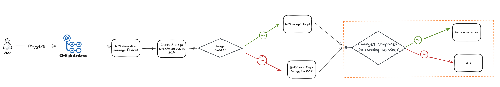

# 🚀 ECS Deployment

This section describes how deployments are handled.
Each environment has its own **GitHub workflow**, which needs to be **manually triggered**.
When starting the workflow, the user selects the **branch to deploy from**.



The workflow consists of two main stages:

---

### 1. 🧱 Image Build & Push

- The workflow scans the package folder and calculates a **SHA** for each image.
- It checks the **ECR repository** to see if the image already exists.
- If the image does not exist, a new image is **built and pushed to ECR**.
- There are four images involved:
  - `server`
  - `web`
  - `nginx`
  - `docs`

> 🟡 Only images that have actual changes are rebuilt, which speeds up the deployment.
> The web image is rebuilt for each environment. This is because the web image relies on env specific variables during build time.
> The web images are therefore stored in separate ECR repositories with the naming convention `pfda/<ENVIRONMENT>/web`.
> The other images are stored in `pfda/<image name>` or `pfda/production/<image name>`. 
---

### 2. 🚢 ECS Deployment

The workflow calls a **deployment script** that:

- Compares the running task definition with the new one.
- If differences are found (e.g., image tag updates, resource allocation changes, new SSM parameters), a **new deployment is triggered**.

To improve speed, **deployments are done in parallel**.
The script calculates **available resources in the cluster** and determines how many services can safely be deployed in parallel.


#### rails db:migrate

Before any application services are updated, a one-off ECS task (pfda-db-migrate) runs rails db:migrate.
This ensures the database schema is up to date before new application code is deployed.

✅ Executed first: The migration task always runs before Node, Web, or any other service deployments.

❌ If it fails: The deployment process stops immediately and no other services are deployed.

🚫 No automatic rollback: The migration task does not rollback automatically. If it fails, it must be manually inspected by checking the logs in the CloudWatch log group for pfda-db-migrate.

Since the migration runs first, no rollback of services is required.

#### 🔄 Force Deployments

In some cases, you may want to **trigger deployments manually**—for example, when an **SSM parameter value changes**.

You can do this by setting the `FORCE_DEPLOY_SERVICES` workflow input:

```yaml
FORCE_DEPLOY_SERVICES:
  description: |
    Comma-separated list of services to force redeploy:
    pfda-pfda-db-migrate, pfda-docs, pfda-nodejs-api, pfda-nodejs-api-internal, pfda-nodejs-worker, pfda-nodejs-admin-platform-client, pfda-sidekiq, pfda-web, pfda-nginx
```

## ⚠️ Deployment Order

**Service Connect** has the concept of **client** and **server** services:

- 🧭 **Servers** must be deployed first, so their DNS endpoints are available.
- 🌐 **Clients** (like `nginx` or `web`) rely on these DNS endpoints to make API calls.

In our setup:

- **Clients:** `nginx`, `web`
- `web` acts as both:
  - a **server** (receiving API calls from `nginx`), and
  - a **client** (making calls to `node-api-internal`)

To handle this correctly, the deployment script uses **parallel stages with a fixed order**:

1. **Node processes** (e.g., `node-api`, `node-api-internal`, etc.)
2. **Web and Sidekiq**
3. **Nginx**

---


## Service Configuration (`services.yml`)

The `services.yml` file, located in the infra/ecs folder defines how each ECS service is deployed. It includes a `default` section for base settings and optional environment-specific overrides for the envs `dev`, `test`, `staging`, `prod`.

### Example

```yaml
services:
  default:
    pfda-nodejs-api:
      imageName: server
      desiredCount: 1
      container:
        cpu: 256
        memoryReservation: 512
      containerPort: 3001
      serviceConnect:
        securityGroups:
          - name: common-sg
      command: ["pnpm", "run", "start:prod:api"]
      healthCheck:
        command: ["CMD-SHELL", "curl -kf https://localhost:3001/health || exit 1"]
        interval: 30
        timeout: 5
        retries: 3
        startPeriod: 60

```

### Key Fields

| Field                           | Description                                                                                             |
|----------------------------------|---------------------------------------------------------------------------------------------------------|
| `imageName`                      | Defines the image type to use (`server`, `web`, `nginx`, `docs`). Determines which image tag to apply.  |
| `desiredCount`                   | Number of ECS tasks to run for the service.                                                             |
| `container.cpu` / `memoryReservation` | **Soft limits** for CPU (in units) and memory (in MiB). ECS uses these to schedule tasks but does not strictly enforce them. |
| `containerPort`                  | Exposed container port for Service Connect or ALB routing.                                             |
| `serviceConnect.securityGroups`  | Logical security group names that are resolved to actual security group IDs at deploy time.             |
| `command` / `entryPoint`         | Optional overrides for the container's default startup command or entry point.                          |
| `healthCheck`                    | Container health check configuration used by ECS to determine task health.                             |
| `targetGroupName`               | (Optional) ALB target group name if the service is behind a load balancer.                              |


### Environment Overrides

Environment-specific settings override defaults:

```yaml
dev:
  pfda-nodejs-api:
    desiredCount: 3
```

Overrides are merged with the defaults to adjust configuration per environment without duplication.

### SSM Override
You can also override resource settings (CPU, memory, desired count) via an SSM parameter. This allows adjusting resources without modifying the YAML file. 
If the SSM parameter /pfda/<ENVIRONMENT>/app/service_resources exists, the values defined there take precedence over what is defined in services.yml.

```json
{
  "pfda-nodejs-api": {
    "cpu": 512,
    "memory": 1024,
    "desiredCount": 2
  }
}

```