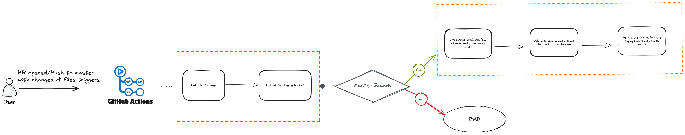

# precisionFDA CLI

##### Written using Go

Distribution builds use Go's native [FIPS 140-3 support](https://go.dev/doc/security/fips140). The Docker build sets `GOFIPS140=v1.0.0-c2097c7c`, which links that exact Go Cryptographic Module snapshot and enables FIPS 140-3 mode by default.


### Getting Started:
This will install Go locally on your machine. For customized installation please refer to the [Go docs on installation](https://golang.org/doc/install).

Run the following in the `packages/cli` directory:

1. To build the Go docker image:
   ```bash
   $ make build-docker
   ```
2. To build the source code, use one of the following: (N.B. darwin is macOS)
   ```bash
   $ make build-darwin
   $ make build-linux
   $ make build-windows
   ```

3. To run the PFDA Uploader:
   ```bash
   $ ./dist/pfda_darwin_amd64
   $ ./dist/pfda_linux_amd64
   $ ./dist/pfda_windows_amd64
   ```

### Development Guide

To quickly test changes to the code, you can use the same docker image as follows.

First build the precisionfda-cli docker image:

   ```# Make sure cwd is the packages/cli directory
   $ make build-docker
   or
   $ docker build -t precisionfda-cli .
   ```

Generate the key for local testing https://localhost:3000/assets/new
or for staging https://precisionfda-staging.dnanexus.com/assets/new and then

   ```$ docker run -it --rm --entrypoint bash --network host --mount type=bind,source="$(pwd)",target=/go/src/dnanexus.com/precision-fda-cli -w /go/src/dnanexus.com/precision-fda-cli precisionfda-cli
   $ export KEY=<INSERT KEY>
   $ go run . upload-file --key $KEY --file <PATH_TO_FILE>
   ```

To test for local development, add the following flags `--server localhost:3000 --skipverify true`
To test on staging, add the following flags `--server precisionfda-staging.dnanexus.com`

To troubleshoot failing requests, add the `-debug` flag to any command. It traces every HTTP request and
response (method, URL, headers, bodies, status, duration, retry attempts) to stderr, so it can be captured
separately with `pfda <command> -debug 2>debug.log`. Response headers are filtered to the diagnostically
relevant ones (`X-Request-Id`, `Content-Type`, `Retry-After`, ...), and error response bodies are always
shown.

What is redacted: secret-bearing request/response headers (like `Authorization`) are omitted; signatures
and tokens are masked in the request-line URL and in the `Location` redirect header. Non-JSON bodies (file
downloads, binary upload chunks) are summarized instead of dumped, so file contents never reach the trace.
Oversized request bodies are summarized; oversized response bodies (JSON, or any error body) are truncated
to the first 10KB and printed with a `<truncated>` marker.

**Warning:** JSON request and response bodies are printed verbatim (up to 10KB). These bodies are **not**
scrubbed, so any presigned upload/download URLs the API returns inside them - including their signatures and
access tokens - appear in the trace in full. Always review the log before sharing it.

For example:

   ``` # Set KEY API key generated above
   # Testing upload to localhost
   $ ./pfda upload-file --server localhost:3000 --skipverify true --key $KEY --file fileYouWantToUpload.pdf
   $ ./pfda upload-file --server localhost:3000 --skipverify true --key $KEY --file fileYouWantToUpload.pdf

   # Testing download from localhost
   $ ./pfda download --server localhost:3000 --skipverify true --key $KEY --file file-yourfileuuid-1
   $ ./pfda download --server localhost:3000 --skipverify true --key $KEY --file file-yourfileuuid-1

   # Testing the API for file download
   $ ./pfda api --server localhost:3000 --skipverify true --key $KEY --route "files/file-G70fbKj0qp9YGkg24kGxQvF4-1/download" --json '{ "format": "json" }'
   $ ./pfda api --server localhost:3000 --skipverify true --key $KEY --route "files/file-G70fbKj0qp9YGkg24kGxQvF4-1/download" --json '{ "format": "json" }'
   ```

### Running Unit Tests

Run `make test`

Or run it inside an interactive docker container
   ```$ docker run -it --rm --entrypoint bash --network host --mount type=bind,source="$(pwd)",target=/go/src/dnanexus.com/precision-fda-cli -w /go/src/dnanexus.com/precision-fda-cli precisionfda-cli
   $ go test ./...
   ```


### Build for Distribution

Make sure the `precisionfda-cli` docker image is built, then invoke `./build-dist.sh` from the /go directory.

Build products will be available in `./dist`

#### Worfklow from GH actions


### Cross Compilation:
Compiling for non-native target platforms is made easy with go. Regardless of what OS/architecture you are running locally.

The supported options for `$GOOS` and `$GOARCH` are listed below:
```bash
$GOOS		$GOARCH

android		arm
darwin		386
darwin		amd64
darwin		arm
darwin		arm64
dragonfly	amd64
freebsd		386
freebsd		amd64
freebsd		arm
linux		386
linux		amd64
linux		arm
linux		arm64
linux		ppc64
linux		ppc64le
linux		mips64
linux		mips64le
netbsd		386
netbsd		amd64
netbsd		arm
openbsd		386
openbsd		amd64
openbsd		arm
plan9		386
plan9		amd64
solaris		amd64
windows		386
windows		amd64
```


# FIPS Compliance

The pFDA CLI uses Go's native FIPS 140-3 support. Distribution builds are compiled with `GOFIPS140=v1.0.0-c2097c7c`, so FIPS 140-3 mode is enabled by default in the built executable.

`v1.0.0-c2097c7c` is the exact, immutable snapshot of Go Cryptographic Module v1.0.0 — the version covered by [CMVP Certificate #5247](https://csrc.nist.gov/projects/cryptographic-module-validation-program/certificate/5247). Snapshot zips are checksummed in `$(go env GOROOT)/lib/fips140/fips140.sum` and, per the Go team's policy in that file, "must not change" once published.

It is pinned to the full snapshot rather than the shorter `v1.0.0` because **`v1.0.0` is itself an alias**: `lib/fips140/v1.0.0.txt` is a redirect file that currently resolves to `v1.0.0-c2097c7c`. If Go publishes a further patched v1.0.0 snapshot, that redirect can be re-pointed, and a `GOFIPS140=v1.0.0` build would silently link a different module. Pinning the full snapshot removes that possibility. It is likewise not set to the `certified` or `inprocess` aliases, which resolve to a moving target by design (`inprocess` currently selects v1.26.0, which is only Pending Review and therefore *not* validated).

**This pin does not survive module removal.** Go removes older module versions once a newer one obtains a CMVP certificate, and removal deletes the snapshot zip itself — which both `v1.0.0` and `v1.0.0-c2097c7c` depend on. So when v1.26.0 is certified and a later `golang` base image drops the v1.0.0 snapshot, this build will fail with:

```text
go: unknown GOFIPS140 version "v1.0.0-c2097c7c"
```

That failure is intentional and preferable to a silent crypto module swap: bumping the FIPS module is a compliance-relevant change that should be reviewed deliberately. When it happens, update the `GOFIPS140` value in the `Dockerfile` to the new certified snapshot (check `ls $(go env GOROOT)/lib/fips140` and `cat $(go env GOROOT)/lib/fips140/certified.txt` in the new base image) and re-verify `pfda -version`.

To verify the runtime status, run:

```bash
$ pfda -version
```

The output includes a `FIPS 140-3` line. A FIPS-enabled distribution build prints the Go Cryptographic Module version, the runtime mode (`on`, or `only (enforced)` when non-approved algorithms are rejected), and the module snapshot the binary was built against, for example:

```text
  FIPS 140-3  :    enabled (module v1.0.0, mode on, built GOFIPS140=v1.0.0-c2097c7c)
```

The `built GOFIPS140=` value is read from the embedded build info and is the *resolved* snapshot, not whatever string was passed at build time — so an artifact always records exactly which module it was built against, even if an alias had been used.

If FIPS mode is not active, the command prints:

```text
  FIPS 140-3  :    warning: FIPS mode not active
```

If FIPS mode was turned on at runtime (for example via `GODEBUG=fips140=on`) without building against a frozen module, the build is not FIPS-validated and the command prints:

```text
  FIPS 140-3  :    warning: enabled with non-frozen 'latest' module (not a validated build)
```

See the [Go FIPS 140-3 documentation](https://go.dev/doc/security/fips140) for details about `crypto/fips140`, `GOFIPS140`, supported platforms, and module validation status.

# Version History

### 2.15.1 (2026-08-06)

- New feature - `run`; launches an app with an optional JSON configuration (`pfda run <app_uid> '<json_config>'`)
- New feature - `terminate`; terminates a running job by its UID (`pfda terminate <job_uid>`)

### 2.15.0 (2026-08-04)

- fixed issue with `--json` output of `mkdir`, `rm`, `rmdir`, `upload-file`, and `download` - results and per-item errors are now always emitted as a single parseable JSON array
- fixed issue where `mkdir`, `rm`, `rmdir`, `upload-file`, and `download` could exit with code 0 even though some items failed
- fixed issue with multi-file upload aborting on the first failed file instead of continuing with the remaining files

### 2.14.2 (2026-08-03)

- fixed issue with the distribution build configuration across all platforms

### 2.14.1 (2026-07-27)

- fixed issue with upload-asset across all platforms

### 2.14.0 (2026-07-27)

- New feature - rmdir `-r` flag; deletes a folder and all its nested contents (non-empty folders now require this flag)
- New feature - `-debug` flag; traces HTTP requests/responses to stderr for troubleshooting (auth headers omitted and URL signatures masked; bodies printed verbatim)

### 2.13.0 (2026-06-30)

- New feature - rm-discussion; removes a discussion by its numeric ID
- New feature - rm-reply; removes a discussion reply by its numeric ID
- upgrade Go to 1.26.4

### 2.12.0 (2026-03-31)

- New feature - run; launches an application with the specified configuration
- New feature - terminate; terminates a running job

### 2.11.2 (2026-03-12)

- upgrade Go to 1.26.0

### 2.11.1 (2025-10-28)

- fixed issue with json output in upload-file

### 2.11.0 (2025-09-25)

- New feature - set-tags; sets tags on a given entity.
- New feature - set-properties; sets properties on a given entity.

### 2.10.3 (2025-08-21)

- fixed issue with binary being dynamically linked

### 2.10.2 (2025-07-30)

- fixed issue with parsing json args

### 2.10.1 (2025-06-30)

- fixed issue with parsing flags

### 2.10.0 (2025-06-17)

- Improved error handling
- Added support for comma-separated arguments
- Optimizing performance

### 2.9.0 (2025-03-31)

- New feature - rotate-password; rotates password of a database cluster
- New feature - get-password; get the password of a database cluster

### 2.8.0 (2025-01-20)
- New feature - create-discussion; create a new discussion in a space
- New feature - create-reply; create a reply to a discussion
- New feature - edit-discussion; append content and attachments to existing discussion
- New feature - edit-reply; append content and attachments to existing reply

### 2.7.3 (2024-10-27)
- security fixes
- improved error handling

### 2.7.2 (2024-09-12)
- upgrade Go to 1.23.1

### 2.7.1 (2024-05-31)
- ls shows files and folders in all states

### 2.7.0 (2024-05-16)
- fixed issue with file-upload
- various improvements

### 2.6.0 (2024-04-02)
- New feature - ls-assets; listing private or public assets
- New feature - ls-members; listing given space members
- New feature - ls-discussions; listing given space discussions
- New feature - ls-apps; listing private, space or public apps
- New feature - ls-workflows; listing private, space or public workflows
- New feature - ls-executions; listing private, space or public executions
- New feature - ls-assets; listing private or public assets
- New feature - describe; describe given entity by id - one of file, asset, job, app, workflow, discussion

### 2.5.0 (2023-12-14) 
- fixed uploading complex folder structure on windows
- fixed uploading large files 
- added support of JSON response format for most commands

### 2.4.1 (2023-07-20)
- fixed folder-id manipulation

### 2.4 (2023-05-25)
- New feature - get-space-id; get space ID from current workstation's context
- New feature - upload-file stdin; added support for stdin input

### 2.3 (2023-03-08)
- improved syntax of commands 
- added support for multiple files/folders to upload-file and download commands.
- New feature - mkdir; create new folders in any location
- New feature - rmdir; delete folders from any location
- New feature - rm; delete files from any location
- New feature - head, cat; print content of a file

### 2.2.1 (2022-12-20)
- improved output of ls command
- added `-overwrite` flag for download command

### 2.2 (2022-12-07)
- New feature - ls; list files from private home or a space
- New feature - list-spaces; list all available spaces
- New feature - describe-app; describe-workflow; describe the entity
- Added new `-help` flag for all commands with examples and brief instructions

### 2.1.2 (2022-08-03)
- Fixed windows asset upload

### 2.1.1 (2022-07-18)
- Improvements to asset upload
- Fixed downloading file with spaces in filename

### 2.1 (2022-02-22)
- The CLI can now download files from private home or a space
- When uploading files, add the -space-id option to specify a space
- Specifying -folder-id will allow files to be uploaded to a specific folder
- -version flag now prints FIPS only mode confirmation

### 2.0.1 (2021-08-26)
- Fix an issue uploading very large files
- Improved uploading progress display
- Upgraded to goboring 1.16.7b7

### 2.0.0 (2021-02-06)
- TLS 1.2 and FIPS 140-2 support

### 1.0.4 (2016-01-05)
- Reduced memory usage of each thread

### 1.0.3 (2015-12-14)
- The uploader can now be used for both assets and files

### 1.0.2 (2015-12-03)
- Multi-threaded uploading, for faster uploading of large assets
