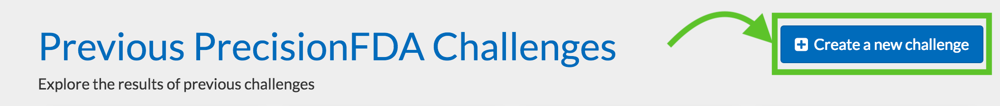
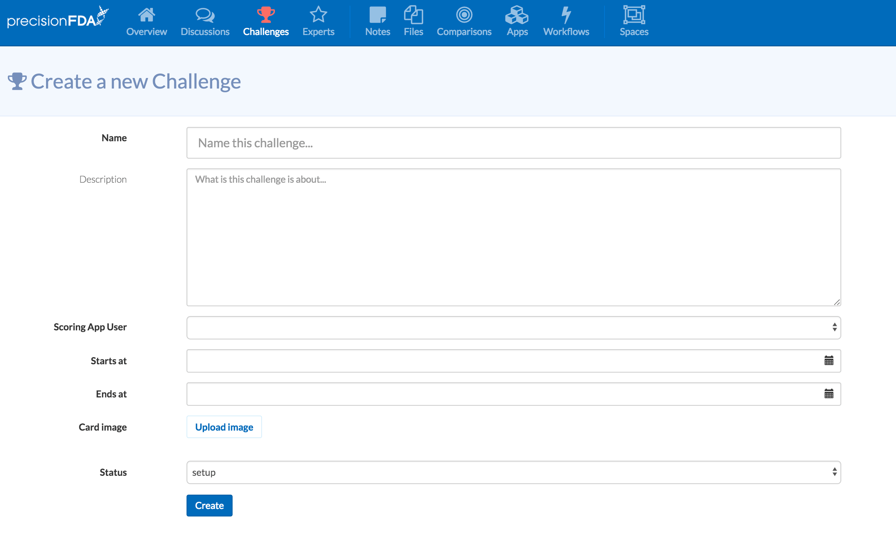
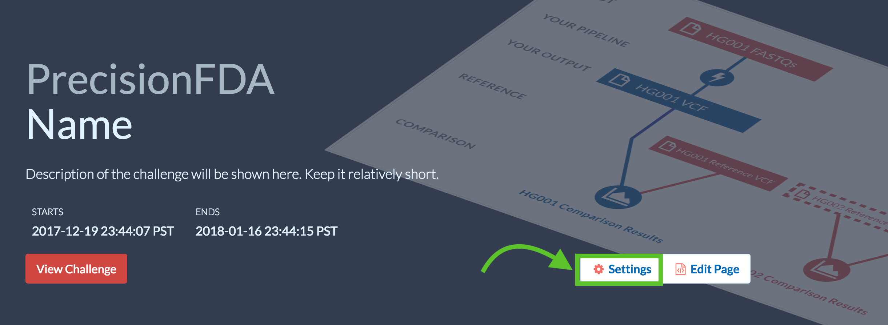
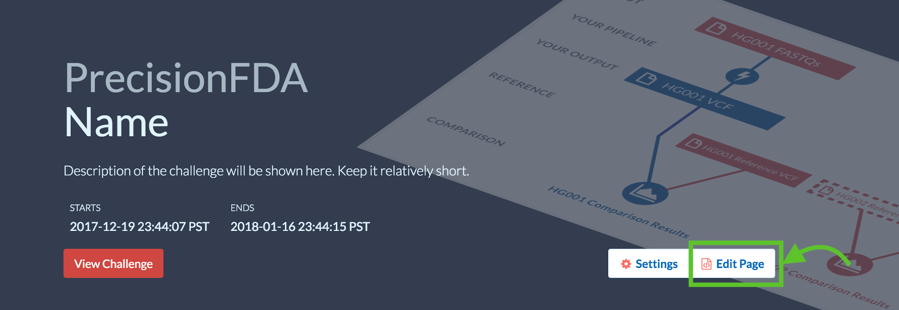
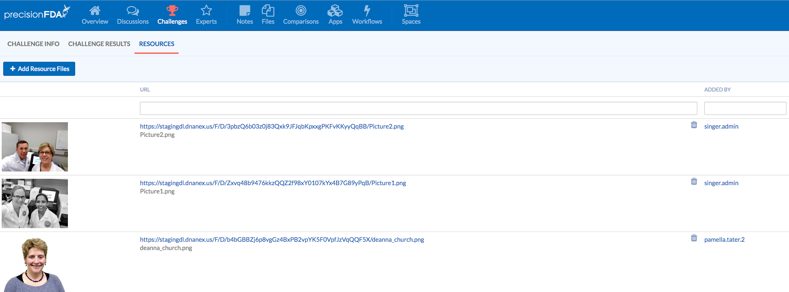

## Creating a New Challenge

For admins of the site, when going to the list of challenges, just above the list of previous challenges, there is a button to “Create a new challenge”. This will allow you to specify the basic information about a new challenge.

This link will take you to the Challenge Creation Workbench, which includes several fields for setting up a new challenge.

- Name: the title of the challenge and will appear in large font.
- Description: a short summary of the challenge that will appear under the title in the challenge banner.
- Scoring App User: the precisionFDA account of the user who will develop the scoring application. This can be your own username or the name of any user on the platform. You select the username from a dropdown list. You can jump to a specific user by typing the first few characters of their name.
- You can set a challenge start and end date and time, based on your local timezone.
- You can upload a “card image” from your local computer. This is the image that appears on the “card” for your challenge on the Challenges page.
- Status: one of setup, open, results\_announced, paused, archived.

## Challenge Phases

When a challenge is first created, it is in the "setup" phase. In this phase, only admins and challenge admins will be able to see the challenge; other users will see no trace of the challenge. Any of the fields may be changed by going to the “Settings” of the challenge (which is only available to admins).

Eventually, the admin can choose to move a challenge into the "open" phase. In this phase, users will be able to see the challenge page. The large challenge banner is displayed in the list of open challenges. At this time, the challenge info page is available to users. If the current time is within the challenge period set, submissions will be accepted.

At any point while the challenge is open, an admin can place the challenge into the “paused” state. The challenge is still open, but the ability to submit is temporarily disabled.

When the challenge is moved into the "results announced" phase, the challenge results tab becomes visible users.

Finally, the challenge can be put into the "archived” phase, at which time the large challenge banner is removed. The challenge is still visible on a card under the “Previous PrecisionFDA Challenges” section of the Challenges page.

Modifying the challenge page settings, phases, and card can all be done by clicking the “Settings” button nearby the challenge on the challenge site. Again, this feature is only accessible to admins on the site.

## Editing an Existing Challenge

When viewing a challenge page, you will be able to edit the content. The tool underlying this page editor is called ContentTools. There is much more complete documentation on how to use the ContentTools editor at [getcontenttools](http://getcontenttools.com/). To begin editing your challenge, under the “Challenges” tab, scroll down to your challenge and click “Edit Page”.

From here, there will be tabs to edit the challenges information, results, and resources. The results page won't be shown until a later time.

To add images to your challenge pages, you will need to add the image as a resource. From the "Resources" tab, you can upload image files. After an image file is uploaded, a link will be generated that you can use to add that image to your challenge pages. The image processing may take a couple of minutes.

You should ensure that the files related to the challenge are linked on the Challenge Intro page. It is usually best to link to the file's page, allowing users to generate their own download URLs.

## Developing a Evaluation App

A key aspect of challenges is evaluating the results. The evaluation app should be carefully crafted to prevent leaking any information and attempt proper validation of all submissions.

Before writing the challenge app, you will want to do some preparatory work. The inputs of the app are the files you are expecting in a submission. You will want to make an asset containing the answer key for comparison purposes. The outputs of the evaluation app should be some metrics that can be used to summarizing the results, often in the form of integers (ints) or floating point numbers (floats), and possibly a text report containing more detailed information about the results.

When a user submits results, one of two things happens. If the challenge evaluation app succeeds, then the user will only know that their submission was successful. If the challenge evaluation app fails, then the user will be able to look at the log file of that failure. For this reason, it is important to write the validation part of the challenge evaluation app to be descriptive when it fails. Additionally, you will want to ensure that no data about the correct answers leak in the log.

You should divide your app into two parts. The first part is validation, which does basic checks to make sure the submissions match an expected file format or output value. Sometimes, you are able to rely on third party tools to validate data (VCF validation is already performed by many tools). Other times you will have to write some custom code to do so (validating the file is in CSV format, for example). Ideally, you have some examples of submissions that should succeed and fail validation for testing purposes.

The second part of your app will actually calculate the output metrics and evaluate the submission results. This can vary quite a bit depending on the nature of the challenge. Again, sometimes there are tools that can help (VCF comparisons), and other times you will have to write the code yourself. The metrics you care about should be saved into variables for output.

It can useful to look at old challenge evaluation apps to get an idea of what to do. All old challenge evaluation apps are publicly available.

For more on app development, see [App development documentation].

## Setting the Challenge Evaluation App

The user configured as the “Scoring App User” must develop the app and publish it. Once the app is published, the user can click the “Assign to Challenge” button and click the name of your challenge. At this point, the app becomes the evaluator app for your challenge.

## Opening a Challenge

Once the challenge intro page and challenge evaluation app are ready, you can transition the challenge to “open” through the challenge settings. At this time, users will be able to access the challenge info page.
