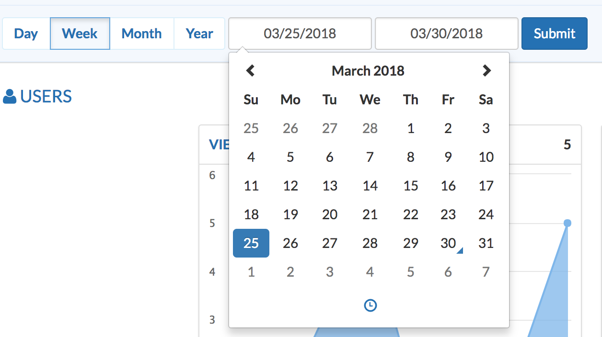
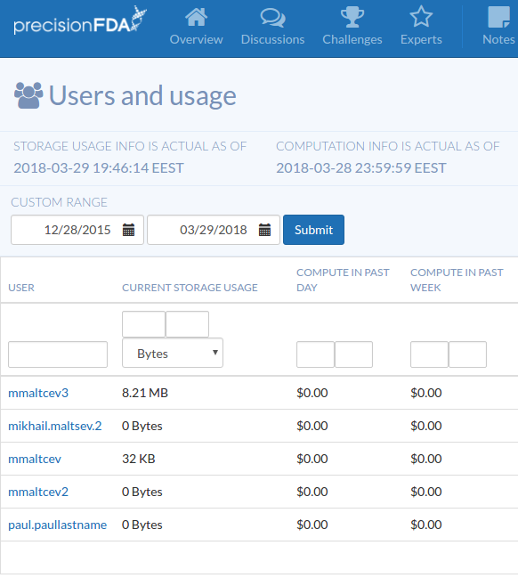

Site activity reporting gives the admin aggregated data about the resource utilization of precisionFDA users. This dashboard has pre-selected time periods (past day, week, month, year as shown below) as well as the ability to select a custom date range. By default, the dashboard shows usage for the current week (starting on Sunday).

The dashboard is divided into four sections:

1. Users: the numbers of site views, access requests, and logins.
2. Data: the amount of data uploaded, downloaded, and generated by running comparisons, apps, and workflows.
3. Apps: the numbers of apps created, published, and run, and the number of jobs run. There is also a summary of the total apps ever published to precisionFDA, the number of public apps, and the total number of CPU hours used for running jobs.
4. Challenges: the numbers of challenge signups and submissions.

## Users and Usage

The Users & Usage button presents a table with fine grained detail about the resource usage of each user. The table shows current storage usage as well as compute and consumption in pre-defined data ranges. Note that the storage usage is only an estimate based on a snapshot, but it will be illustrative of the relative levels of storage usage amongst users.

Along the top of the table, there are fields with which to filter the rows visible in the table. Users can be filtered by name, storage can be filtered by a range of sizes, compute can be filtered by a range of dollar amounts, and consumption can be filtered by a range of Bytes-Hours values. If either field in a range is left blank, it is assumed to be the extreme value, i.e. zero for the left field and the maximum value across all users for the right field.

You may also select a custom data range, for which the results are shown in additional columns of the table ("Compute/Consumption in Custom Range").

Clicking the "Export to CSV" button exports the table to a CSV formatted file to be looked at offline.
