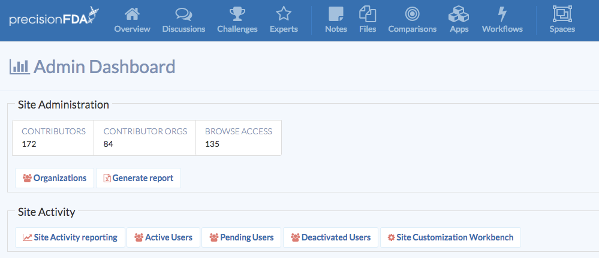
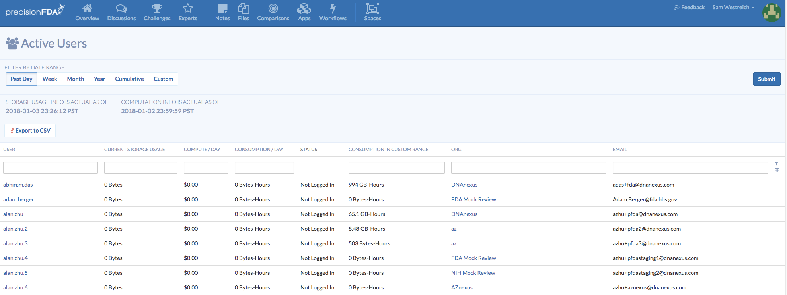
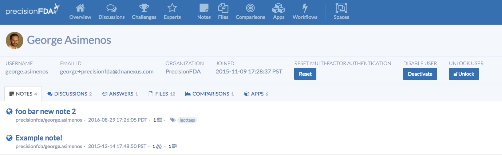
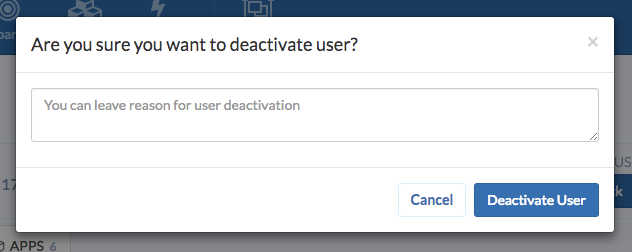
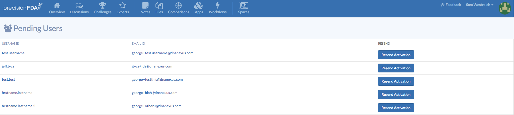
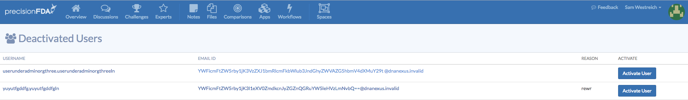

Site administrators on precisionFDA are able to provide some services for users, including viewing account activations, resending activation emails, modifying user profiles, and granting account unlocks and multi-factor authentication resets. Additionally, site administrators are able to manually enable and disable accounts.

## The Admin Dashboard

From the Admin Dashboard, accessible from the drop-down menu under the admin's name in the upper-right corner, an administrator may access statistics and lists of active, pending, and deactivated users.

## Exploring Active Users

Clicking on the “Active Users” button under Site Activity brings up a list of all active users, with additional tools to sort and filter the list.

At the top, the admin may filter by a specific date range, or can export the list to a downloaded CSV file.

For each user, the following data is displayed:

- Their current level of data being stored
- Their average compute cost for the selected range
- Their data consumption for the selected range
- Their status (whether or not the user is logged in)
- Their total data consumption
- The org with which that user is affiliated
- The email address used by the user to sign up.

Clicking on an individual user brings up additional information about that user's account.

The administrator can, using the buttons available, reset the user’s multi-factor authentication, deactivate the user account, or unlock the user account if it has been locked. These actions will take effect when the user next logs in. Note that, if the account is not locked, the “Unlock” button will be grayed out.

The administrator may also view the different objects and jobs performed by this user account. This includes viewing notes created by the user, discussions posted by the user, answers provided by the user, files uploaded by the user, comparisons run by the user, and applications created by the user.

When deactivating a user, a prompt will pop up, asking the administrator to confirm the deactivation and, optionally, provide a reason for the deactivation.

## Pending Users

Clicking on Pending Users from the Admin Dashboard brings up a list of all pending users - users for whom accounts have been provisioned, but have not yet been activated by the user. Here, the admin has the option to resend the activation email.

## Deactivated Users

Clicking on Deactivated Users from the Admin Dashboard brings up a list of all deactivated users, with the option to reactivate the user profile. This will restore their permissions and original email address.

