The precisionFDA site has many areas for publishing content. These include the Expert Spotlight, News, Community Participants, and Get Started areas. These areas allow for new content to become readily available when relevant. The Site Customization Workbench allows precisionFDA admins to add a new piece of content, preview how it will look, and then publish it to the full precisionFDA site.

## The Overview Page and Site Customization Workbench

The overview page contains important links and boxes that can direct users to useful pages throughout the site. To begin editing the overview page, click on your name in the upper right hand corner and then go to “Admin Dashboard”.

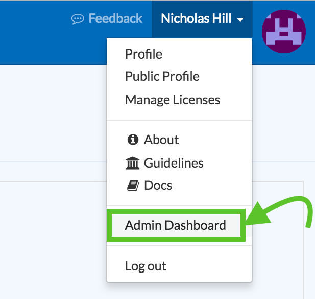

From there, click on the button “Site Customization Workbench”.

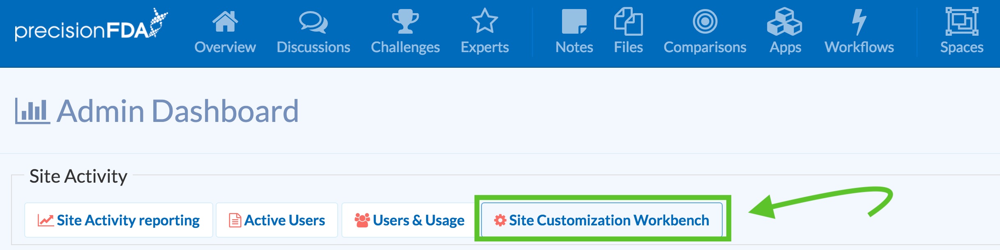

This will take you to a page that allows you to modify the Get Started boxes, the News, and the Participants pages.

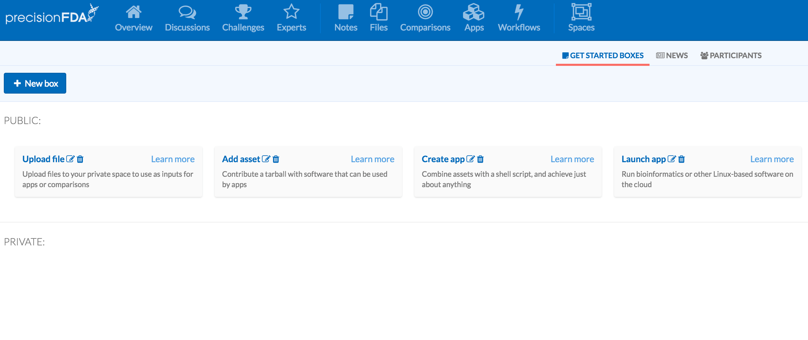

## Get Started Boxes

Get started boxes are displayed on the overview page and provide users with quick links to features and documentation for those features on the platform. To create a Get Started box, click the box that says “New box” in the site customization workbench page.

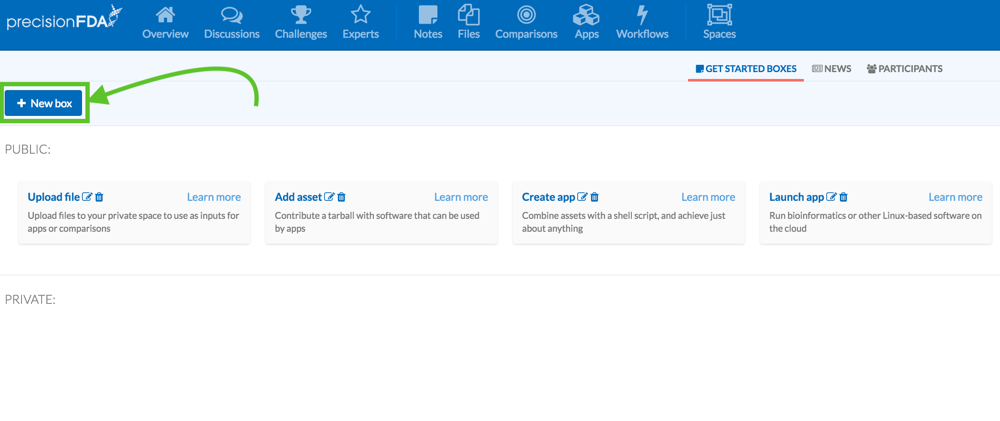

From this link, you can specify a title, description, url, and documentation url for a given feature on the site.

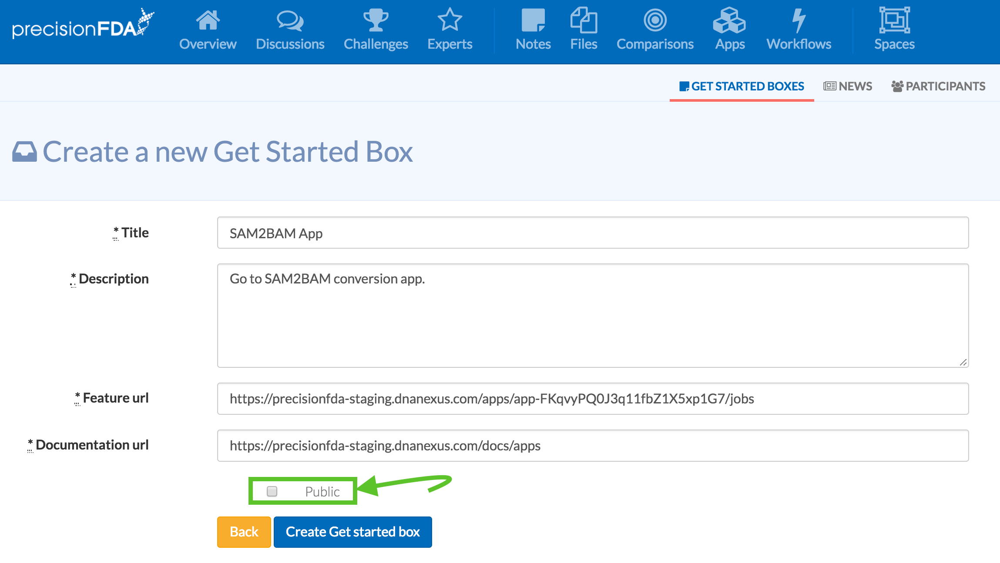

If you’re ready to display your Get Started box on the Overview page, check the box marked “Public” before pressing “Create Get started box”. If you would like to first test your Get Started box, then leave this box unselected. If the Get Started box is set to private mode, then once it has been created it will appear on your admin dashboard in the Get Started boxes area under “Private.”

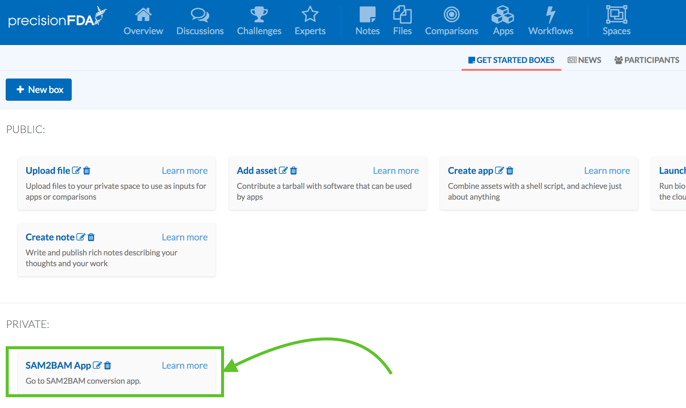

If you need to edit either your public or private Get Started boxes, click the “paper and pencil” icon next to the box’s name. This can be useful for modifying the viewership setting on the Get Started box. If a Get Started box is no longer necessary, one can remove it by clicking the small “trash can” icon beside the box’s name.

## News

The overview page also displays current and relevant news articles that are of interest to the community of users. To create a news article on precisionFDA, select the “New article” button under the news tab in the site customization workbench.

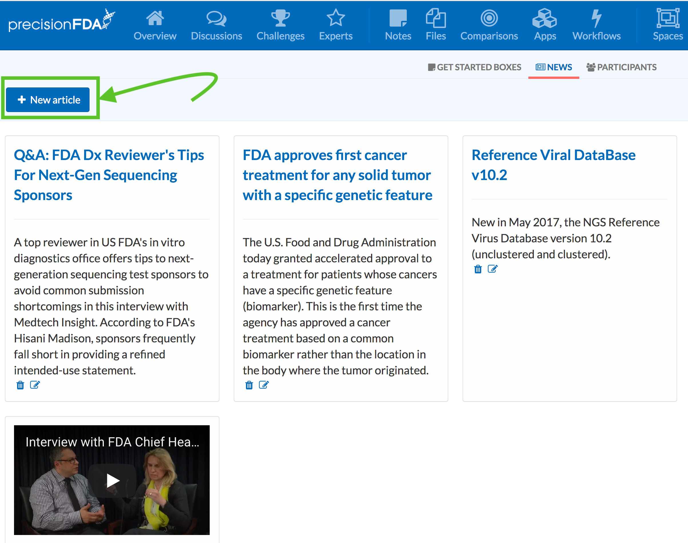

From here, you can specify the name of the article as it would appear on precisionFDA, the date the article is to be posted, a link to the article, a content summary of the article, and, optionally, a link to a video associated with the article. If you’re ready to make the article visible on the overview page, check the “Published” box and click “Create News Item”. If the Published box is left unchecked, the article will only be visible to you within your personal Site Customization Workbench.

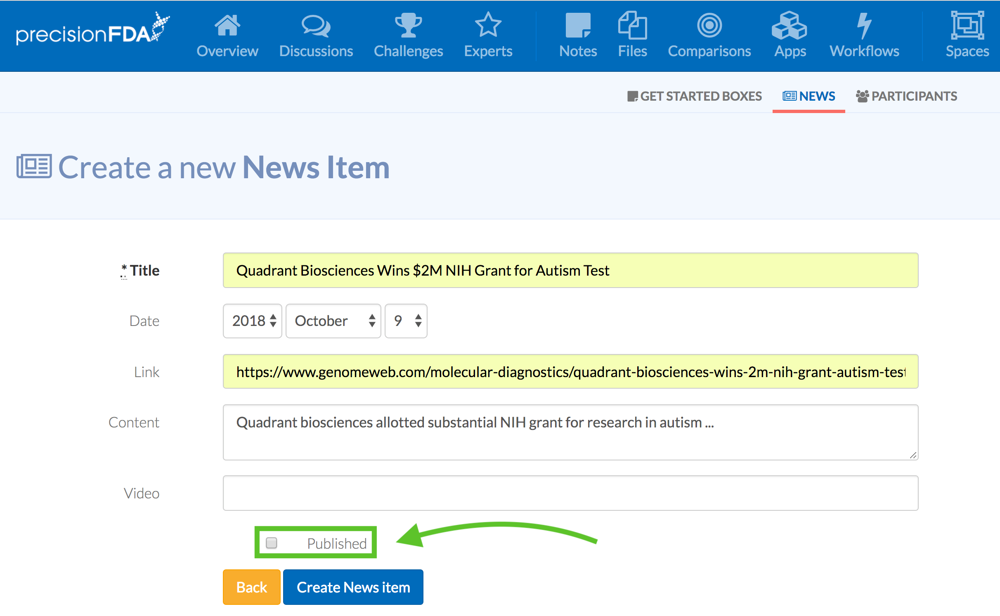

## Participants

Another customizable feature within the Site Customization Workbench is the participants. The participants may be individuals or organizations who collaborate with precisionFDA. These participants will be displayed on the homepage. Under the participants tab, click on the button called “New participant”.

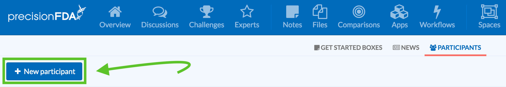

From here you can specify the title of the participant and an associated image to upload from your local computer.

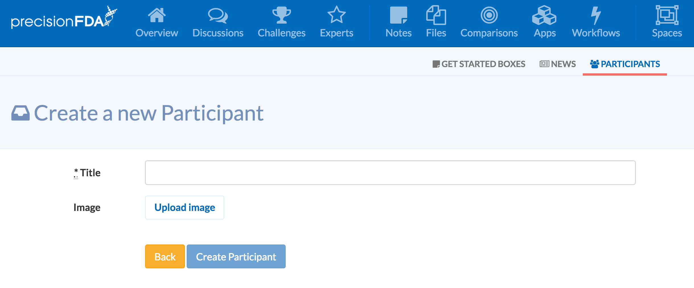

## The Expert Spotlight

The expert spotlight highlights a precisionFDA user as an expert in the field of genomics, bioinformatics, biomedical informatics, or precision medicine. The customization page on precisionFDA allows you to create an Expert Spotlight page by clicking the “Experts” button and then clicking “Create a new expert”. From here, you can identify the expert by their username, select an image for the post on their local computer, type out the expert’s preferred name, and create a biographical entry.

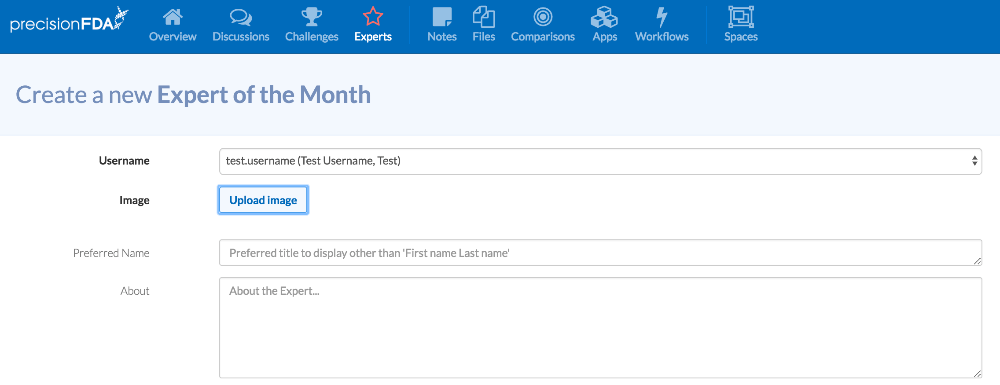

Now that the expert user for the post has been selected, a blog post for this highlighted expert can be created by filling out the blog sections, which include a title for the blogpost, the text displayed within the blogpost, and a preview to display on the front page of the Experts section.

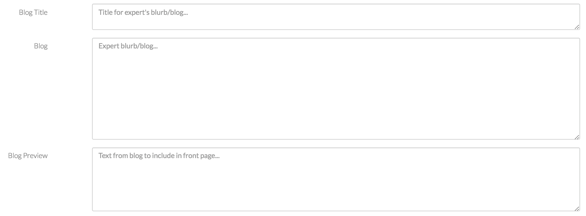

Lastly, the visibility mode of the post can be set to either “Private” or “Public.” The Private setting allows you to test out how the post will appear on the precisionFDA site. The Public setting is for the finalized publication of the post.

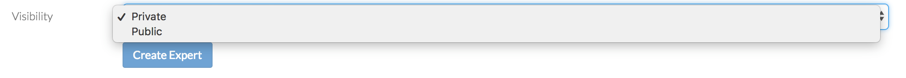

To test the appearance of your post privately or go public with it, click the “Create Expert” button.
