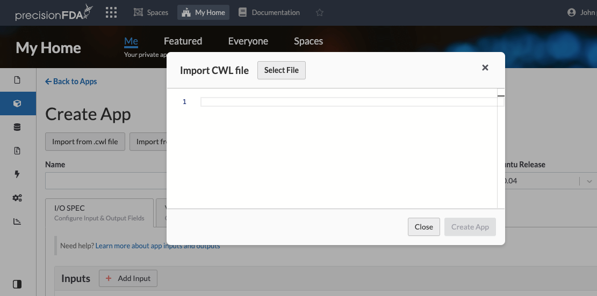
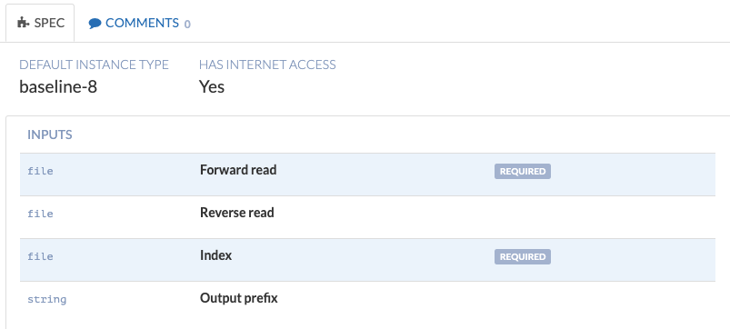
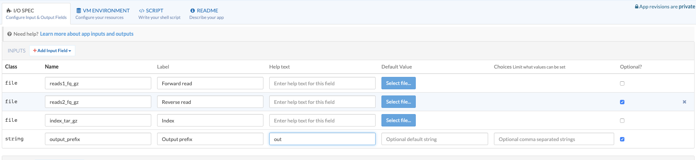
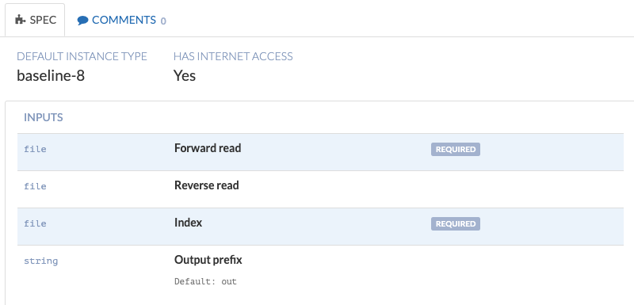
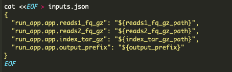
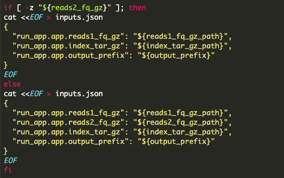

To create a new app, click "Create App" in the Apps page. The following section walks you through important concepts of app development.

> [!info] Tip
> Want to learn by example? Simply choose any of the public apps in precisionFDA and click "Fork". This will load up the app editor, where you can take a look at the internals of the app and see what it is comprised of. You can then hit the Back button in your web browser -- unless of course you truly want to fork the app and make a private copy with which you can experiment, in which case click the new Fork button from inside the app editor to complete the operation.

## App naming conventions

Apps have a machine-readable name that cannot contain spaces (such as "bwa-freebayes") and a human-readable title (such as "BWA-MEM and FreeBayes"). Among apps that you create, names need to be unique (you cannot author two distinct apps with the same name). This restriction is only per-user, meaning that you can still create an app with the same name as someone else's app. In fact, the system encourages you to use someone else's app as a starting point and make further tweaks and save it as your own app (a process called "**forking**" an app). This model was inspired from the model of GitHub repositories.

## Input and Output spec

Apps require an input/output specification, which mandates what inputs they need from the user, and what outputs they are expected to generate. Note that an "input" is anything that needs to be received from the user and which can potentially vary between executions. These can be not only input files but also numerical or boolean values, and strings. In that sense, the "inputs" can be used both for receiving data to operate on as well as receiving configuration parameters. Each input field has the following properties:

| Property      | Explanation                                                                                                                                                                                                  |
|---------------|--------------------------------------------------------------------------------------------------------------------------------------------------------------------------------------------------------------|
| Class         | The kind of input. There are exactly five classes supported: file, string, integer, float and boolean.                                                                                                       |
| Array?        | Whether this input is an array. If so, the user can provide multiple values for this input.                                                                                                                  |
| Name          | A machine-readable name for this input (no spaces allowed). The system will create a shell variable named after this, for your script to use.                                                                |
| Label         | A human-readable label for this input. The system uses this to render the form that users see when launching the app.                                                                                        |
| Help text     | Additional help text describing what this input field is about. The system shows this help text in the app details page ("spec" tab), and upon hovering on an input during app launch.                       |
| Default value | A default value that this field will be pre-filled with when users launch the app. (You are not required to provide defaults; do so only if you need to guide users in choosing the right values.)           |
| Choices       | A set of comma-separated values denoting the only permitted values for this field. If such choices are provided, the user must choose one of them using a drop-down menu and can't write in their own value. |
| Optional?     | Whether this field is optional or required. When launching an app, users must fill all required fields before they can continue.                                                                             |

#### Input spec example

Let's consider an app which takes a BED file with genomic intervals, and extends each interval's coordinates by adding a fixed amount of padding on both sides. Here's an example of input spec:

| Property      | Value for 1st input                                    | Value for 2nd input                                                     |
|---------------|--------------------------------------------------------|-------------------------------------------------------------------------|
| Class         | file                                                   | integer                                                                 |
| Array?        | false                                                  | false                                                                   |
| Name          | intervals                                              | padding                                                                 |
| Label         | BED file with intervals                                | Padding amount to add                                                   |
| Help text     | The BED file whose genomic intervals will be extended. | The number of base pairs to extend each interval along both directions. |
| Default value |                                                        | 10                                                                      |
| Choices       |                                                        |                                                                         |
| Optional?     | false                                                  | false                                                                   |

The output specification is similar to the input specification (but with no default values). When creating an app, you specify what kind of inputs your app is expected to create, and define names and labels for them. When your script runs, it is responsible for generating the respective outputs. If an output is marked as optional, your script is not required to produce it. See the [app shell script](/guides/creating-apps#app-script) section for more information.

#### Output spec example

To continue our aforementioned example, here is a potential output specification for our example app:

| Property  | Value for 1st output                                      |
|-----------|-----------------------------------------------------------|
| Class     | file                                                      |
| Array?    | false                                                     |
| Name      | padded\_intervals                                         |
| Label     | Padded BED result                                         |
| Help text | The generated BED file with the padded genomic intervals. |
| Optional? | false                                                     |

## VM Environment

Apps run inside a virtual machine (VM); a computer on the cloud with a specific environment. When authoring an app, you have the opportunity to configure the environment according to your needs, using the "VM Environment" tab.

By default, apps do not have access to the Internet. Removing Internet access ensures that apps cannot communicate with the outside world over the Internet -- this increases user comfort and lowers the barriers for users to try out apps. If your app requires Internet access (for example, to communicate with a third-party database over the Internet, to fetch files from URLs, or to fetch and install external software at runtime), you can enable it in this tab.

> [!info] precisionFDA CLI Support
> When internet access is enabled, the precisionFDA CLI (`pfda`) is automatically installed and configured inside the app's virtual machine. This allows your app script to interact with the precisionFDA platform directly, with no additional setup required in your script.

The default instance type denotes the particular hardware configuration that the app will run on. Each instance type comes with a specific amount of memory, number of CPU cores, and hard disk storage. See the section on [available instance types](/guides/creating-apps#available-instance-types) below for more information. Although you can choose a default one in the "VM Environment" tab, users can still override the default choice when launching the app. This is useful if you have a single app that can work for both small inputs (such as an exome) and large inputs (such as a whole genome).

> [!info] Tip
> Make a smart choice of default instance type. Select an instance that would be suitable for typical inputs, and use the app's Readme to guide users as to how to adjust it when running your app with larger inputs. Jobs consume energy depending on the instance type used, so your pipeline may be wasteful if it does not use its default instance type efficiently.

The operating system of the virtual machine depends on your selection (either Ubuntu 14.04 or Ubuntu 16.04), with several preinstalled packages.

If your app requires additional Ubuntu packages, you can specify so in the "VM Environment" tab. For example, if your app needs Java, we recommend adding the "openjdk-7-jre-headless" package. If you are unsure as to what a certain package is called, you can use the [packages.ubuntu.com](http://packages.ubuntu.com/) website to locate packages (make sure to select the "trusty" distribution in the search form, as that is the codename for Ubuntu 14.04 or "xenial" for Ubuntu 16.04). Note that, specifically for Java 8, we support additional packages (such as "openjdk-8-jre-headless") which are not listed on the Ubuntu packages website.

If you need to load additional files onto the virtual machine and have them available to your app's shell script, such as executables, libraries, reference genome files or pretty much any other static files required for your execution, you can use **App assets**. Assets are tarballs that are uncompressed in the root folder of the virtual machine right before running your app script. The [App assets](/guides/creating-apps#app-assets) section discusses in detail how to create, manage, and select assets for your app.

The shell script of an app contains the shell code that will run inside the virtual machine. The script runs as root. During the script execution, the default working directory (home directory) is `/work`. For more information about the shell variables available to your script, and the handling of app inputs and outputs from your script, consult the [App script](/guides/creating-apps#app-script) section.

To summarize, here is what happens when your app is launched:

| Step |                                                                                              |
|------|----------------------------------------------------------------------------------------------|
| 1    | A new virtual machine with selected Ubuntu release and preinstalled packages is initialized. |
| 2    | Additional Ubuntu packages are installed per your app's spec.                                |
| 3    | Your app's assets are fetched and uncompressed in the root folder.                           |
| 4    | The job's input files are downloaded in subfolders under the `/work/in/` folder.             |
| 5    | Shell variables are populated according to your job's inputs.                                |
| 6    | Your app's shell script is executed.                                                         |

## Available instance types

The precisionFDA system supports the following hardware configurations (instance types) for apps to run on:

| Instance type | \# of CPU cores | Memory | Hard Disk Storage |
|---------------|-----------------|--------|-------------------|
| Baseline 2    | 2               | 4 GB   | 32 GB             |
| Baseline 4    | 4               | 8 GB   | 80 GB             |
| Baseline 8    | 8               | 16 GB  | 160 GB            |
| Baseline 16   | 16              | 32 GB  | 320 GB            |
| Baseline 36   | 36              | 72 GB  | 640 GB            |
|  |
| High Mem 2 | 2 | 16 GB | 32 GB |
| High Mem 4 | 4 | 32 GB | 80 GB |
| High Mem 8 | 8 | 64 GB | 160 GB |
| High Mem 16 | 16 | 128 GB | 320 GB |
| High Mem 32 | 32 | 256 GB | 640 GB |
|  |
| High Disk 2 | 2 | 3.8 GB | 160 GB |
| High Disk 4 | 4 | 7.5 GB | 320 GB |
| High Disk 8 | 8 | 15 GB | 640 GB |
| High Disk 16 | 16 | 30 GB | 1280 GB |
| High Disk 36 | 36 | 60 GB | 2880 GB |
|  |
| GPU 8 | 8 | 60 GB | 160 GB |

## App assets

App assets are the building blocks of apps. They are tarballs (file archives), which get uncompressed in the root folder of the virtual machine before the app script starts to run. They can contain executables (such as bioinformatics tools), static data (such as reference genomes and index files) or pretty much anything else that is required for an app to run.

Just like regular files, app assets can be either private or publicly contributed to the precisionFDA community. Your app can choose among any accessible assets (whether private or public).

> [!info] Tip
> You can have a public app that uses a private asset. In that case, people will be able to run the app, but will not have access to the private executables. They will also be able to fork the app but their fork won't include the private assets. This may be an option of choice if you want to allow people to try out something without giving them access to the code. For more information consult the second table in the [Publishing](/guides/publishing) section.

To help get you started, the precisionFDA team has contributed a few popular app assets that you can include in your app's environment. The table below lists some examples of such public app assets:

| Asset        | Contents                                                    |
|--------------|-------------------------------------------------------------|
| samtools-1.2 | The `/usr/bin/samtools` executable.                         |
| htslib-1.2.1 | The `/usr/bin/bgzip` and `/usr/bin/tabix` executables.      |
| grch37-fasta | The GRCh37 reference genome FASTA file (`/work/grch37.fa`). |
| bwa-0.7.12   | The `/usr/bin/bwa` executable.                              |
| bwa-grch37   | The GRCh37 reference genome, indexed for BWA.               |

When editing an app, in the "VM Environment" tab, you will see a list of assets that have been selected for inclusion in the app's virtual machine. You can remove assets by hovering over them and clicking the "X" button on the right hand side. You can select additional assets by clicking the "Select assets" button, which will pop up the asset selector.

The selector lists all available assets on the left hand side. Clicking on the name of an asset, or on the checkbox next to it, will select that asset for inclusion. Clicking on the whitespace surrounding the asset name, or on the right-pointing arrow next to the asset name will display information about the asset (but not toggle the selection). Each asset comes with documentation, which is meant to describe what is the asset and how it can be used. In addition, the system displays a list of all files that are found inside the tarball.

We understand that asset names may not always be indicative of their contents; for example, many people would recognize `tabix` as the executable that indexes VCF files, but fewer people would recognize `htslib` as the asset containing that executable. For this reason, the precisionFDA system includes a feature that allows you to search filenames across all assets. In the asset selector, type a search keyword (such as `tabix`) in the upper left corner. The asset list will be filtered to show you assets which include that file (such as `htslib`), as well as assets whose name starts with that prefix.

To upload your own assets, or to perform more detailed asset management (such as download an asset to take a look at it yourself, or delete an asset you've previously uploaded) click "Manage your assets", from either the asset selector or the "VM Environment" tab (or "Manage Assets" from the Apps listing page). You will be taken to a page listing all the precisionFDA assets (your private ones, and all public ones). Click on an asset's name to see asset details, and to perform actions such as download, delete, or edit its readme. Click "Create Assets" at the top to be presented with instructions on how to upload your own assets. The next section discusses the process in detail.

## Your own assets

To upload an asset, you must first prepare the files that will be included in the tarball archive. On your computer, start by creating a "fake root" folder and by assembling your files underneath it.

Since the asset will be uncompressed in the root folder on the cloud, it is important for the tarball to contain the proper subfolders inside of it. If an asset tarball does not have any subfolders, then its files will be placed directly inside the root folder (i.e. in `/`), which is not typically desired.

Therefore, create the `usr/bin` subfolder under the "fake root" and place there any binaries, and create the `work` subfolder for any working directory files. Since your app's script starts its execution inside `/work`, any files you place under that folder will be readily accessible. For example, if your asset includes a file `/work/GenomeAnalysisTK.jar`, you can use it inside your script without any other folder designation, i.e. like this: `java -jar GenomeAnalysisTK.jar`.

If you need to compile binaries for Ubuntu, or otherwise experiment with a Linux environment similar to the one that apps run on, download and install the freely available [VirtualBox](https://www.virtualbox.org/wiki/Downloads) virtualizer. Then, from the "Create Assets" page, download the precisionFDA virtual machine image and double-click it to open it in VirtualBox. Power on the machine and log in as the `ubuntu` user. This environment contains the same Ubuntu packages as the cloud environment where apps run.

> [!info] Tip
> From your host operating system (such as the OS X Terminal) you can SSH into the VM by typing `ssh -p 2222 ubuntu@localhost`. This will allow you to use your host operating system's copy/paste capabilities, or to transfer files in and out of the VM.

The following table summarizes ways in which you can use the VirtualBox machine to prepare content for inclusion in your fake root:

| To include...               | Do this...                                                                                                                                                 |
|-----------------------------|------------------------------------------------------------------------------------------------------------------------------------------------------------|
| Compilable executables      | `make` <br> `mkdir -p fake_root/usr/bin` <br> `cp _program_ fake_root/usr/bin`                                                                             |
| Complex compilable packages | `./configure --prefix=/opt/_packagename_` <br> `sudo make install` <br> `mkdir -p fake_root/opt/` <br> `cp -R /opt/_packagename_ fake_root/opt/`           |
| Python packages             | `pip install --user _packagename_` <br> `mkdir -p fake_root/work/` <br> `mv ~/.local fake_root/work/`                                                      |
| R packages                  | `R` <br> `> install.packages(...)` <br> Answer Y to the question "create a personal library" <br> `mkdir -p fake_root/work/` <br> `mv ~/R fake_root/work/` |

After assembling your fake\_root, prepare a Readme file for your asset. This file needs to contain [Markdown syntax](https://jonschlinkert.github.io/remarkable/demo/). Below is an example of the Readme file included with the htslib-1.2.1 public asset: (note the extra two spaces after tabix-1.2.1.html -- this is how you introduce line breaks in markdown)

```
This asset provides the `bgzip` and `tabix` executables.

Include this asset if your app needs to compress and index
a VCF file.

### Example usage

The following produces `file.vcf.gz` and `file.vcf.tbi`:

`
bgzip file.vcf
tabix -p vcf file.vcf.gz
`

### Links

http://www.htslib.org/doc/tabix-1.2.1.html
https://github.com/samtools/htslib/releases/tag/1.2.1
```

Download the precisionFDA uploader by clicking the respective button for your operating system (os) and architecture (arch) in the "Create Assets" page. The downloaded archive contains a single binary, `pfda_{os}_{arch}`, which you can run to upload the asset.

The tool requires an "authorization key" in order to authenticate the client against the precisionFDA system. You can get a key by clicking the respective link in the "Add Assets" page. Copy the key from that page and paste it in the command below where it says **KEY**. For your security, the key is valid for 24h.

Run `./pfda --cmd upload-asset --key KEY --name my-asset.tar.gz --root /path/to/fake_root --readme my-asset.txt`. This command will archive the contents of the fake root into the named tarball, and upload it to precisionFDA along with the contents of the readme file. The tarball name must end in either `.tar.gz` or `.tar` (in which latter case it will not be compressed).

> [!info] Tip
> The uploader saves your key in `$HOME/.pfda_config`, so after you have run it once, you don't need to specify the key in subsequent invocations.

## App script

When creating an app, the "Script" tab provides you with an editor where you can write the shell script that will be executed. The script will run as root, inside the `/work` folder (which is also set as the home directory during execution). The script is `source`'ed from inside bash, so you don't need to include any `#!/bin/bash` headers as they will be ignored. Bash by default runs with the `set -e -x -o pipefail` options.

App inputs are handled in the following way:

- For string, integer, float and boolean inputs, the system defines a shell variable with the same name. Its value is set to whatever value the user provided for that input (or empty, if that input is optional and no value was provided)
- For files, the system downloads each file input under `/work/in/_field_/_filename_`. For instance, in the [example we gave earlier](/guides/creating-apps#input-and-output-spec), if a user provides a file called `trusight.bed` for the input field `intervals`, the system will download the file into `/work/in/intervals/trusight.bed`. In addition, the following variables are defined:
    
    | Variable          | Content                                                                                                                                     |
    |-------------------|---------------------------------------------------------------------------------------------------------------------------------------------|
    | `$_field_`        | The unique system id (i.e. file-Bk0kjkQ0ZP01x1KJqQyqJ7yq) of whatever file was assigned for that field.                                     |
    | `$_field__name`   | The filename.                                                                                                                               |
    | `$_field__path`   | The full file path, i.e. `/work/in/_field_/_filename_`.                                                                                     |
    | `$_field__prefix` | The filename without its suffix (and if its suffix is ".gz", without its second suffix, i.e. without ".tar.gz", ".vcf.gz", or ".fastq.gz"). |
    
- Input and output arrays are accessed in an indexed way e.g.`$_field_name[0]_`. Examples of array usage follow:

| Scenario                                                         | Example script                                                                                                                                                                                               |
|------------------------------------------------------------------|--------------------------------------------------------------------------------------------------------------------------------------------------------------------------------------------------------------|
| string\[\] string_output integer\[\] int\_output float\[\] float\_output | `emit _string_output_ "hello" "world"` <br> `emit _int_output_ 11 22 33` <br>`emit _float_output_ 10.5 13.1 77.7`                                                                                            |
| string\[\] string\_input <br> string\[\] string\_output          | `_string_input[0]_="${_string_input[0]_}""added_to_first_element"` <br> `_string_input[1]_="${_string_input[1]_}""added_to_second_element"` <br> `emit _string_output_ "${_string_input[@]_}"`               |
| file\[\] file\_output                                               | `echo "Test output file 1." > file1.txt` <br> `echo "Test output file 2." > file2.txt` <br> `emit _file_output_ file1.txt file2.txt`                                                                         |
| file\[\] file\_input <br> file\[\] file\_output                  | `arr=("test1.txt" "test2.txt")` <br> ``echo `head ./in/file_input/0/test.txt` > test1.txt`` <br> `echo "added content" >> test1.txt` <br> `echo "content" > test2.txt` <br> `emit _file_output_ "${arr[@]}"` |

#### Example of system-defined variables

For our [example](/guides/creating-apps#app-io), the system would define the following variables:

| Variable            | Content                           |
|---------------------|-----------------------------------|
| `$intervals`        | `file-Bk0kjkQ0ZP01x1KJqQyqJ7yq`   |
| `$intervals_name`   | `trusight.bed`                    |
| `$intervals_path`   | `/work/in/intervals/trusight.bed` |
| `$intervals_prefix` | `trusight`                        |

The system defines the prefix variable because it can be often used to name results. In our example app, we can name the padded intervals `"$intervals_prefix".padded.bed`.

Your script needs to communicate back to the system its outputs. This is handled via a helper utility called `emit`. Use it as follows:

- For string, integer, float and boolean outputs, type `emit field value`. For example, if you've defined an output field called `qc_pass` of boolean type, use `emit qc_pass true` to set it to true.
- For file outputs, type `emit field filename`. This command will upload the particular file from the local hard disk of the virtual machine onto the cloud storage, and assign it to that field.

#### Example of app script

To put it all together, here is what the script would look like for our example app:

```
bedtools slop -i "$intervals_path" -g grch37.chrsizes -b "$padding" >"$intervals_prefix".padded.bed
emit padded_intervals "$intervals_prefix".padded.bed
```

## Bash tips

Bash is the shell interpreter that runs your app's shell script. It is the most popular shell interpreter in Linux distributions, and also used to power the OS X Terminal app. In most systems you can reach the bash manual by typing `man bash`.

On precisionFDA, your app's script runs with the `set -e -x -o pipefail` options. These options have the following effects:

| Option        | Effect                                                                                                  |
|---------------|---------------------------------------------------------------------------------------------------------|
| `-e`          | The script will halt as soon as any command fails.                                                      |
| `-x`          | The script will echo every command as it is executed into the output logs.                              |
| `‑o pipefail` | The script will halt as soon as any command fails in a pipeline of commands, i.e. `cmd1 | cmd2 | cmd3`. |

> [!info] Tip
> We use `pipefail` to ensure that code such as `zcat file.vcf.gz | head >vcf-header.txt` would fail if the input file was corrupted and could not be uncompressed. Without pipefail, a failure in the first part (`zcat`) of the pipeline would not cause this command to fail, so your script would have continued running. However, this means that you must be careful to not include any commands which may return non-zero exit status in your script. For example, `grep chr1 some_file | wc -l >chr1-counts.txt` would fail if there are no `chr1` entries in `some_file`, instead of outputting the number `0` to `chr1-counts.txt` (because when grep does not find something, it fails). If you are worried about this behavior, you can undo the option via `set +o pipefail`.

When using bash variables that refer to a single unit (such as a filename, or a value that should not be further tokenized or otherwise interpreted on the command line), it is **strongly recommended** that you enclose such variables within double quotes, i.e. `"$file_path"` instead of `$file_path`. This will allow you to handle corner cases such as spaces included in the filename.

## Forking an app

When viewing any app, clicking the "Fork" button will bring up the app editor and initialize it with the specification of the original app. You can make any changes and then save them into a new private app owned by you. (Unlike GitHub, precisionFDA does not keep track of forks, and the operation is always private).

In addition, this feature can be used to take a peek at the insides of an app — just fork it to bring up the editor, and the simply cancel the operation. This allows you to see the app's script, assets, etc.

## App Import

On precisionFDA, there are two methods for building apps. You may create apps on precisionFDA using the UI, as is described in [Creating Apps](./../../pdfs/Tutorial_-_Apps_and_Workflows_-_20221130.pdf). However, advanced users may choose to instead create their app by writing a CWL or WDL file that contains all the pertinent details for the app and uploading this to precisionFDA.

## Why Use App Import?

This import method for creating precisionFDA apps offers several advantages over the step-by-step UI method:

- If you are familiar with CWL or WDL, you may specify all of the parameters for your app without needing to click through multiple UI screens.
- Importing an app via a CWL or WDL script is an easy way to make use of public Docker images in an application format on precisionFDA.
- A CWL or WDL app script may be easily shared with other collaborators, allowing them to build and customize their own versions of this app, either on or off precisionFDA.
- Because the CWL or WDL script contains all parameters used by the app, it can be shared with collaborators who do not have precisionFDA accounts to explain how an analysis was performed.

## How to Structure a CWL Script

In order to successfully import as an app in precisionFDA, a CWL script must include several key features.

First, the inputs and outputs specified in the CWL script must be one of the five data types used on precisionFDA - **file, string, float, integer, or Boolean**. Arrays are not supported as a data type on precisionFDA, and any CWL script that specifies an array as an input or output will not import successfully as an app.

Second, our CWL script includes a baseCommand, which is the actual instruction that the app will execute. If this baseCommand is not present, the script will not import successfully as an app, because the app will not see a valid set of commands to run.

Third, output component should be specified and can not be left blank.

Finally, note the DockerRequirement under requirements. Using this method, we specify a public Docker image that will be automatically pulled and used to execute the commands of the app.

Other useful notes for creating a CWL script for app import:

- The **id** field will become the app name.
- The **label** field will become the title of the app.
- Information in the **doc** field will be included in the Readme of the app. You may provide details about how your app functions and what dependencies are used in this area.

Here is our example CWL script:

```
#!/usr/bin/env cwl-runner

class: CommandLineTool

id: "cgp-chksum"

label: "CGP file checksum generator"

cwlVersion: v1.0

doc: |

A Docker container for producing file md5sum and sha512sum. See the [dockstore-cgp-chksum](https://github.com/cancerit/dockstore-cgp-chksum) website for more information.

requirements:
- class: DockerRequirement
dockerPull: "quay.io/wtsicgp/dockstore-cgp-chksum:0.1.0"

inputs:
in_file:
type: File
doc: "file to have checksum generated from"
inputBinding:
position: 1

post_address:
type: ["null", string]
doc: "Optional POST address to send JSON results"
inputBinding:
position: 2

outputs:
chksum_json:
type: File
outputBinding:
glob: check_sums.json

post_server_response:
type: ["null", File]
outputBinding:
glob: post_server_response.txt

baseCommand: ["/opt/wtsi-cgp/bin/sums2json.sh"]
```

## How to Import a CWL File

To import your CWL file and create a precisionFDA app, you begin by navigating to the Apps page, where you select **Create App**. On the Create App page, you can see a button labeled **Import from .cwl file**.



When you click on this button, you'll be prompted to select a local file from your computer with a .cwl extension. There is also a textbox to type in the CWL script if you don't have the file ready.

Once you select the CWL app file, the details will be automatically loaded into that textbox. Before you click on "Import" to make the new app, you may review the contents of the script to confirm that the proper options are specified.

If you see a red error message at the top of the page, there may be one or more components missing from your CWL script, or there may be a non-authorized data type specified in the script. If your type in your CWL script, make your that your script has correct indentation. Make sure that all components are present in the CWL script; you may consult the example CWL script in this help.

Click "Import" to finish importing the script. If the script imports successfully, you will see the ID of your new app.

After you click Ok, you can see all the inputs and outputs specified in the CWL file are shown as inputs and outputs of your app.

## How to Structure a WDL Script

In order to successfully import as an app in precisionFDA, the WDL script must include several key features.

First, the inputs and outputs specified in the WDL script must be one of the five data types used on precisionFDA - file, string, float, integer, or Boolean. Arrays are not supported as a data type on precisionFDA, and any WDL script that specifies an array as an input or output will not import successfully as an app.

Second, command only uses and cannot run with <<< and >>>.

Finally, the required docker is under runtime. Using this method, we specify a public Docker image that will be automatically pulled and used to execute the commands of the app.

The task name will become the app name and title. Output component is not required.

Here is our example WDL script:
```
task bwa_mem_tool {
  Int threads
  Int min_seed_length
  Int min_std_max_min
  File reference
  File reads

  command {
     bwa mem -t ${threads} \
     -k ${min_seed_length} \
     -I ${sep=',' min_std_max_min+} \
    ${reference} \
    ${sep=' ' reads+} > output.sam
  }
  output {
    File sam = "output.sam"
  }
  runtime {
    docker: "broadinstitute/baseimg"
  }
}
```

## How to Import a WDL File

To import your WDL file and create a precisionFDA app, you navigate to the Apps page, where you select "Create App". On the Create App page, you can see a button labeled "Import from .wdl file".

When you click on this button, you'll be prompted to select a local file from your computer with a .wdl extension. There is also a textbox to type in the WDL script if you don't have the file ready.

Once you select the WDL app file, the content will be automatically loaded into the textbox. Before you click on "Import" to make the new app, you may review the contents of the script to confirm that the proper options are specified.

If you see a red error bar at the top of the page, there may be one or more components missing from your WDL script, or there may be a non-authorized data type specified in the script. Make sure that all components are present in the WDL script; you may consult the example WDL script in this help.

Click "Import" to finish importing the script. If the script imports successfully, you will see the ID of your new app.

After you click Ok, you can see all the inputs and outputs specified in the WDL file are shown as inputs and outputs of your app.

Click on "Edit" for any further revision.

## How to Handle Optional Inputs

- Add default values
    
    This is an example of an app that has "Reverse read" and "Output prefix" as optional inputs.
    
    
    
    After importing the WDL file, all optional inputs don't have any default value. Click on "Edit" and fo to tab "I/O Spec" to add default values for optional inputs.
    
    
    
    Default values are shown in spec after editing.
    
    
- Customize inputs.json
    
    This step is required for all optional inputs that doesn't have a default value. If all inputs are required, there is no need to do this extra step.
    
    Click on "Edit" to open the editing page of the app, scroll down to the script that creates the inputs.json file.
    
    
    
    Modify the script for the optional inputs as following, make sure to change the workflow name (run\_app) and the app name (app) into your workflow name and your app name in this script.
    
    
    
    Since the "Output prefix" has default value has "out", it is not necessary to have an extra if block for this input parameter.