**Review spaces** are custom environments on precisionFDA, designed to let two collaborating groups work cooperatively on a project.

A **review space** provides two private areas - one for the reviewer, and one for the sponsor organization. Both groups also have access to a shared, cooperative space, where they may both interact with common files, run apps and examine jobs.

## Creating the Review Space

To begin working with a sponsor org as a review lead, you will create a review space. You can start this by navigating to the Spaces area of the precisionFDA website from the top menu bar and selecting **Provision a space**.

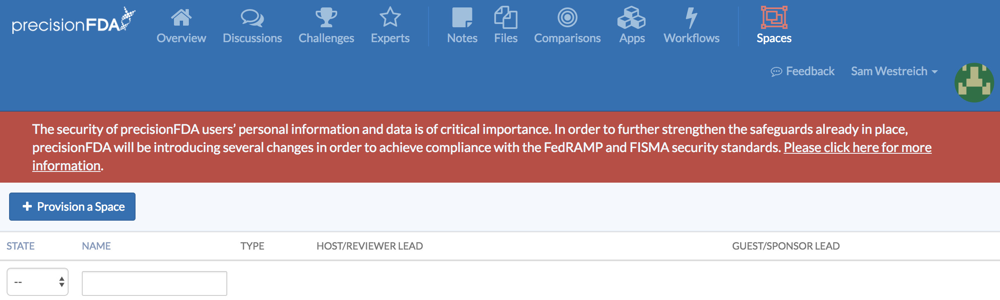

You must select **review** as the type of space.

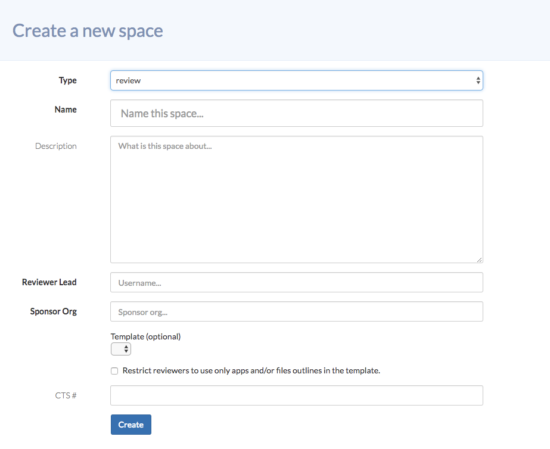

You can then provide a name for the space, a description, and a reviewer lead and sponsor org.**The reviewer** lead should be either yourself or the person leading the review, as their account will have permission to complete the space setup process.**The sponsor org** should be the organization whose work you are reviewing. You may also choose to load a template space that was used for app verification, if you choose to do so.

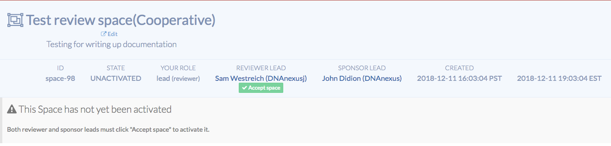

After creating the review space, both the reviewer lead and the sponsor org must accept the space. Both groups will receive an email prompting them to accept the space, and they must log in to precisionFDA to do so.

## Using the Confidential Review Space

Once the review space has been accepted by both groups, it will activate, and both the review lead and the sponsor org administrator may log into their **confidential spaces**. From here, they may add files, apps, jobs and notes, and they may add other members to the space.

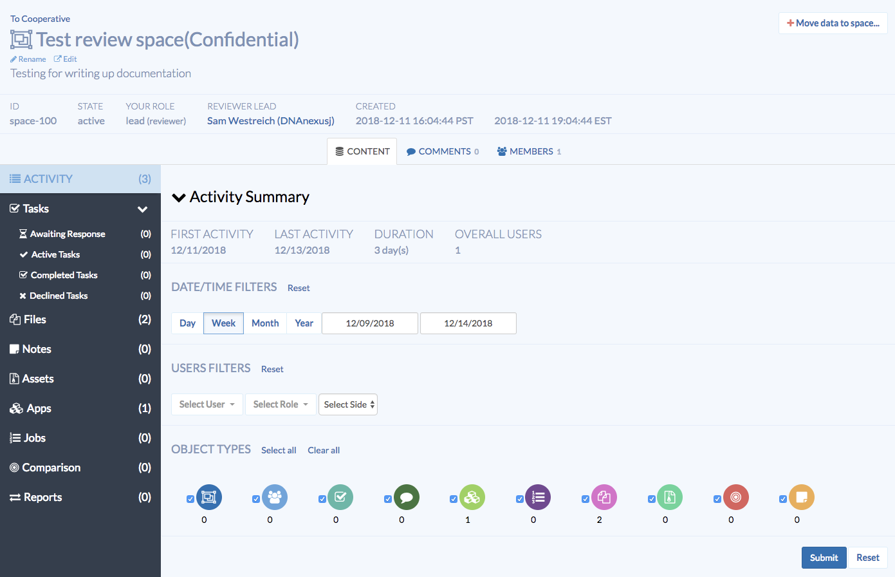

To add data to a space, you can click on the **Move data to space** button located in the upper right hand corner. To invite other users to a space, you can click on the **Members** tab, located in the middle of the page, and add them by username. When adding new members, you may also set their permissions level for the space.

## Using the Cooperative Review Space

To access the shared, cooperative review space, you can click the link labeled **To Cooperative** in the upper left, next to the name of the review space.

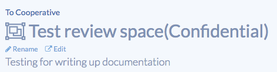

**The cooperative space** appears very similar to the private space, and includes all of the same features. You can add files, notes, assets, apps and jobs, and run apps in this space. Here, however, you’ll note that the members of both spaces have access - any data objects you add to this space can be accessed by both parties, so make sure you only add objects that you wish to share!

To add data directly to the cooperative space, you can use the **Move data to space** button located in the upper right corner, just like in the private space.

If you wish to transfer a data object from your private, confidential space to the shared, cooperative space, you may do so by going to the page of that data object.

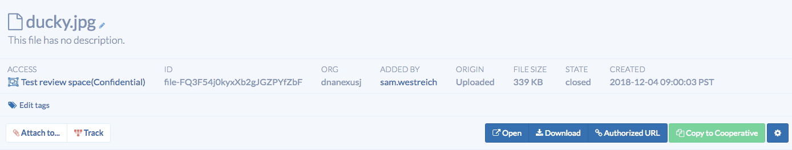

If this data object does not currently exist in the cooperative space, you will see a green button labeled **Copy to Cooperative**. When you click this button, a copy of this data object will be created in the shared cooperative space. Once again, note that this action cannot be undone, so you will receive an **Are you sure?** prompt.

## Running Workflows in Review Spaces

Similar to apps, workflows can be made available in group, verification, and review spaces. There are two methods for moving a workflow to a space: 1) publishing the workflow from the “Workflows” screen, or 2) moving the workflow to a space from the “Spaces” screen.

Workflows cannot be removed from a space once added, so take caution when adding a workflow to a space. Additionally, once a workflow has been added to one space, it cannot be added to any other space. However, a workflow can be “forked” to create a new copy of the workflow that can optionally be modified and then added to another space if desired.

## Publishing a Workflow

To publish a workflow, go to the workflows tab, select the workflow you would like to publish, and then select the ‘Publish’ button. An example is shown below.

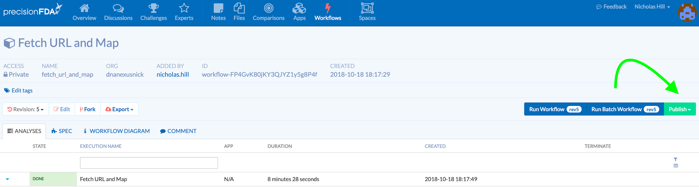

Upon pressing ‘Publish’, the spaces you have available will appear as a set of selections. Find and choose the workspace that you would like to publish the workflow to. An example is shown below.

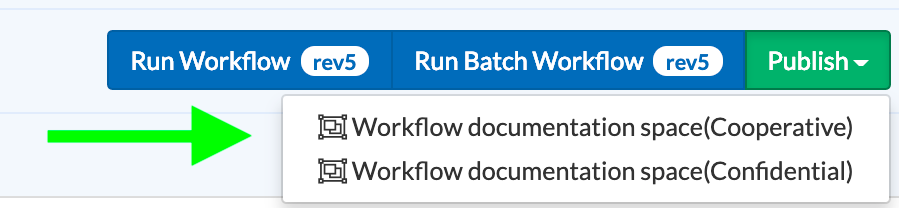

This will take you to a page which will ask if you are willing to share the objects which are included in the workflow that is being published. If, for example, a component app was privately built by you, then you must check “share” to include all of the resources contained within that app. Alternatively, if the component object in your workflow is public, it will be automatically shared to the space. See the example case below.

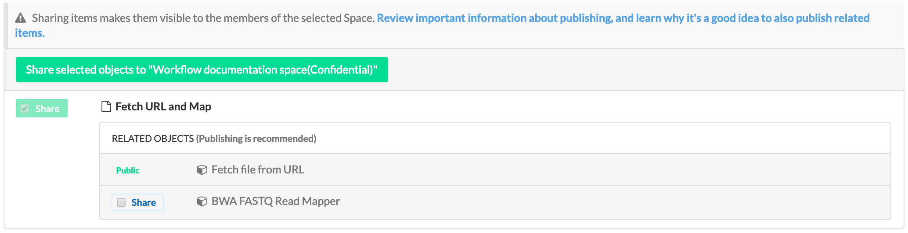

Once the ‘Share’ button has been checked, the resources contained in the object that will be shared will appear.

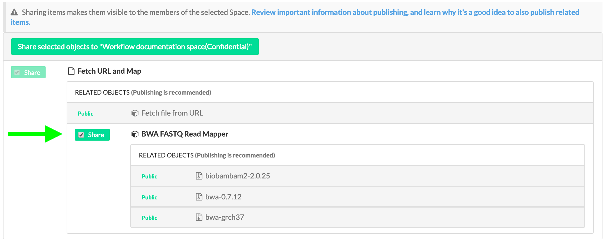

After you’ve decided to share all of the data objects within the workflow, you may press 'Share select objects to “<space name>”'. The workflow will then be published to that space. Only public objects can be shared with cooperative spaces. Both public and private objects can be shared to confidential spaces.

## Moving a workflow

A workflow may also be added to a Space by clicking the “Move data to space…” button in the upper right corner, and selecting the workflow in the popup.

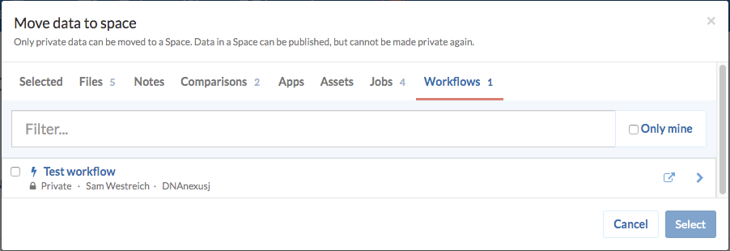

After the workflow has been added to the space, it is now runnable in the space, and can be accessed under the “Workflows” tab on the left side.

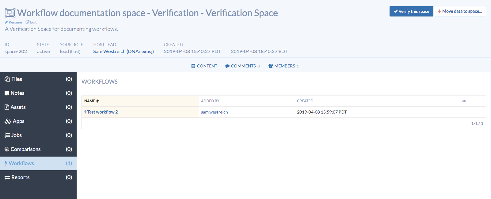
