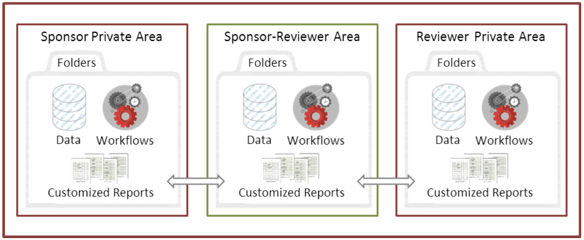
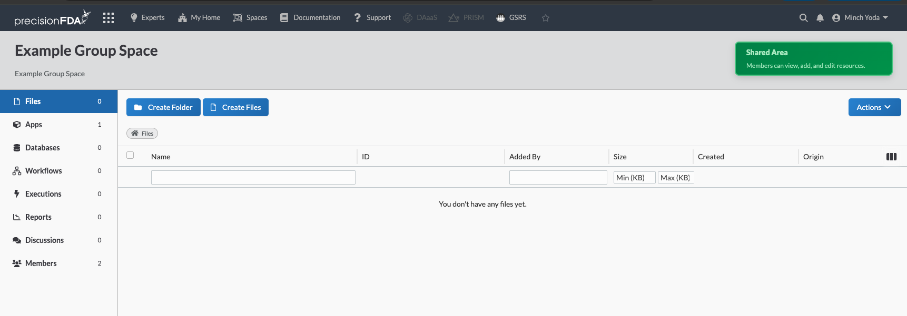
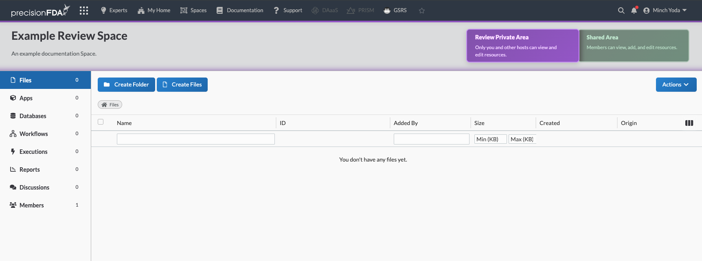
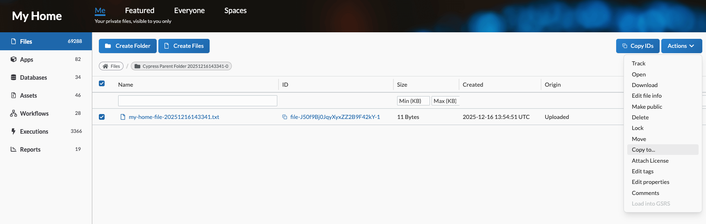
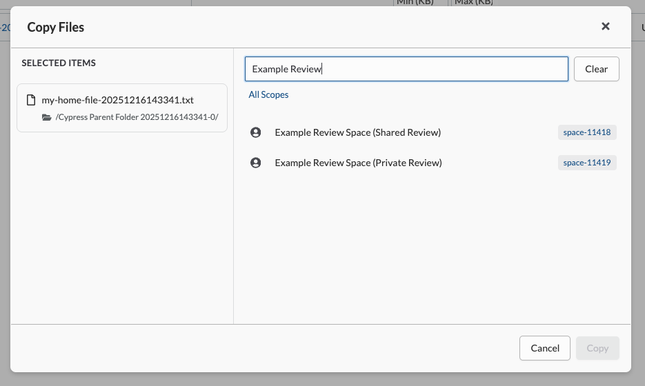
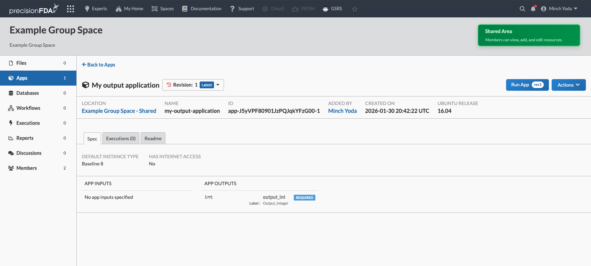
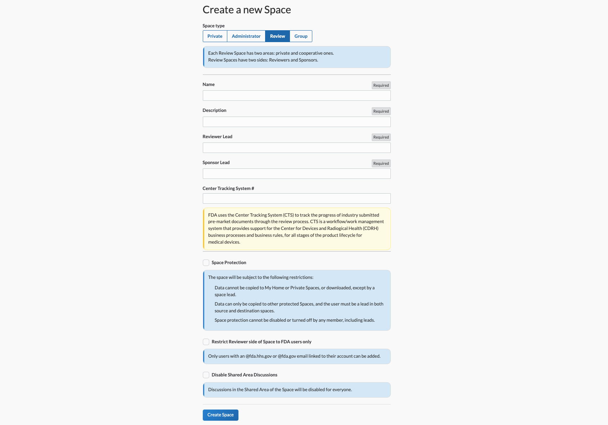

**Spaces** are collaborative environments on precisionFDA, where multiple users may work together and share files, apps, executions, and more.

There are several different types of Spaces:

* **Group Spaces** provide a single shared environment, where multiple users may access data objects uploaded or copied to the Space.
* **Review Spaces** are custom environments on precisionFDA, designed to let two collaborating groups work cooperatively on a project. Review Spaces include 3 different areas - one for the reviewer, one for the sponsor organization, and a shared cooperative area.

* **Government Spaces** are a form of Group Space where access is limited to users with a .gov email associated with their account. Non-government users may not be added to this Space.
* **Private Spaces** are single-person Spaces accessible only to the user who created them; they're a useful way to archive old data.

## Requesting a new Space

Most Spaces must be initially created by a precisionFDA administrator. If you need a new Group, Review, or Government Space, it can be requested via email to [precisionFDA@fda.hhs.gov](mailto:precisionfda@fda.hhs.gov).

Any user can create any number of Private Spaces. Keep in mind that Private Spaces do not have a membership feature; no one else can access a Private Space except for you. It's like an extension from your My Home area.

To begin working with a sponsor org as a review lead, you will need a Review Space.

## Using Group Spaces

Once a Space Administrator has created your Group Space, it will activate, and both the host lead and the guest lead may log into the Space. From here, they may add files, apps, executions, and discussions, and they may add other members to the space.

To add data to a space, you can click on the **Create Files** button located in the upper left hand corner. This will bring up a modal where you can copy in existing files on the precisionFDA platform (such as in My Home or another Space), or you can directly upload files from your local computer to the Space.

To invite other users to a space, you can click on the **Members** tab, located in the left-hand navigation bar on the page, and add them by username. When adding new members, you may also set their permissions level for the space:

* Administrator - able to add, remove, and modify data in the Space. Able to add, remove, and modify the permissions of other members of the Space.
* Contributor - able to add, remove, and modify data in the Space.
* Viewer - able to see all data in the Space and can copy it out, but cannot add, modify, or delete any data in the Space.

## Using Review Spaces

Review Spaces are a special three-area Space, set up between a reviewer and a sponsor. Each side gets their own private area, while both sides have access to a shared area.

> Important note: you will only ever see two of the three areas of the Review Space! If you are on the Reviewer side, you cannot see the Sponsor's private area, and vice versa.

To access the shared, cooperative area of the Review Space, click the green button labeled **Shared Area** in the upper right, opposite to the name of the Review Space. To swap back to the private area of the Review Space, click the purple button labeled **Private Area**.

**The Shared Area** appears very similar to the private area, and includes all of the same features. You can add files, assets, apps, executions, and Discussions, and can run apps in this space. Here, however, you’ll note that the members of both sides of the Review Space have access - any data objects you add to this space can be accessed by both the reviewers and the sponsors, so make sure you only add objects that you wish to share!

To add data directly to the Shared Space, you can use the **Create Files** button located in the upper left corner.

If you wish to transfer a data object from your Private Area to the Shared Area, you may do so by going to the page of that data object.

Click the checkbox to select the object(s), and then click the Actions menu, then select Copy to... in the dropdown. This should bring up a list of all Spaces; for Review Spaces, each area (Private vs. Shared) will be listed separately. Select the appropriate area then click Copy on the modal.

When adding members to a Review Space, note that they will be added to your "team," either Sponsor or Reviewer. They will be able to see the Shared Area and the Private Area for your team. If you are a reviewer, do not add any sponsors to the Review Space! They'll be able to see the Reviewer Private Area if you add them. Ask the Sponsor Lead to add them.

## Running Apps and Workflows in Review Spaces

Apps and workflows can be made available in Group and Review Spaces. There are two methods for moving an app or workflow to a Space: 1) publishing the app or workflow from your My Home area, or 2) moving the app or workflow to a Space from the “Spaces” screen.

After the workflow has been added to the Space, it is now runnable in the Space, and can be accessed under the "Apps" or “Workflows” tab on the left side.

## For Space Admins: Creating new Spaces

For Space Admins, new Spaces can be created by navigating to the Spaces Overview area of precisionFDA from the top menu bar and selecting **Create Space**.

You may select a Space type: Administrator (visible and accessible only to Site Admins), Review, or Group.

You can then provide a name for the Space, a description, and a two leads of the Space. Note that this information can be changed later, once the Space is created.

If creating a Group Space, there is no functional difference between the Host vs. Guest Lead roles.

If creating a Review Space, the **Reviewer Lead** should be either yourself or the person leading the review. The **Sponsor Lead** should be the representative of the organization whose work you are reviewing.

After creating the Review Space, both the Reviewer and Sponsor Leads will receive an email notifying them that the new Space was created.

If, at a later point, either Lead wishes to pass their Lead role on to another member of the Space on their side, they may do so from the Members page by selecting the awardee and clicking Change Role.
