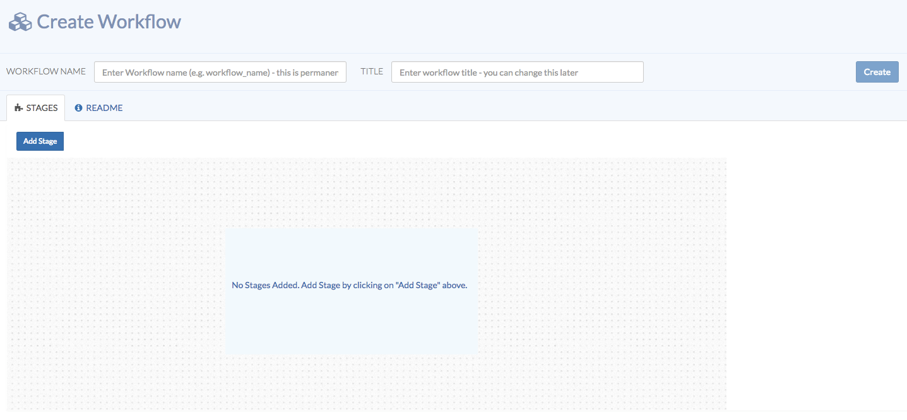
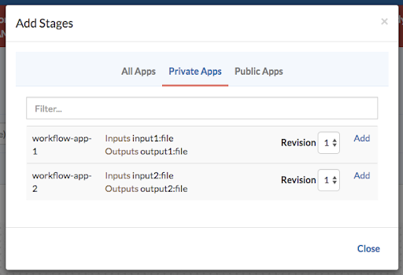
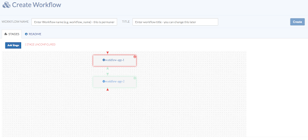
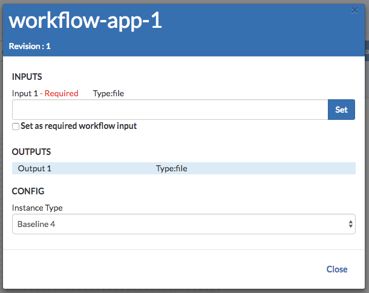
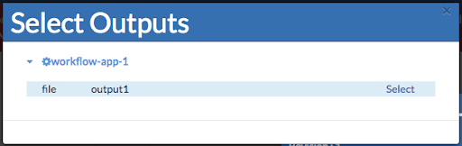
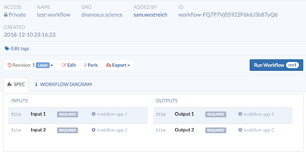

> [!warning]
> The content on this page may be outdated. Please refer to the new [tutorials](/tutorials/apps/introduction).

Workflows on precisionFDA allow multiple applications to be chained together, with the output from one application serving as the input for the next. A workflow is an object, just like an app. You can build a unique workflow, save it, and rerun it as many times as you choose. Workflows can be edited to update app versions, add or remove apps, and make other configuration changes whenever you choose to do so.

## Creating a Workflow

To create a workflow, navigate to the Workflows page and select **Create Workflow**.

On this page, you can choose a **name** and **title** for the workflow. Note that, just like an app name, the workflow name is **permanent and cannot be changed later.**

## Add apps to a Workflow

To add apps to the workflow, click on **Add Stage**. You may add either public apps, private apps, or a combination of the two.

Workflows are **private** by default, so private apps may be used in a workflow. You may select which revision of an app you choose to add to the workflow by using the dropdown menu. Click the **Add** button next to an app to add it to the workflow.

After apps have been added to the workflow, they will appear on the **workflow diagram grid**. Each app is shown as a box, which is highlighted to show whether it is properly configured (green) or needs additional attention (red).

## Configure a Workflow's apps

To configure each app in a workflow, click the **app name**. You must specify the source of each input to that app for it to be properly configured.

Each input can either come from another app in the workflow, or can be set as required workflow input by using the checkbox. All inputs that are set as required workflow input must be specified when you run the workflow (similar to how you specify inputs when running an app).

Because workflows are linear, inputs to the first app in the workflow must be set as required workflow input. Inputs to later apps further downstream in the workflow can either be set as required inputs, or can come from the output of previous apps.

To set an app input as the output from a previous app, click the blue **Set** button on the right. This will bring up a list of all outputs from other apps in the workflow. You may select the desired output by clicking **Select**.

Once an app in a workflow is properly configured, the highlighted box around the app will change from red to green. Similarly, the color of the funnels that indicate inputs and outputs for that app will change from red to green as they are configured. For a workflow to run successfully, all required inputs must be green.

To remove an app from a workflow, you may click the **small X** in a circle in the upper-right corner of that app's box.

You may add documentation and additional information about the workflow in the **Readme tab**.

> [!info] Tip
> After you have created a workflow, it can be executed from the Workflows page, just like running an app. A workflow can be edited to create a new revision; apps may be added, removed, and inputs and/or outputs may be changed. After a workflow has run, all outputs are provided in the output location.

## Publishing/Moving Workflows to Spaces

A workflow may be published/moved to a group, review, or verification space. See the [Spaces](/guides/spaces) documentation for details.
