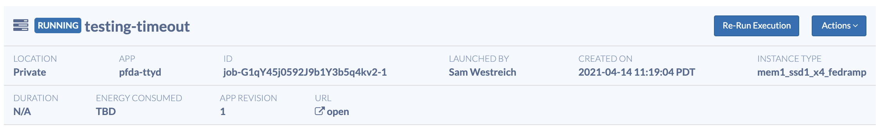

> [!warning]
> The content on this page may be outdated. Please refer to the new [tutorials](/tutorials/apps/introduction).

Workstations are a class of apps on precisionFDA that are "interactive". Most apps on precisionFDA are non-interactive: you provide inputs, the app follows a set script, and creates outputs if it finishes successfully. Workstations are interactive; they create an environment where the user may enter any command they choose.

## Workstation Types

There are currently two types of Workstations on precisionFDA:

1) **TTYD** - this Workstation provides an Ubuntu command-line terminal interface.

2) **JupyterLab** - this Workstation provides a JupyterLab server graphical interface. The Jupyter interface supports running Python or R notebooks, as well as a built-in terminal.

## Access to Workstations

In order to run a Workstation, your account needs additional authorization. You can request Workstations authorization by sending an email to precisionFDA Support (precisionfda@fda.hhs.gov).

If you do not have authorization, you will receive an error message when you click "Run" on a Workstation app.

## Launching a Workstation

Workstations may be found in the public Apps repository, similar to other apps.

Here are links to current Workstations:

[TTYD Workstation, for command line access](https://precision.fda.gov/home/apps/app-G1gY2BQ0KJ893JfK3jBYP2v5-1)

[JupyterLab Workstation, for creating and running Jupyter notebooks](https://precision.fda.gov/home/apps/app-G1gY5900XgB9pFq87g5bgz92-1)

When you launch a Workstation, it will take 2-5 minutes for the worker to initialize. Once the Execution page states that the execution is "Running", you may access the Workstation. A link will appear in the middle of the page, labeled "Open."

Clicking on this "Open" link will open the Workstation in a new tab, bringing up a terminal interface (**TTYD** Workstation) or the Jupyter interface (**JupyterLab** Workstation).

## Accessing files and data on Workstations

When you run a Workstation, you have full admin access on the worker, as well as unrestricted internet access.

You may install packages with "sudo pip" or "sudo apt-get".

`sudo apt-get install pigz`

You may install Python packages with pip.

`sudo pip install numpy`

You may download any public-facing file with wget.

`wget http://www.usadellab.org/cms/uploads/supplementary/Trimmomatic/Trimmomatic-0.36.zip`

You can pull GitHub repositories with Git.

`git clone https://github.com/lh3/bwa.git`

#### Accessing data on precisionFDA

Workstations have full access to your private files in your precisionFDA cloud environment. You can interact with these files using `pFDA CLI` commands.

`./pfda ls` will show all files on your private precisionFDA area.

`./pfda download <$file-id>` will download a file from precisionFDA to the local worker. You may also use filename instead but it might not be unique.

`./pfda upload-file <$filename>` will upload a file from the local worker to your precisionFDA private area.

To learn more about pFDA CLI capabilities, please check our dedicated [CLI docs](/guides/cli) page.

## Creating snapshots on Workstations

Workstations support the ability to create a snapshot, which takes a picture of all modifications to the Workstation since it was launched and can be seen as a "save point". The snapshot action creates a tarball that contains all modified files, which is placed in a user's precisionFDA private area as a \*.snapshot data object.

After a snapshot file is created, a new execution of a Workstation may be launched, with the snapshot data object as an optional input. If a snapshot is provided as input, it will be unpacked on the worker instance and all files will be placed in the locations where they were located when the snapshot was created.

To take a snapshot in the TTYD Workstation, navigate to the execution page and click on the "Snapshot" button. You'll be given a default name that you can override, and an option to terminate the workstation once the snapshot has been created.

To take a snapshot with the JupyterLab Workstation, click on the "snapshot" option under the "precisionFDA" menu in the top menu bar.

Once created and synched (via termination of the Workstation), a snapshot file will appear in your private Files area. You can recognize these files, as they will end in ".snapshot". This file may be an optional input to a new Workstation execution.

**NOTE:** In order to run the snapshot generation command, Python2.7 must be included in the $PYTHONPATH variable. Installing Python managers, such as Conda/BioConda, may alter this path. If you see a failure to generate the snapshot, check to see if this path has been changed by running`echo $PYTHONPATH`.

## Terminating Workstations

**TTYD** Workstations will terminate after 30 days.

**Jupyter** Workstations will terminate after 4 hours (240 minutes) by default. This timeout can be adjusted, either by providing a custom duration as an input or by using the "Adjust Duration" option in the Jupyter interface.

You can terminate a Workstation at any time by selecting "Terminate" from the Execution detail page.

Any uploaded files on a Workstation, pushed to the cloud using \`dx upload\`, will **not** appear on precisionFDA in your private area until the execution is synced, or until it is terminated. This syncing will happen automatically upon execution termination, but can be triggered to happen earlier by clicking on "Sync now" on the Execution detail page.

Note that after a Workstation is terminated, any files on the worker are no longer accessible! Make sure to upload your work, or take a snapshot of the worker, before terminating.
