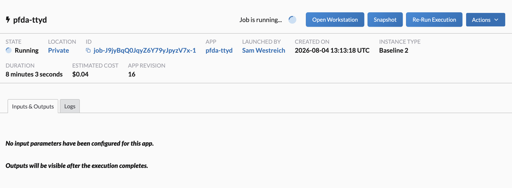
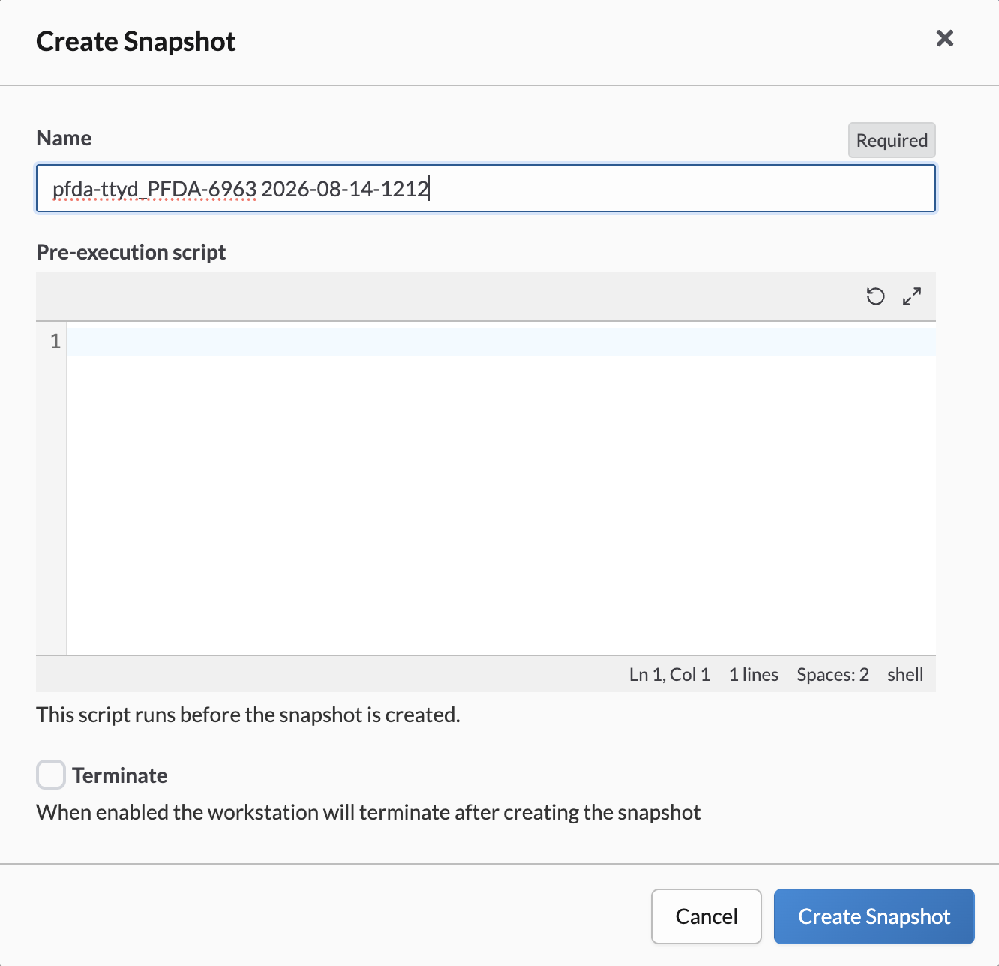

Workstations are a class of apps on precisionFDA that are "interactive". Most apps on precisionFDA are non-interactive: you provide inputs, the app follows a set script, and creates outputs if it finishes successfully. Workstations are interactive; they create an environment where the user may enter any command they choose.

## Workstation Types

There are currently three types of Workstations on precisionFDA:

1) **TTYD** - this Workstation provides an Ubuntu command-line terminal interface.

2) **Guacamole** - this Workstation provides a full graphical desktop environment accessible directly from your web browser, powered by [Apache Guacamole](https://guacamole.apache.org/). No plugins or client software are required — Guacamole is a clientless remote desktop gateway that supports VNC, RDP, and SSH protocols.

3) **JupyterLab** - this Workstation provides a JupyterLab server graphical interface. The Jupyter interface supports running Python or R notebooks, as well as a built-in terminal.

## Access to Workstations

In order to run a Workstation, your account needs additional authorization. You can request Workstations authorization by sending an email to precisionFDA Support (precisionfda@fda.hhs.gov).

If you do not have authorization, you will receive an error message when you click "Run" on a Workstation app.

## Launching a Workstation

Workstations may be found in the public Apps repository, similar to other apps.

Here are links to current Workstations:

[TTYD Workstation, for command line access](https://precision.fda.gov/home/apps/app-series-1131)

[Guacamole Workstation, for graphical desktop access](https://precision.fda.gov/home/apps/app-series-1369)

[JupyterLab Workstation, for creating and running Jupyter notebooks](https://precision.fda.gov/home/apps/app-series-1130)

When you launch a Workstation, it will take 2-5 minutes for the worker to initialize. Once the Execution page states that the execution is "Running", you may access the Workstation by clicking the "Open Workstation" button in the top-right actions of the page.

Clicking "Open Workstation" will open the Workstation in a new tab, bringing up a terminal interface (**TTYD** Workstation), a graphical desktop (**Guacamole** Workstation), or the Jupyter interface (**JupyterLab** Workstation).

## Accessing files and data on Workstations

When you run a Workstation, you have full admin access on the worker, as well as unrestricted internet access.

You may install packages with "sudo pip" or "sudo apt-get".

`sudo apt-get install pigz`

You may install Python packages with pip.

`sudo pip install numpy`

You may download any public-facing file with wget.

`wget http://www.usadellab.org/cms/uploads/supplementary/Trimmomatic/Trimmomatic-0.36.zip`

You can pull GitHub repositories with Git.

`git clone https://github.com/lh3/bwa.git`

#### Accessing data on precisionFDA

Workstations have full access to files in your precisionFDA cloud environment. You can interact with these files using `pFDA CLI` commands.

`./pfda ls` will show all files on your precisionFDA area.

`./pfda download <$file-id>` will download a file from precisionFDA to the local worker. You may also use filename instead but it might not be unique.

`./pfda upload-file <$filename>` will upload a file from the local worker to your precisionFDA area.

To learn more about pFDA CLI capabilities, please check our dedicated [CLI docs](/guides/cli) page.

## Creating snapshots on Workstations

Workstations support the ability to create a snapshot, which takes a picture of all modifications to the Workstation since it was launched and can be seen as a "save point". The snapshot action creates a tarball that contains all modified files, which is placed in the job's context area as a \*.snapshot data object.

After a snapshot file is created, a new execution of a Workstation may be launched, with the snapshot data object as an optional input. If a snapshot is provided as input, it will be unpacked on the worker instance and all files will be placed in the locations where they were located when the snapshot was created.

To take a snapshot, navigate to the execution page and click on the "Snapshot" button. You'll be given a default name that you can override, and an option to terminate the workstation once the snapshot has been created.

Once created and synched (via termination of the Workstation), a snapshot file will appear in your context area Files. You can recognize these files, as they will end in ".snapshot". This file may be an optional input to a new Workstation execution.

#### Excluded paths

The following paths are excluded from the snapshot:

- `/proc*`
- `/tmp*`
- `/run*`
- `/boot*`
- `/sys*`
- `/var/log*`
- `/var/lib/lxc*`
- `/var/lib/docker*`
- `/var/lib/containerd*`
- `/var/lib/.workstation*`

#### Pre-script

When creating a snapshot, you may optionally provide a pre-script, which is a shell script that will run before the snapshot process begins. This is useful for tasks such as cleaning up temporary files, backing up data, or gracefully shutting down a database prior to capture. If the pre-script exits with a non-zero code, the snapshot will not proceed.

**Note:** Pre-script is not supported for prior versions of Workstation apps (TTYD revision 16 or earlier, Guacamole revision 24 or earlier, and JupyterLab revision 11 or earlier).

## Terminating Workstations

All Workstations will terminate after 30 days.

You can terminate a Workstation at any time by selecting "Terminate" from the Execution detail page.

Note that after a Workstation is terminated, any files on the worker are no longer accessible! Make sure to upload your work, or take a snapshot of the worker, before terminating.
