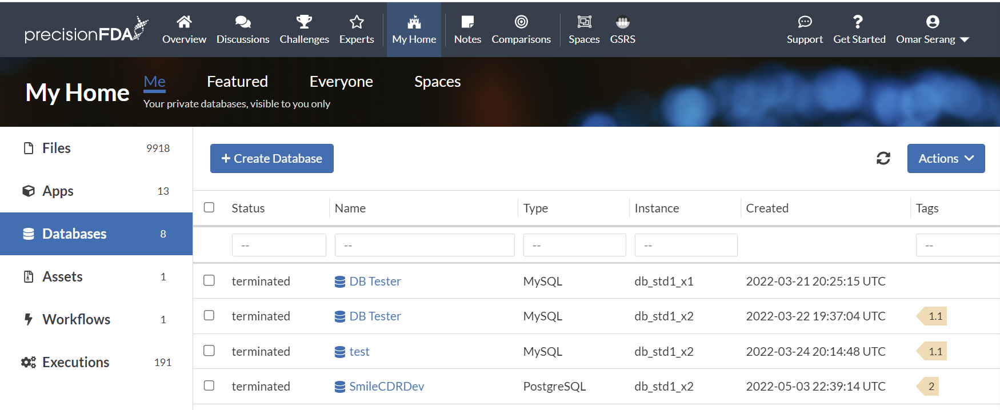
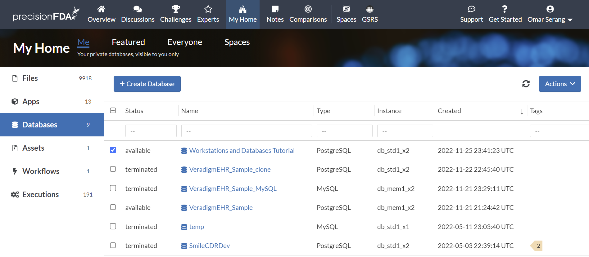
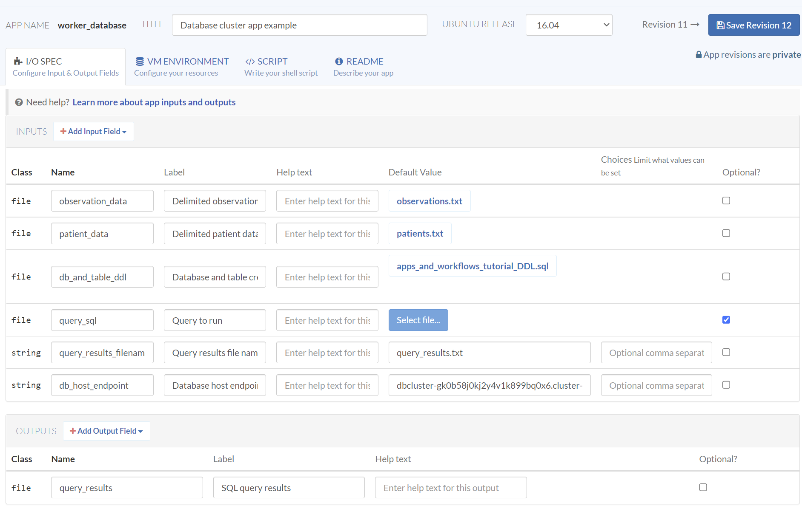
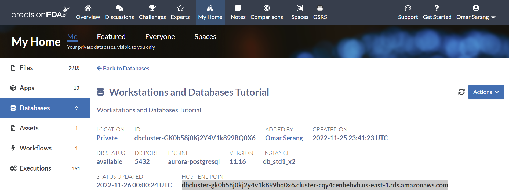
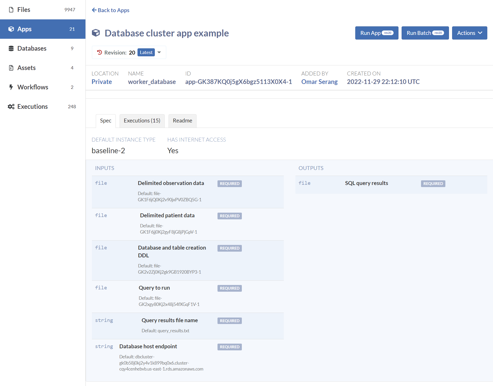
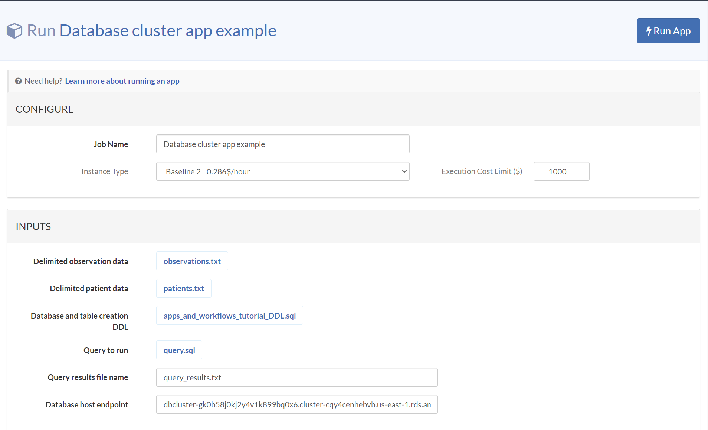

import Image from 'next/image';
import image56 from './assets/image56.png';
import image25 from './assets/image25.png';

## Database App: *worker_database*

This app demonstrates the use of a precisionFDA Database cluster (PostgreSQL), a convenient and very power resource for RDBMS-based analytics. You will need to be authorized for DB Clusters in order to create the database for this app.

### Create the Database

Select the Databases tab in My Home and click the Create Database button.



Create a "Workstations and Databases Tutorial" database, "password", PostgreSQL 11.16 on the smallest available database instance type, and click the Submit button.


<Image height="500" src={image56} width="500" alt="doc"/>

Refresh the database status using the <Image height="500" src={image25} width="30" alt="doc"/> button until the database is available.



### Fork *workstation_layout_inspection* to *workstation_database* app 

Using My Home / Apps, select the worker_layout_inspection app and select Fork. Name the new application *worker_database* titled "Database cluster app example".

#### Specify the I/O Spec

Update the I/O spec to the following:

<table>
  <thead>
    <tr>
      <th>Class</th>
      <th>Input Name</th>
      <th>Label</th>
      <th>Default Value</th>
    </tr>
  </thead>
  <tbody>
  <tr>
    <td>file</td>
    <td>observation data</td>
    <td>Delimited data file for ETL into OBSERVATION table.</td>
    <td>observations.txt</td>
  </tr>
  <tr>
    <td>file</td>
    <td>patient_data</td>
    <td>Delimited data file for ETL into PATIENT table.</td>
    <td>patients.txt</td>
  </tr>
  <tr>
    <td>file</td>
    <td>db_and_table_ddl</td>
    <td>Database and table creation DDL</td>
    <td></td>
  </tr>
  <tr>
    <td>file</td>
    <td>query_sql</td>
    <td>Query to run</td>
    <td>(optional)</td>
  </tr>
  <tr>
    <td>string</td>
    <td>db endpoint url</td>
    <td>Database host endpoint</td>
    <td></td>
  </tr>
  <tr>
    <td>string</td>
    <td>query_results_: fi lename</td>
    <td>Query results file name</td>
    <td>query_results.txt</td>
  </tr>
  </tbody>
  <thead>
    <tr>
      <th>Class</th>
      <th>Output Name</th>
      <th>Label</th>
      <th></th>
    </tr>
  </thead>
  <tbody>
  <tr>
    <td>file</td>
    <td>query_results</td>
    <td>SQL query results</td>
    <td></td>
  </tr>
  </tbody>
</table>



#### Specify the VM Environment

Update the VM environment to keep internet access enabled, Baseline 2 default instance type, and remove the pfda_cli_2.2 and ubuntu_asset assets so that only the worker_layout_inspection asset remains. Note that it can take minutes for the list of assets to loaded before they can be searched.

#### Specify the Script

Enter the following Script:
```bash
set -euxo pipefail

# Install postgres client
sudo apt install -y postgresql-client
psql --version

# Inspect the database and table DDL
# and the three data files for ETL.
# Two data files specified as inputs.
#cat "$db_and_table_ddl_path"
#cat "$observation_data_path"
#cat "$patient_data_path"

# Third data file installed with the worker_layout_inspection asset
#cat /work/countries.txt

# Connect to the DB cluster and list the databases
PGPASSWORD="password" psql -h "$db_host_endpoint" -U root -d postgres -c '\l'

# Create the apps_and_workflows_tutorial_db and three tables
PGPASSWORD="password" psql -h "$db_host_endpoint" -U root -d postgres -f "$db_and_table_ddl_path"
PGPASSWORD="password" psql -h "$db_host_endpoint" -U root -d apps_and_workflows_tutorial_db -c '\d'

# ETL the OBSERVATION table data
PGPASSWORD="password" psql -h "$db_host_endpoint" -U root -d apps_and_workflows_tutorial_db -c "\copy public.\"OBSERVATION\" from '/work/in/observation_data/observations.txt' delimiter '|' NULL ''"

PGPASSWORD="password" psql -h "$db_host_endpoint" -U root -d apps_and_workflows_tutorial_db -c "select * from public.\"OBSERVATION\""

# ETL the PATIENT table data
PGPASSWORD="password" psql -h "$db_host_endpoint" -U root -d apps_and_workflows_tutorial_db -c "\copy public.\"PATIENT\" from '/work/in/patient_data/patients.txt' delimiter '|' NULL ''"

PGPASSWORD="password" psql -h "$db_host_endpoint" -U root -d apps_and_workflows_tutorial_db -c "select * from public.\"PATIENT\""

# ETL the COUNTRY table data
PGPASSWORD="password" psql -h "$db_host_endpoint" -U root -d apps_and_workflows_tutorial_db -c "\copy public.\"COUNTRY\" from '/work/countries.txt' delimiter '|' NULL ''"

PGPASSWORD="password" psql -h "$db_host_endpoint" -U root -d apps_and_workflows_tutorial_db -c "select * from public.\"COUNTRY\""

# Run the specified query and put the results into the specified filename.
PGPASSWORD="password" psql -h "$db_host_endpoint" -U root -d apps_and_workflows_tutorial_db -f "$query_sql_path" | tee -a "$query_results_filename"

emit "query_results" "$query_results_filename"
```

#### Specify the Readme

Enter a Readme and Create the app.
```
Connect to a database cluster and create a database and three tables. Load two tables with data provided as input files, and the third table with data from an asset. Present a specified query file and retrieve the query results file.
```
### Run the app

Click on the Workstations and Databases Tutorial database to open the detail page and copy the host endpoint URL.



Run the app providing the database host endpoint URL copied above, and leave the remaining inputs at their default values.





### Inspect the execution logs

View the logs for the *Database cluster app example* execution using the Actions dropdown menu. Let's look at a condensed and annotated version of the log output to understand what our app just did.
```bash
# Install the assets and file inputs on the worker filesystem
Fetching asset worker_layout_inspection2.tar (file-GK1xxbQ0Kj2gBZjxF244F21k)
downloading file: file-GK2xgy80Kj2x48j54fXGqF1V to filesystem: /work/in/query_sql/query.sql
downloading file: file-GK1F6jj0Kj2gyF8jG8jPjGpV to filesystem: /work/in/patient_data/patients.txt
downloading file: file-GK2v2Zj0Kj2gk9GB1920BYP3 to filesystem: /work/in/db_and_table_ddl/apps_and_workflows_tutorial_DDL.sql
downloading file: file-GK1F6jQ0Kj2v90jxPV0ZBQ5G to filesystem: /work/in/observation_data/observations.txt

# Install postgres CLI client and display version
++ sudo apt install -y postgresql-client
++ psql --version
psql (PostgreSQL) 9.5.25

# Providing the password, connect to the specified host,
# user root, database postgres, and list the databases on the cluster.
++ PGPASSWORD=password
++ psql -h dbcluster-gk0b58j0kj2y4v1k899bq0x6.cluster-cqy4cenhebvb.us-east-1.rds.amazonaws.com -U root -d postgres -c '\l'
                                                List of databases
                  Name                  |  Owner   | Encoding |   Collate   |    Ctype    |   Access privileges   
----------------------------------------+----------+----------+-------------+-------------+-----------------------
 apps_and_workflows_tutorial_db         | root     | UTF8     | en_US.UTF-8 | en_US.UTF-8 | 
 postgres                               | root     | UTF8     | en_US.UTF-8 | en_US.UTF-8 | 
 rdsadmin                               | rdsadmin | UTF8     | en_US.UTF-8 | en_US.UTF-8 | rdsadmin=CTc/rdsadmin
 template0                              | rdsadmin | UTF8     | en_US.UTF-8 | en_US.UTF-8 | =c/rdsadmin          +
                                        |          |          |             |             | rdsadmin=CTc/rdsadmin

# Create a new database and tables
++ PGPASSWORD=password
++ psql -h dbcluster-gk0b58j0kj2y4v1k899bq0x6.cluster-cqy4cenhebvb.us-east-1.rds.amazonaws.com -U root -d postgres -f /work/in/db_and_table_ddl/apps_and_workflows_tutorial_DDL.sql
 template1                              | root     | UTF8     | en_US.UTF-8 | en_US.UTF-8 | =c/root              +
                                        |          |          |             |             | root=CTc/root
 workstations_and_databases_tutorial_db | root     | UTF8     | en_US.UTF-8 | en_US.UTF-8 | 
(6 rows)

 pg_terminate_backend 
----------------------
(0 rows)

DROP DATABASE
CREATE DATABASE
You are now connected to database "apps_and_workflows_tutorial_db" as user "root".
CREATE TABLE
CREATE TABLE
CREATE TABLE

# Connect to the new database and list the new tables
++ PGPASSWORD=password
++ psql -h dbcluster-gk0b58j0kj2y4v1k899bq0x6.cluster-cqy4cenhebvb.us-east-1.rds.amazonaws.com -U root -d apps_and_workflows_tutorial_db -c '\d'
          List of relations
 Schema |    Name     | Type  | Owner 
--------+-------------+-------+-------
 public | COUNTRY     | table | root
 public | OBSERVATION | table | root
 public | PATIENT     | table | root
(3 rows)

# ETL the OBSERVATION table from the specified file.
++ PGPASSWORD=password
++ psql -h dbcluster-gk0b58j0kj2y4v1k899bq0x6.cluster-cqy4cenhebvb.us-east-1.rds.amazonaws.com -U root -d apps_and_workflows_tutorial_db -c '\copy public."OBSERVATION" from '\''/work/in/observation_data/observations.txt'\'' delimiter '\''|'\'' NULL '\'''\'''
COPY 5
++ PGPASSWORD=password
++ psql -h dbcluster-gk0b58j0kj2y4v1k899bq0x6.cluster-cqy4cenhebvb.us-east-1.rds.amazonaws.com -U root -d apps_and_workflows_tutorial_db -c 'select * from public."OBSERVATION"'
 observation_id | patient_id | observation_name |   loinc   | created_date 
----------------+------------+------------------+-----------+--------------
           9870 |      12345 | Annual check up  | 66678-4   | 2022-11-01
           9871 |      12345 | Emergency        | LG32756-5 | 2022-11-02
           9872 |      12346 | Clinic visit     | 66678-4   | 2022-11-03
           9873 |      12347 | Lab results      | 74418-5   | 2022-11-04
           9874 |      12347 | Post-op checkup  | 65375-8   | 2022-11-05
(5 rows)

# ETL the PATIENT table from the specified file.
++ PGPASSWORD=password
++ psql -h dbcluster-gk0b58j0kj2y4v1k899bq0x6.cluster-cqy4cenhebvb.us-east-1.rds.amazonaws.com -U root -d apps_and_workflows_tutorial_db -c '\copy public."PATIENT" from '\''/work/in/patient_data/patients.txt'\'' delimiter '\''|'\'' NULL '\'''\'''
COPY 3
++ PGPASSWORD=password
++ psql -h dbcluster-gk0b58j0kj2y4v1k899bq0x6.cluster-cqy4cenhebvb.us-east-1.rds.amazonaws.com -U root -d apps_and_workflows_tutorial_db -c 'select * from public."PATIENT"'
 patient_id |     name      | gender |  zip  | country_id | created_date 
------------+---------------+--------+-------+------------+--------------
      12345 | Fred Foobar   | M      | 94040 |       1001 | 2022-10-25
      12346 | Mary Merry    | F      | 94040 |       1002 | 2022-09-24
      12347 | Barney Rubble | M      | 94040 |       1003 | 2022-08-23
(3 rows)

# ETL the COUNTRY table as installed from the asset.
++ PGPASSWORD=password
++ psql -h dbcluster-gk0b58j0kj2y4v1k899bq0x6.cluster-cqy4cenhebvb.us-east-1.rds.amazonaws.com -U root -d apps_and_workflows_tutorial_db -c '\copy public."COUNTRY" from '\''/work/countries.txt'\'' delimiter '\''|'\'' NULL '\'''\'''
COPY 3
++ PGPASSWORD=password
++ psql -h dbcluster-gk0b58j0kj2y4v1k899bq0x6.cluster-cqy4cenhebvb.us-east-1.rds.amazonaws.com -U root -d apps_and_workflows_tutorial_db -c 'select * from public."COUNTRY"'
 country_id | country_name 
------------+--------------
       1001 | USA
       1002 | CAN
       1003 | EU
(3 rows)

# Run the specified query.
++ PGPASSWORD=password
++ psql -h dbcluster-gk0b58j0kj2y4v1k899bq0x6.cluster-cqy4cenhebvb.us-east-1.rds.amazonaws.com -U root -d apps_and_workflows_tutorial_db -f /work/in/query_sql/query.sql
++ tee -a query_results.txt
Expanded display is on.
-[ RECORD 1 ]----+----------------
patient_id       | 12345
name             | Fred Foobar
gender           | M
zip              | 94040
country_id       | 1001
created_date     | 2022-10-25
observation_id   | 9870
observation_name | Annual check up
loinc            | 66678-4
created_date     | 2022-11-01
country_id       | 1001
country_name     | USA
-[ RECORD 2 ]----+----------------
patient_id       | 12345
name             | Fred Foobar
gender           | M
zip              | 94040
country_id       | 1001
created_date     | 2022-10-25
observation_id   | 9871
observation_name | Emergency
loinc            | LG32756-5
created_date     | 2022-11-02
country_id       | 1001
country_name     | USA
-[ RECORD 3 ]----+----------------
patient_id       | 12346
name             | Mary Merry
gender           | F
zip              | 94040
country_id       | 1002
created_date     | 2022-09-24
observation_id   | 9872
observation_name | Clinic visit
loinc            | 66678-4
created_date     | 2022-11-03
country_id       | 1002
country_name     | CAN
-[ RECORD 4 ]----+----------------
patient_id       | 12347
name             | Barney Rubble
gender           | M
zip              | 94040
country_id       | 1003
created_date     | 2022-08-23
observation_id   | 9873
observation_name | Lab results
loinc            | 74418-5
created_date     | 2022-11-04
country_id       | 1003
country_name     | EU
-[ RECORD 5 ]----+----------------
patient_id       | 12347
++ emit query_results query_results.txt
name             | Barney Rubble
gender           | M
zip              | 94040
country_id       | 1003
created_date     | 2022-08-23
observation_id   | 9874
observation_name | Post-op checkup
loinc            | 65375-8
created_date     | 2022-11-05
country_id       | 1003
country_name     | EU
```