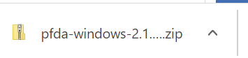
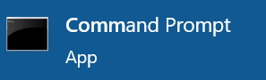
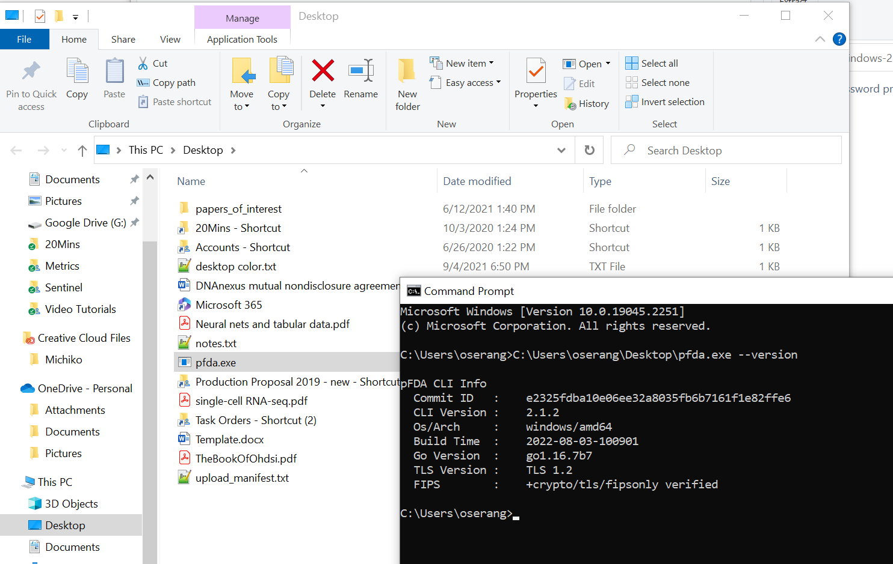
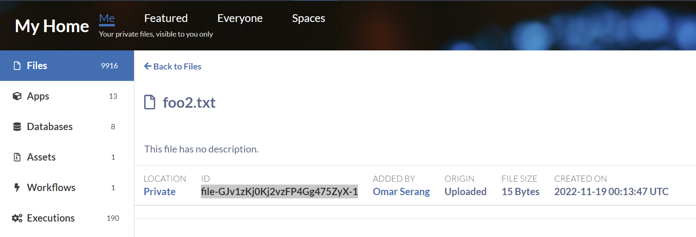
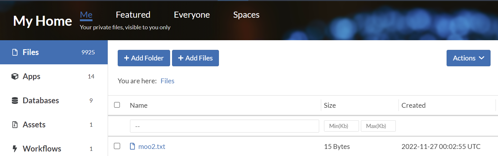

import Image from 'next/image';
import image1 from './assets/image1.png';
import image2 from './assets/image2.png';
import image3 from './assets/image3.png';
import image4 from './assets/image4.png';
import image6 from './assets/image6.png';
import image7 from './assets/image7.png';

The precisionFDA CLI is useful for programmatic uploading and downloading of files from Windows, MacOS, and Linux clients (e.g. your laptop) to and from precisionFDA. Installation and testing for Windows and Linux OS are described below.

Under My Home Assets, click on the How to create assets button to find links to the precisionFDA CLI, and the button to generate the temporary authorization key that you'll use with the CLI.

<div style={{'display':'grid','gridTemplateColumns':'1fr 1fr','gap':'16px'}}>
  <Image src={image1} alt="1"></Image>
  <div>
    <Image width="500" height="500" src={image2} alt="2"/>
    <Image width="500" height="500" src={image3} alt="3"/>
    <Image width="500" height="500" src={image4} alt="4"/>
  </div>
</div>

### Windows

Click the Windows download button to place the zip file and double click it in the browser footer to open it. 



Click on Extract all to decompress the pfda CLI and browse to select the Desktop as the destination for the pfda.exe file. NOTE: On FDA laptops, you will need to install the pfda.exe file in C:\temp\ or you will get a permissions error when trying to run it.

<div style={{"display":"grid","gridTemplateColumns":"1fr 1fr","gap":"16px"}}>
  <Image width="500" height="500" src={image6} alt="1" />
  <Image width="500" height="500" src={image7} alt="1" />
</div>


Using the Windows start menu, bring up a Command Prompt window with the pfda.exe file visible in a file explorer side-by-side. Drag *pfda.exe* onto the Command Prompt window to expand the full path the executable and add *--version* and hit return.





First, copy a file ID to test downloading, and retrieve an authorization key that is required for all file transfers.



```
# Provide the auth key
set key=<paste key>

# Download the selected file
C:\Users\oserang\Desktop\pfda.exe download -key <key> -file-id file-GJv1zKj0Kj2vzFP4Gg475ZyX-1

# Copy it to a new file and upload it
copy foo2.txt moo2.txt
C:\Users\oserang\Desktop\pfda.exe upload-file -file moo2.txt

dir *.txt
11/26/2022  04:26 PM                15 foo2.txt
11/26/2022  04:26 PM                15 moo2.txt 
```


### Linux

Copy the download URL and install and test uploading and downloading files. First, copy a file ID to test downloading, and retrieve an authorization key that is required for all file transfers.


```
-- Install pfda CLI
wget <paste URL from CLI download>
tar xf pfda-linux-<version>.tar.gz 
mv pfda /usr/bin/
pfda --version

-- Provide the auth key
key="<paste key>"

-- Download the selected file
pfda download -key $key -file-id file-GJv1zKj0Kj2vzFP4Gg475ZyX-1

-- Copy it to a new file and upload it
cp foo2.txt moo2.txt
pfda upload-file -key $key -file moo2.txt

ls *.txt
foo2.txt  moo2.txt
```

