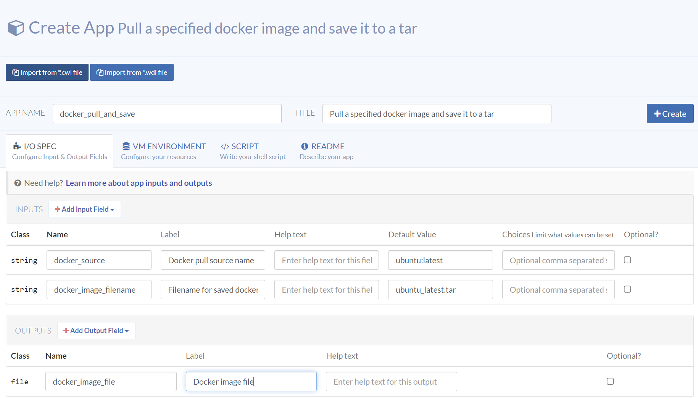
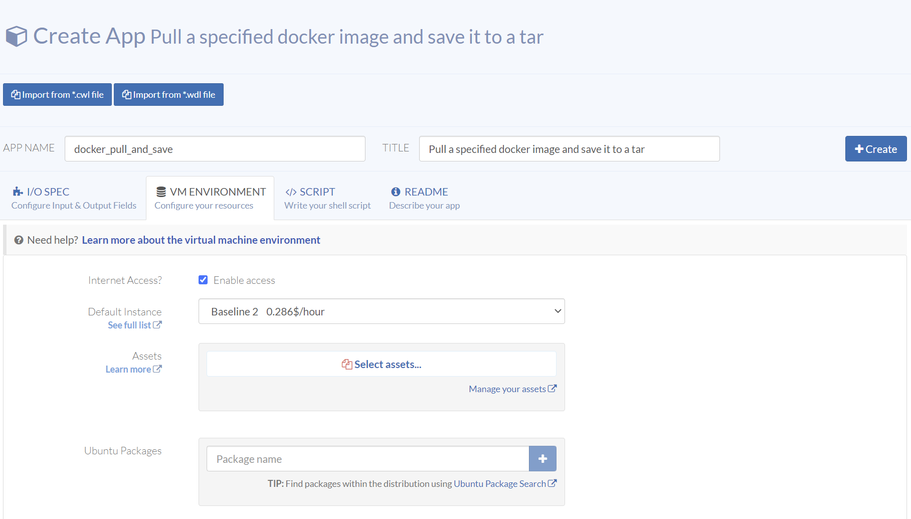
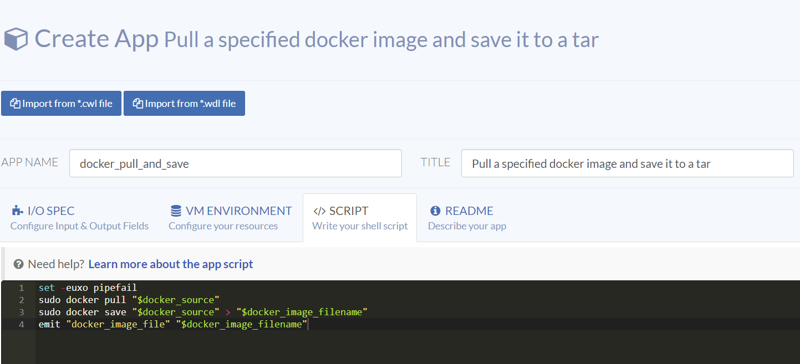
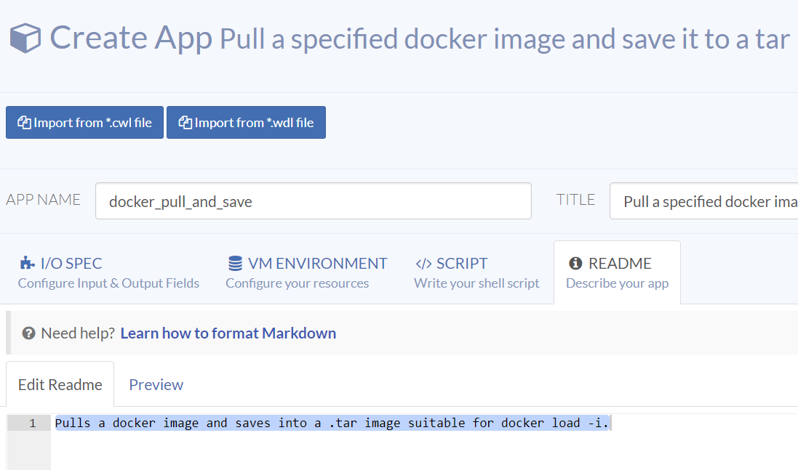
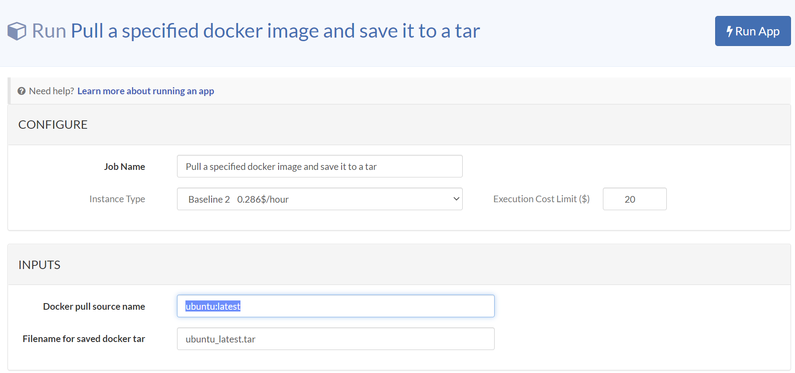
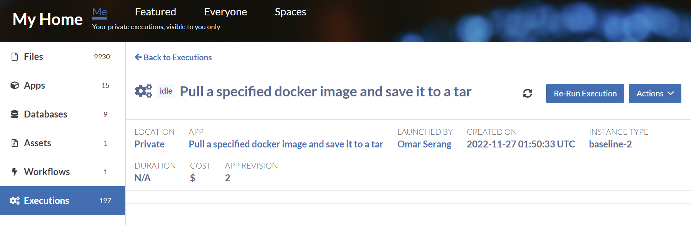
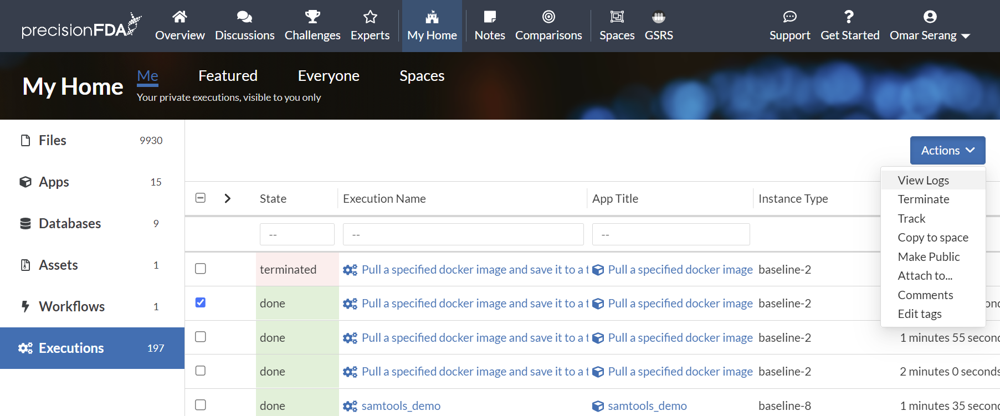
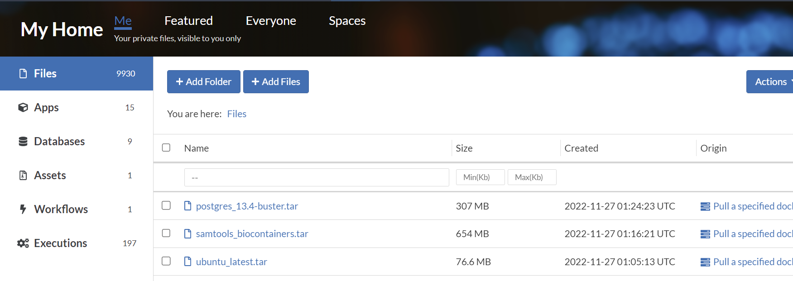

## docker_pull_and_save

The first app demonstrates the use of string input variables, allowing the app to access the internet, how to use the emit shell function to output a named file. This app pulls a docker image and saves it to a .tar file suitable for use in precisionFDA apps. We'll create three image files in our Files:

<table>
  <thead>
    <tr><th></th><th>docker_source</th><th>docker_image_filename</th></tr>
  </thead>
  <tbody>
    <tr><td>1</td><td>ubuntu:latest</td><td>ubuntu_latest.tar</td></tr>
    <tr><td>2</td><td>biocontainers/samtools:v1.9-4-deb_cv1</td><td>samtools_biocontainers.tar</td></tr>
    <tr><td>3</td><td>postgres:13.4-buster</td><td>postgres_13.4-buster.tar</td></tr>
  </tbody>
</table>

### Create the docker_pull_and_save App

From My Home / Apps, click on Create App to create the *docker_pull_and_save* app. In the I/O Spec tab, add the input and output fields.



Select the VM Environment tab, enable internet access, and select Baseline 2 as the default instance type.



Select the Script tab and enter the following shell script:
```bash
set -euxo pipefail
sudo docker pull "$docker_source"
sudo docker save "$docker_source" > "$docker_image_filename"
emit "docker_image_file" "$docker_image_filename"
```

The set -euxo pipefail set is advisable at the start of all your app scripts. The docker source string is resolved and used to pull the image and to save it to the docker image filename. Lastly the resulting image is saved as a precisionFDA file with the specified image filename.



Select the Readme tab and describe your app, then hit the Create button to create your app.



### Run the docker_pull_and_save App

Run this app three times with the inputs listed above. You don't have to wait for one to finish to start the others as they will run in parallel.





Select one of the completed executions My Home / Executions for the app and View Logs using the Action dropdown menu and we can see the desired actions took place and the image .tar files appear in My Home / Files.



```
Downloading files using 2 threads++ set -euxo pipefail

++ sudo docker pull postgres:13.4-buster

13.4-buster: Pulling from library/postgres
.
.
.
Status: Downloaded newer image for postgres:13.4-buster

++ sudo docker save postgres:13.4-buster

++ emit docker_image_file postgres_13.4-buster.tar
```


