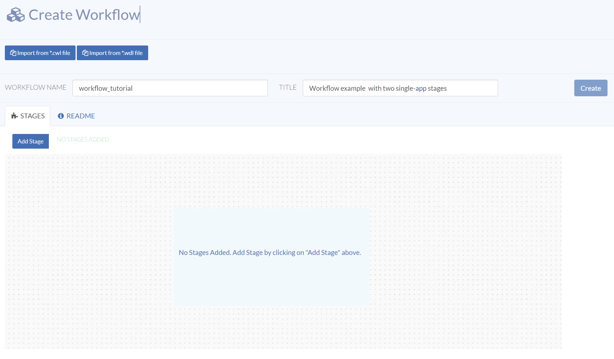
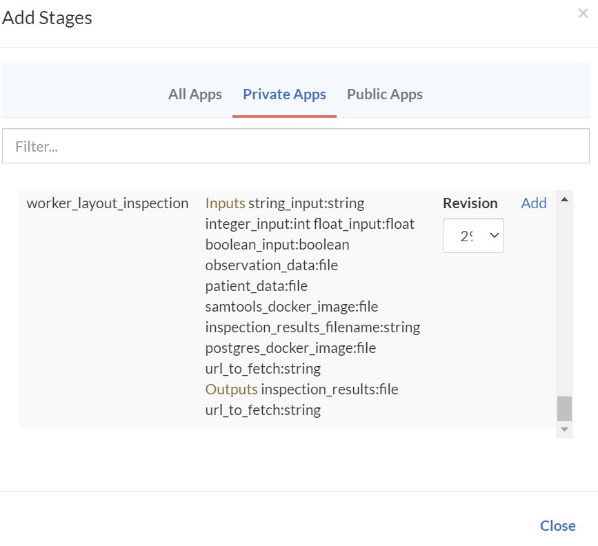
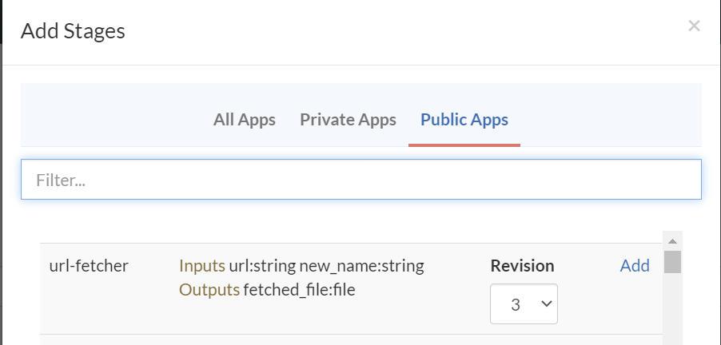
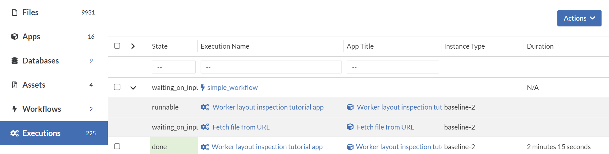
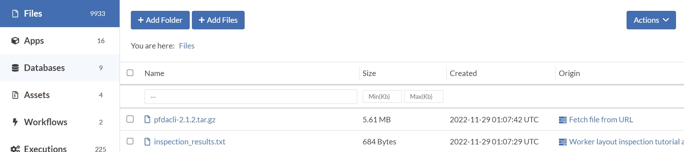

import Image from 'next/image';
import image37 from './assets/image37.png';
import image38 from './assets/image38.png';
import image39 from './assets/image39.png';
import image40 from './assets/image40.png';
import image41 from './assets/image41.png';
import image42 from './assets/image42.png';
import image43 from './assets/image43.png';
import image44 from './assets/image44.png';
import image45 from './assets/image45.png';
import image46 from './assets/image46.png';
import image47 from './assets/image47.png';
import image48 from './assets/image48.png';

## simple_workflow

Workflows enable you to string together multiple stages, each running on its own instance type and its own app(s). Outputs from a given stage can be routed to inputs in the next stage. We will create this workflow using the web interface. In My Home / Workflows, click Create Workflow and name it *simple_workflow* with a title "Workflow example with two single-app stages".

### Add the workflow stages

Click the Add Stage button and add the private workflow_layout_inspection app to the stage.

Add a second stage with the public url-fetcher app.

### Configure the workflow stages

Now we are ready to configure the stages.

<Image height="500" src={image37} width="400" alt="doc"/>

Click on Stage 1 to display the worker_layout_inspection app's configuration; we will accept all the default values provided in the app so there is nothing more that needs to be configured for Stage 1.

<Image height="500" src={image38} width="200" alt="doc"/>

Click on Stage 2 to display the url-fetcher app's configuration. Note the red color indicating that a required input has not been specified either from the output of a previous stage, or explicitly in the workflow stage's input spec.

Click the <Image height="500" src={image39} width="30" alt="doc"/> button to enter an explicit URL for this Stage.

<Image height="500" src={image40} width="300" alt="doc"/>

However, we want to specify this input field using the output field from the previous stage by clicking on the <Image height="500" src={image41} width="30" alt="doc"/> button.

<Image height="500" src={image42} width="300" alt="doc"/>

<Image height="500" src={image43} width="300" alt="doc"/>

Select the Baseline 2 instance type to override the app default value and close the stage. Note that everything is green now and ready to Create.

<Image height="500" src={image44} width="500" alt="doc"/>

You can view the two stages of your new workflow.

<Image height="500" src={image45} width="500" alt="doc"/>
<Image height="500" src={image46} width="500" alt="doc"/>

### Run the workflow

Click on the Run Workflow button, accept all the default values for the workflow_layout_inspection stage, but enter *pfdacl.tar.gz* in the *Rename into* field in the second stage, then run the workflow.

<Image height="500" src={image47} width="500" alt="doc"/>
<Image height="500" src={image48} width="500" alt="doc"/>

In the Executions tab, expand the simple_workflow listing to see the two executions associated with the workflow.

Once the stages have completed, the workflow is done and we can open the executions associated with the stages and inspect the logs. Also note the inspection results file from stage 1 and the renamed fetched URL file from stage 2.

