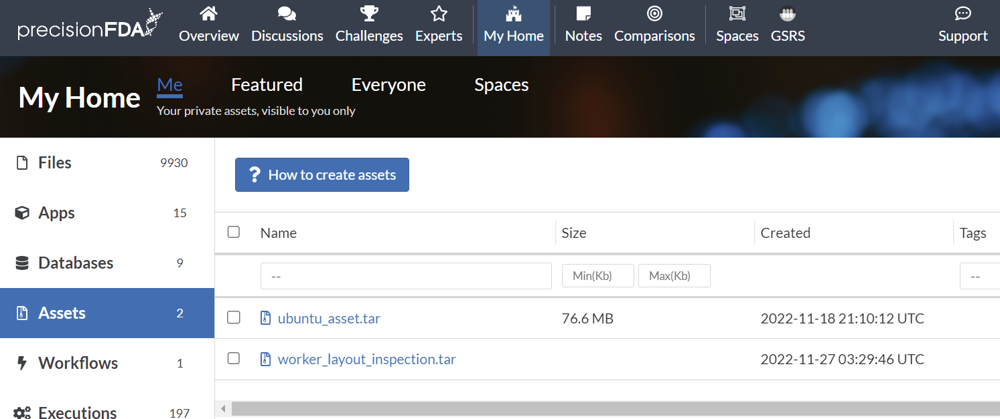
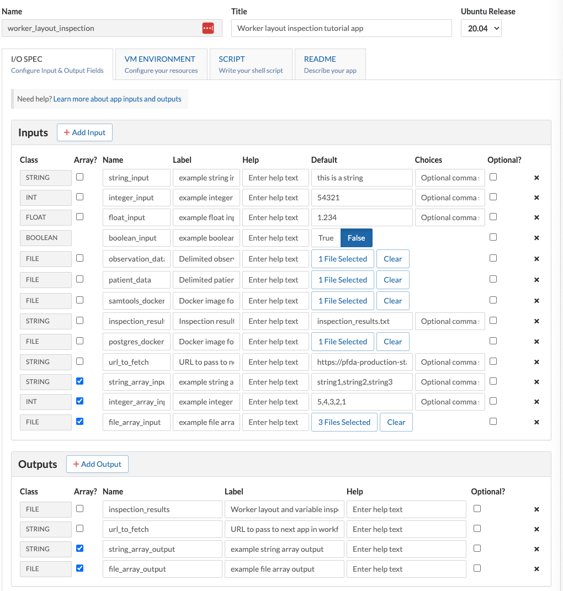
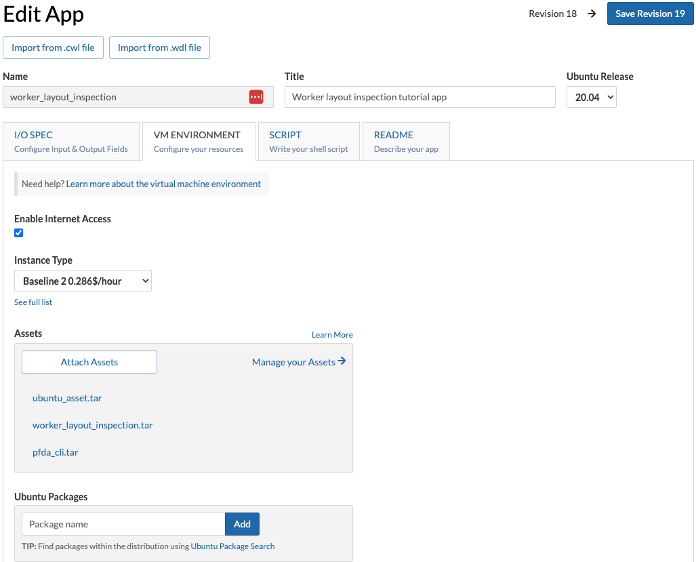
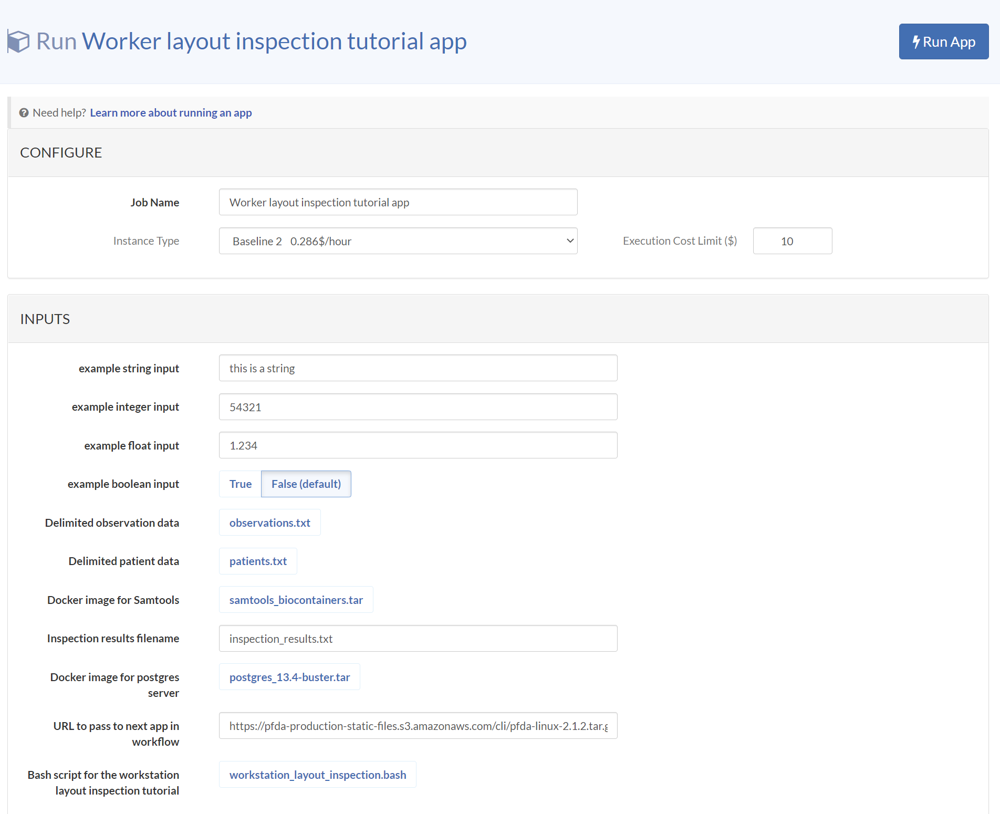
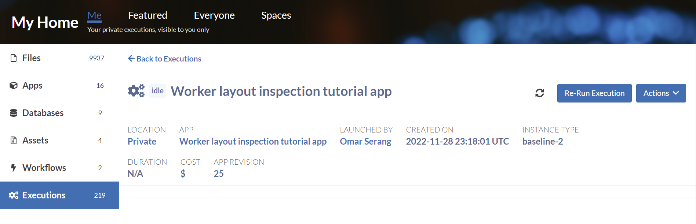
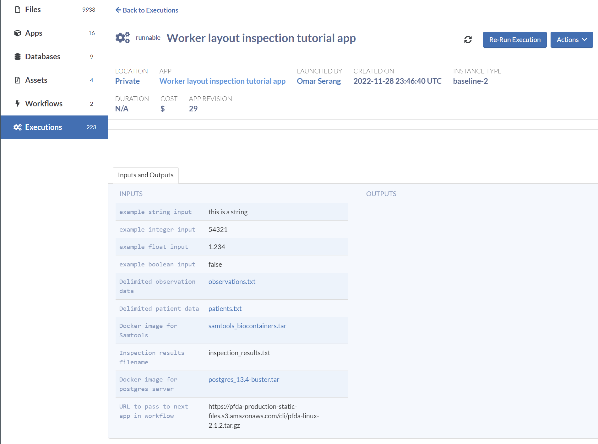
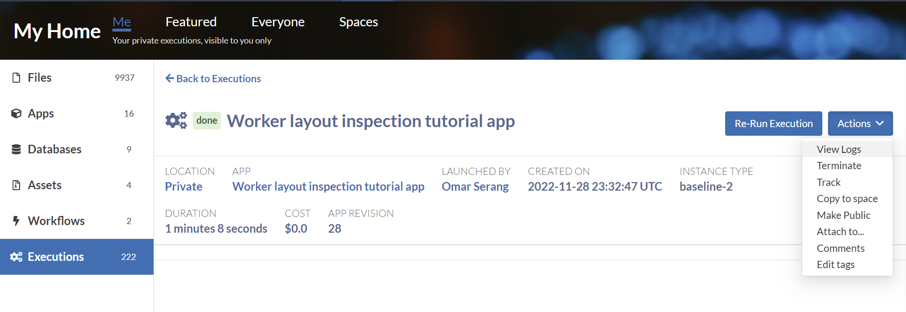
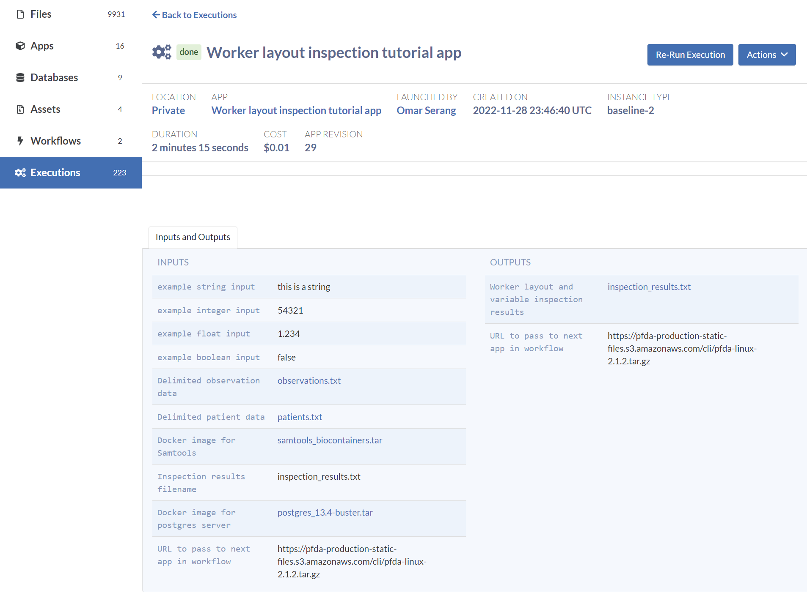

import Image from 'next/image';
import image1 from './assets/image1.png';
import image3 from './assets/image3.png';
import image4 from './assets/image4.png';

## worker_layout_inspection

Since assets are such a great app developer convenience, our second app, worker_layout_inspection, will illustrate the use of assets and inputs for presenting code and data to the app. First let's create some assets that will be incorporated into the app. Additionally, since Docker is also such a great app developer tool, the incorporation of Docker images into the app by packaging them in an asset or providing them as an input file, are both illustrated.

### Create an asset with code and data

#### Layout your asset directories and files

The file system structure that you layout in your asset will be overlaid on the worker / (root) mount when the app is run. If you've include code in the asset's /usr/bin, it will be available to your app running on the worker. The app framework uses /work as the directory to present input files to apps so any files placed in the asset's /work directory will be available with other input files, though you could place files in whatever asset directory structure you want.

We going to construct our asset in a Linux shell, downloading from precisionFDA the following for inclusion in the asset:

- ubuntu_latest.tar (file-GK1FP9j05gK8z93Y1xGQpf5B-1)

- countries.txt (file-GK1F6j80Kj2XbJzx29f25y42-1)

Create your asset directory structure.
```bash
apt install tree
mkdir -p ~/fakeroot/work
mkdir -p ~/fakeroot/usr/bin
tree ~/fakeroot/
/home/dnanexus/fakeroot/
├── usr
│   └── bin
└── work
```
Create a shell script to install tree and run it, then move the script into the asset directory structure.
```bash
cat > tree_script.sh
  sudo apt install tree
  tree $1
  CTRL-D
chmod ugo+x tree_script.sh
./tree_script.sh ~
/home/dnanexus
├── EHR_Sample_backup_nodbcreate_postgres.sql
├── datafiles
│   ├── manifest.txt
│   ├── observations.txt
│   └── patients.txt
├── db_backups
mv tree_script.sh ~/fakeroot/usr/bin
```

Create a Readme file as required for the asset. This doesn't need to reside in the asset /fakeroot directory structure.

```
echo "Assets for the worker layout inspection tutorial app" > ~/readme.txt
```

Download the Docker and data files and move them into the asset directory structure. Under My Home Assets, click on the How to create assets button to find links to the precisionFDA CLI, and the button to generate the temporary authorization key that you'll use with the CLI.

<div style={{"display":"grid","gridTemplateColumns":"1fr 1fr","gap":"16px"}}>
  <Image width="500" height="500" src={image1} alt="1"></Image>
  <div>
      <Image width="500" height="500" src={image3} alt="3"></Image>
      <Image width="500" height="500" src={image4} alt="4"></Image>
  </div>
</div>
<br/>

```bash
key="..."

pfda download -key $key -file-id file-GK1FP9j05gK8z93Y1xGQpf5B-1
pfda download -key $key -file-id file-GK1F6j80Kj2XbJzx29f25y42-1
ls *.tar *txt
countries.txt  foo2.txt  moo2.txt  ubuntu_latest.tar

mv countries.txt postgres_13.4-buster.tar ubuntu_latest.tar ~/fakeroot/work tree ~/fakeroot

/home/dnanexus/fakeroot
├── usr
│   └── bin
│       └── tree_script.sh
└── work
    ├── countries.txt
    └── ubuntu_latest.tar
```

### Create the asset using the CLI

Now that the asset contents have been laid out, creating the asset on precisionFDA is a straightforward process using the precision FDA CLI.

```bash
key="..."

pfda upload-asset --key $key --name worker_layout_inspection.tar --root ~/fakeroot --readme ~/readme.txt

>> Archiving asset...

>> Finalizing asset...

>> Done! Access your asset at https://precision.fda.gov/home/assets/file-GK1JJB00Kj2fkz464yxB5zY2-1
```



#### Manually deploying an asset tar file

While this workflow should not be required, it is worth knowing to understand how assets work. Upload the asset tarball (e.g. *worker_layout_inspection.tar*) as a file, then in your app, add a file to the I/O Spec (e.g. "asset_tarball") and select this tarball as the default. Add the following line to the Script, right after the `set -euxo pipefail` command:

```
tar zxvf ${asset_tarball_path} -C / --strip-components=1 --no-same-owner
```
Everything that was installed in the fake_root/ in the tarball will be placed into the root directory of the worker, including any executable you may have. For example:
```
fake_root/usr/local/bin/sambamba
```
from the asset_tarball input, will be available in:
```
/usr/local/bin/sambamba
```
after the tar command above is run in the app script.

### Create the App and Specify the I/O Spec

In My Home / Apps, click the Create App button to create the *worker_layout_inspection* app. In the I/O Spec tab, add the input and output fields.



<table>
  <thead>
    <tr>
      <th>Class</th>
      <th>Array?</th>
      <th>Input Name</th>
      <th>Label</th>
      <th>Default Value</th>
    </tr>
  </thead>
  <tbody>
  <tr>
    <td>string</td>
    <td></td>
    <td>string_input</td>
    <td>example string input</td>
    <td>this is a string</td>
  </tr>
  <tr>
    <td>int</td>
    <td></td>
    <td>integer_input</td>
    <td>example integer input</td>
    <td>54321</td>
  </tr>
  <tr>
    <td>float</td>
    <td></td>
    <td>float_input</td>
    <td>example float input</td>
    <td>1.234</td>
  </tr>
  <tr>
    <td>boolean</td>
    <td></td>
    <td>boolean_input</td>
    <td>example boolean input</td>
    <td>FALSE</td>
  </tr>
  <tr>
    <td>file</td>
    <td></td>
    <td>observation_data</td>
    <td>Delimited observation data</td>
    <td>observations.txt</td>
  </tr>
  <tr>
    <td>file</td>
    <td></td>
    <td>patient data -</td>
    <td>Delimited patient data</td>
    <td>patients.txt</td>
  </tr>
  <tr>
    <td>file</td>
    <td></td>
    <td>samtools docker - image</td>
    <td>Docker image for Samtools</td>
    <td>samtools biocontaine rs.tar</td>
  </tr>
  <tr>
    <td>file</td>
    <td></td>
    <td>postgres_docker_ image</td>
    <td>Docker image for postgres server</td>
    <td>postgres_13.4- buster.tar</td>
  </tr>
  <tr>
    <td>string</td>
    <td></td>
    <td>inspection resul ts filename -</td>
    <td>Inspection results filename</td>
    <td>inspection_results.t xt</td>
  </tr>
  <tr>
    <td>string</td>
    <td></td>
    <td>url_to_fetch</td>
    <td>URL to pass to next app in workflow</td>
    <td>https://pfda- production-static- files.s3.amazonaws.c om/cli/pfda-linux- 2.2.tar.gz</td>
  </tr>

  <tr>
    <td>string</td>
    <td>Yes</td>
    <td>string_array_input image</td>
    <td>example string array input</td>
    <td>string1,string2,string3</td>
  </tr>
  <tr>
    <td>int</td>
    <td>Yes</td>
    <td>integer_array_input</td>
    <td>example integer array input</td>
    <td>5,4,3,2,1</td>
  </tr>
  <tr>
    <td>file</td>
    <td>Yes</td>
    <td>file_array_input</td>
    <td>example file array input</td>
    <td>(select three files)</td>
  </tr>
  </tbody>
  <thead>
    <tr>
      <th>Class</th>
      <th>Array?</th>
      <th>Output Name</th>
      <th>Label</th>
      <th></th>
    </tr>
  </thead>
  <tbody>
  <tr>
    <td>file</td>
    <td></td>
    <td>Inspection resul - ts</td>
    <td>Worker layout and variable inspection results</td>
    <td></td>
  </tr>
  <tr>
    <td>string</td>
    <td></td>
    <td>url_to_fetch</td>
    <td>URL to pass to next app in workflow</td>
    <td></td>
  </tr>
  <tr>
    <td>file</td>
    <td>Yes</td>
    <td>file_array_output</td>
    <td>example file array output</td>
    <td></td>
  </tr>
  <tr>
    <td>string</td>
    <td>Yes</td>
    <td>string_array_output</td>
    <td>example string array output</td>
    <td></td>
  </tr>
  </tbody>
</table>

#### Specify the VM Environment

In the VM Environment tab, enable internet access, select default instance Baseline 2, and add the following assets: worker_layout_inspection, pfda_cli_2.2, and ubuntu_asset.



#### Specify the Script

Add the following code to the script tab:
```bash
set -euxo pipefail

# Append the worker OS information to the specified inspection results file.
cat /etc/os-release  | tee -a "$inspection_results_filename"

# Install tree
sudo apt update
sudo apt install tree

# Inspect the scalar input variables.
echo "string_input" "$string_input" 
echo "integer_input" "$integer_input"
echo "float_input" "$float_input"
echo "url_to_fetch" "$url_to_fetch"
echo ""

# Inspect the file input variables and the different
# operators for accessing them on the worker FS.
echo "patient_data" "$patient_data"
echo "patient_data_name" "$patient_data_name"
echo "patient_data_path" "$patient_data_path"
echo "patient_data_prefix" "$patient_data_prefix"
echo ""
echo "observation_data" "$observation_data"
echo "observation_data_name" "$observation_data_name"
echo "observation_data_path" "$observation_data_path"
echo "observation_data_prefix" "$observation_data_prefix"
echo ""
echo "samtools_docker_image" "$samtools_docker_image"
echo "samtools_docker_image_name" "$samtools_docker_image_name"
echo "samtools_docker_image_path" "$samtools_docker_image_path"
echo "samtools_docker_image_prefix" "$samtools_docker_image_prefix"

# Use the pfda CLI that was loaded with the pfda_cli_2.2 asset.
ls -al /usr/bin/pfda*
pfda --version

# Use the simple script that was loaded with the worker_layout_inspection asset.
ls -al /usr/bin/tree_script.sh
tree_script.sh /work

# Using the Docker image that was loaded with the ubuntu_asset asset,
# we can run an up-to-date Ubuntu OS in a docker container on the worker.
# Append the container OS information to the specified inspection results file.
docker load -i /ubuntu_latest.tar
docker run --rm -v /work:/work -w /work ubuntu:latest cat /etc/os-release | tee -a "$inspection_results_filename"

# Using the Docker image that was provided as an input file,
# we can run samtools. Add inputs and outputs to this script and
# pass them to the samtools invocation to create your own
# samtools app.
docker load -i "$samtools_docker_image_path"
docker run --rm biocontainers/samtools:v1.9-4-deb_cv1 samtools --version

docker images
docker ps

# Pass the URL to fetch input to the same output variable to pass
# to the next app in the tutorial workflow (i.e. url fetcher).
emit "url_to_fetch" "$url_to_fetch"

# Save the inspection results file with specified name.
emit "inspection_results" "$inspection_results_filename"
```

#### Specify the Readme

Add the following in the Readme tab:
```
Produce an inspection report of the worker filesystem and file inputs from the context of the app.

Also provide the multiple representations available for file inputs.

Echo the non-file input variables.
```
### Run the app

In My Home / Apps, select the *worker_layout_inspection* app and click Run App to launch the latest version of the app with all default inputs.





Refresh the execution status using the  button until the job is first idle, runnable, running, and done, (or failed).



### Inspect the execution logs and the inspection results file

Note that the execution of the app took just over a minute and produced inspection_results.txt file and URL string outputs.





Select View Logs from the the Actions dropdown menu. Let's look at a condensed and annotated version of the log output to understand what our app just did.
```bash
# Worker initialization
Logging initialized (priority)
CPU: 20% (2 cores) * Memory: 779/3720MB * Storage: 32GB free * Net: 0↓/0↑MBps
umount: /proc/diskstats: not mounted
dxpy/0.331.0 (Linux-5.4.0-1088-aws-x86_64-with-Ubuntu-16.04-xenial)
/usr/sbin/rsyslogd already running.
bash running (job ID job-GK2ZQj00Kj2z9q76KbZbkG3G)

# Fetch the app's assets.
Fetching asset ubuntu_asset.tar (file-GJqz9J00Kj2zZQPGKVZBg436)
Fetching asset pfda_cli_2.2.tar (file-GJv0kFQ0Kj2YzFb86g4B8px5)
Fetching asset worker_layout_inspection2.tar (file-GK1xxbQ0Kj2gBZjxF244F21k)

# Download the input files.
downloading file: file-GK1F6jj0Kj2gyF8jG8jPjGpV to filesystem: /work/in/patient_data/patients.txt
downloading file: file-GK1F6jQ0Kj2v90jxPV0ZBQ5G to filesystem: /work/in/observation_data/observations.txt
downloading file: file-GK1FXK80pyBj68X3K6jVX55b to filesystem: /work/in/samtools_docker_image/samtools_biocontainers.tar
downloading file: file-GK1Fg68072kf3ZXYGJvxPGPj to filesystem: /work/in/postgres_docker_image/postgres_13.4-buster.tar

# The worker's OS release information.
cat /etc/os-release 
NAME="Ubuntu"
VERSION="16.04.7 LTS (Xenial Xerus)"
ID=ubuntu
ID_LIKE=debian
PRETTY_NAME="Ubuntu 16.04.7 LTS"
VERSION_ID="16.04"
HOME_URL="http://www.ubuntu.com/"
SUPPORT_URL="http://help.ubuntu.com/"
BUG_REPORT_URL="http://bugs.launchpad.net/ubuntu/"
VERSION_CODENAME=xenial
UBUNTU_CODENAME=xenial

# Install tree
sudo apt update
apt install tree
Unpacking tree (1.7.0-3) ...
Processing triggers for man-db (2.7.5-1) ...
Setting up tree (1.7.0-3) ...

# Resolution of each scalar input variable
string_input this is a string
integer_input 54321
float_input 1.234
url_to_fetch cli/pfda-linux-2.2.tar.gz

# Resolution of each file input variable into the four
# types of references available
patient_data file-GK1F6jj0Kj2gyF8jG8jPjGpV
patient_data_name patients.txt
patient_data_path /work/in/patient_data/patients.txt
patient_data_prefix patients

observation_data file-GK1F6jQ0Kj2v90jxPV0ZBQ5G
observation_data_name observations.txt
observation_data_path /work/in/observation_data/observations.txt
observation_data_prefix observations

samtools_docker_image file-GK1FXK80pyBj68X3K6jVX55b
samtools_docker_image_name samtools_biocontainers.tar
samtools_docker_image_path /work/in/samtools_docker_image/samtools_biocontainers.tar
samtools_docker_image_prefix samtools_biocontainers

# View the pfda CLI that was installed with the pfda CLI asset and run it.
ls -al /usr/bin/pfda
-rwxr-xr-x 1 root root 11810776 Aug  3 08:07 /usr/bin/pfda

pfda --version
pFDA CLI Info
  Commit ID   :    e2325fdba10e06ee32a8035fb6b7161f1e82ffe6
  CLI Version :    2.2
  Os/Arch     :    linux/amd64
  Build Time  :    2022-08-03-100606
  Go Version  :    go1.16.7b7
  TLS Version :    TLS 1.2
  FIPS        :    +crypto/tls/fipsonly verified

# View the tree script that was installed with the workstation asset and run it.
# Note the countries.txt file in /work as it was packaged in the worker_layout_inspection asset.
# Note the directory layout of the file input types.

ls -al /usr/bin/tree_script.sh
-rwxr-xr-x 1 root root 30 Nov 27 21:32 /usr/bin/tree_script.sh

tree_script.sh /work
/work
├── countries.txt
├── in
│   ├── observation_data
│   │   └── observations.txt
│   ├── patient_data
│   │   └── patients.txt
│   ├── postgres_docker_image
│   │   └── postgres_13.4-buster.tar
│   └── samtools_docker_image
│       └── samtools_biocontainers.tar
└── inspection_results.txt

# Load the docker image that was installed with ubuntu asset and run it,
# presenting the container OS release information.
docker load -i /ubuntu_latest.tar

5 directories, 6 files
Loaded image: ubuntu:latest
docker run --rm -v /work:/work -w /work ubuntu:latest cat /etc/os-release | tee -a inspection_results.txt

PRETTY_NAME="Ubuntu 22.04.1 LTS"
NAME="Ubuntu"
VERSION_ID="22.04"
VERSION="22.04.1 LTS (Jammy Jellyfish)"
VERSION_CODENAME=jammy
ID=ubuntu
ID_LIKE=debian
HOME_URL="https://www.ubuntu.com/"
SUPPORT_URL="https://help.ubuntu.com/"
BUG_REPORT_URL="https://bugs.launchpad.net/ubuntu/"
PRIVACY_POLICY_URL="https://www.ubuntu.com/legal/terms-and-policies/privacy-policy"
UBUNTU_CODENAME=jammy

# Load the samtools docker image that was provided as an input file and run it.
docker load -i /work/in/samtools_docker_image/samtools_biocontainers.tar
Loaded image: biocontainers/samtools:v1.9-4-deb_cv1

docker run --rm biocontainers/samtools:v1.9-4-deb_cv1 samtools --version
samtools 1.9
Using htslib 1.9
Copyright (C) 2018 Genome Research Ltd.

# Docker images and running containers on the worker
docker images
REPOSITORY               TAG                 IMAGE ID            CREATED             SIZE
ubuntu                   latest              a8780b506fa4        3 weeks ago         77.8MB
biocontainers/samtools   v1.9-4-deb_cv1      f210eb625ba6        3 years ago         666MB

docker ps
CONTAINER ID        IMAGE               COMMAND             CREATED             STATUS              PORTS               NAMES

# Emit the URL string output variable.
emit url_to_fetch cli/pfda-linux-2.2.tar.gz

# Emit the inspection results file.
emit inspection_results inspection_results.txt
```
