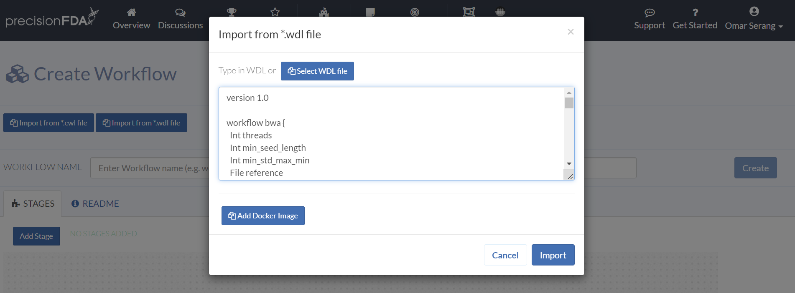
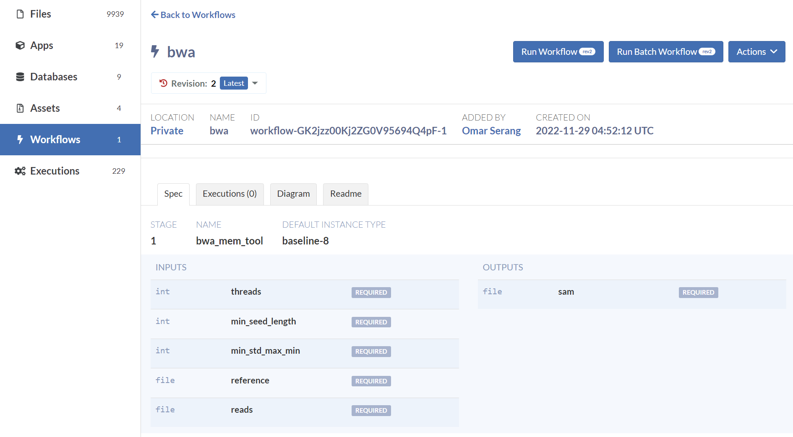

import Image from 'next/image';
import image53 from './assets/image53.png';
import image54 from './assets/image54.png';

## workflow_from_wdl

Importing a workflow from a WDL specification based on Docker images provides convenient way to express precisionFDA workflows in a serialized textual format. From My Home / Workflows, click the Create Workflow button, and click the Import from \*.wdl file button. Enter the following WDL in the text input and click Import.

```
version 1.0

workflow bwa {
  Int threads
  Int min_seed_length
  Int min_std_max_min
  File reference
  File reads

  call bwa_mem_tool {
    threads = threads,
    min_seed_length = min_seed_length,
    min_std_max_min = min_std_max_min,
    reference = reference,
    reads = reads
  }
}

task bwa_mem_tool {
  Int threads
  Int min_seed_length
  Int min_std_max_min
  File reference
  File reads
  
  command {
    bwa mem -t ${threads} \
    -k ${min_seed_length} \
    -I ${sep=',' min_std_max_min+} \
    ${reference} \
    ${sep=' ' reads+} > output.sam
  }

  output {
    File sam = "output.sam"
  }

  runtime {
    docker: "broadinstitute/baseimg"
  }
}
```





Like workflows created through the web inteface, WDL-based workflows can be updated and run.

<Image height="500" src={image53} width="300" alt="doc"/>

<Image height="500" src={image54} width="400" alt="doc"/>
