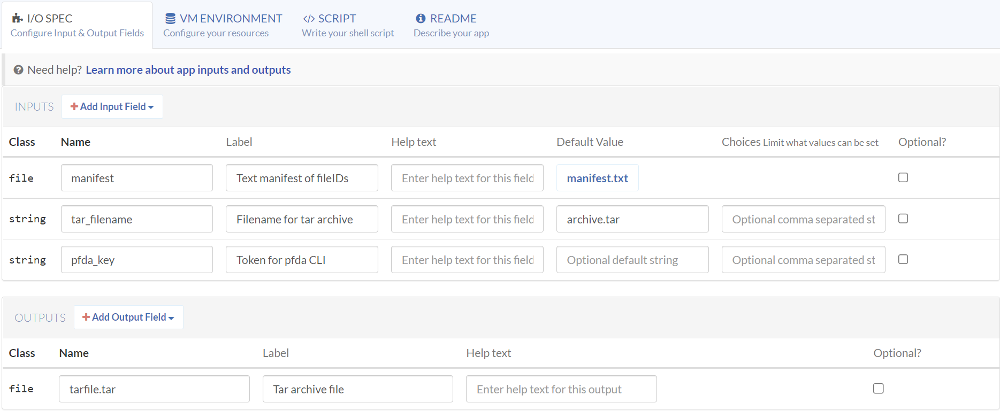
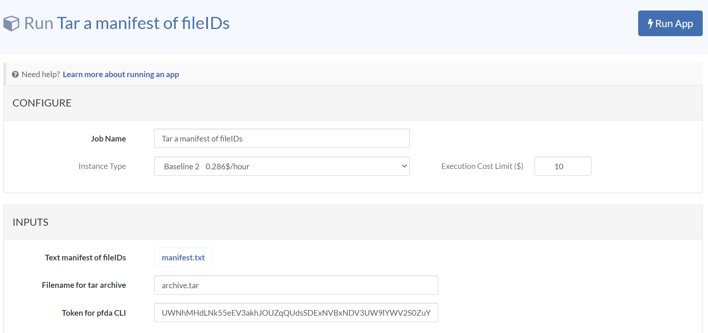
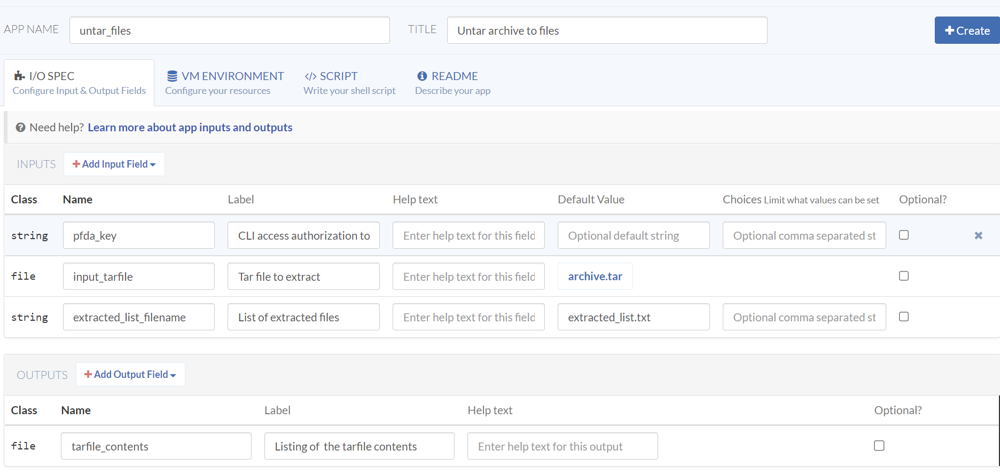
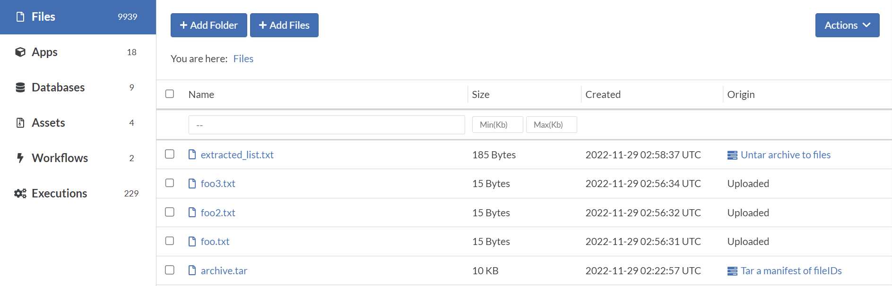
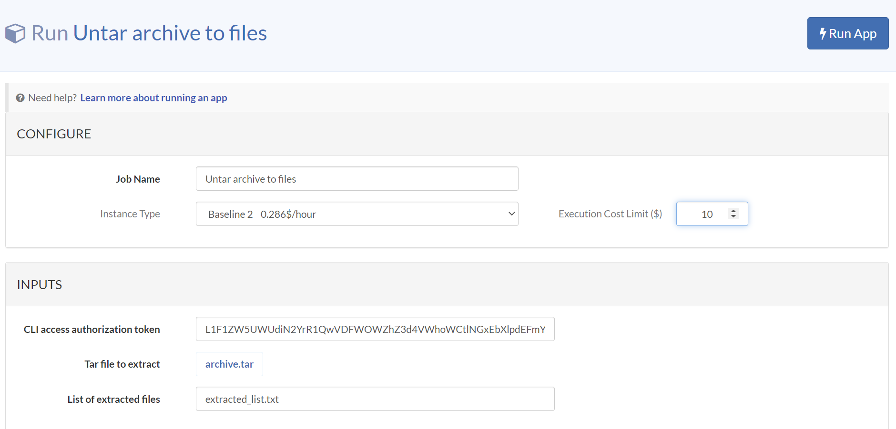

import Image from 'next/image';
import image4 from './assets/image4.png';

## untar_files, tar_files_from_manifest

We are going to use the pfda_cli_2.2.tar asset to create two very useful apps that demonstrate a design pattern that is readily extensible. The precisionFDA app I/O specification supports scalar and file and output types but does not support arrays for input or output variables. This means that using the app input variable and output emit framework, you cannot create apps with an arbitrary number of inputs or outputs. For instance, you really can't even create an untar app due to this limitation. These two apps demonstrate a design pattern to overcome this limitation.

<div style={{"display":"grid","gridTemplateColumns":"1fr 1fr","gap":"16px"}}>
  <div>
    Note that these apps require a temporary authorization key that you'll use with the CLI and this key will appear in the execution log files. Thus you should only run this app in your My Home or Private Space contexts so as not to expose the key to other users.
  </div>
  <Image width="500" height="500" src={image4} alt="doc" />
</div>


### tar_files_from_manifest: Tar a manifest of fileIDs

From My Home / Files, select the detail page and copy the file ID for a
number of files. Create and upload *manifest.txt* with the list to be
incorporated into an archive file (e.g.):

```bash
cat manifest.txt
file-GJv1zKj0Kj2vzFP4Gg475ZyX-1
file-GJv1zKj0Kj2XY800GgJY2f4G-1
file-GJv1zKQ0Kj2vfZkVFxp436B9-1

key="..."
pfda upload-file -key $key -file manifest.txt
```

Create a *tar_files_from_manifest* app titled "Tar a manifest of
fileIDs", with the following I/O Spec.

<table>
  <thead>
    <tr>
      <th>Class</th>
      <th>Input Name</th>
      <th>Label</th>
      <th>Default Value</th>
    </tr>
  </thead>
  <tbody>
    <tr>
      <td>file</td>
      <td>manifest</td>
      <td>Text manifest of fileIDs</td>
      <td>manifext.file</td>
    </tr>
    <tr>
      <td>string</td>
      <td>tar_filename</td>
      <td>Filename for tar archive</td>
      <td>archive.tar</td>
    </tr>
    <tr>
      <td>string</td>
      <td>pfda_key</td>
      <td>Token for pfda CLI</td>
      <td></td>
    </tr>
  </tbody>
  <thead>
    <tr>
      <th>Class</th>
      <th>Output Name</th>
      <th>Label</th>
      <th></th>
    </tr>
  </thead>
  <tbody>
  <tr>
    <td>file</td>
    <td>tarfile</td>
    <td>Tar archive file</td>
    <td></td>
  </tr>
  </tbody>
</table>



Setup the VM environment with internet access enabled, Baseline 2
default instance type, and select the pfda_cli_2.2 asset. Note that it
can take minutes for the list of assets to loaded before they can be
searched.

Enter the following Script:

```bash
set -euxo pipefail
echo "$pfda_key"
echo "$tar_filename"
echo "$manifest"
sudo apt-get update
sudo apt-get install -y dos2unix
pfda -version
mkdir temp
cd temp
dos2unix "$manifest_path"
for file in $(cat "$manifest_path"); do pfda download -key "$pfda_key" -file-id $file; done
cd ..
tar cvf "$tar_filename" temp/*
emit "tarfile" "$tar_filename"
```

Enter a Readme and Create the app.
```
Input a manifest file containing a list of fileIDs and the name of tar archive file. You\'ll need to provide a temporary authorization key for use with the pfda CLI and thus you should only run this app in your My Home or Private Spaces.
```
Run the app with the default inputs and a fresh authorization token for
the pfda CLI and observe the new archive.tar file.



When the execution is done, download the archive.tar file to verify its
contents.
```
tar tvf archive.tar
-rw-r--r-- root/root        15 2022-11-29 02:22 temp/foo.txt
-rw-r--r-- root/root        15 2022-11-29 02:22 temp/foo2.txt
-rw-r--r-- root/root        15 2022-11-29 02:22 temp/foo3.txt
```

### untar_files: Untar archive to files

Create a *untar_files* app titled "Untar archive to files", with the
following I/O Spec.

<table>
  <thead>
    <tr>
        <th>Class</th>
        <th>Input Name</th>
        <th>Label</th>
        <th>Default Value</th>
    </tr>
  </thead>
  <tbody>
    <tr>
        <td>string</td>
        <td>pfda_key</td>
        <td>CLI access authorization token</td>
        <td></td>
    </tr>
    <tr>
        <td>file</td>
        <td>input_tarfile</td>
        <td>Tar file to extract</td>
        <td>archive.tar</td>
    </tr>
    <tr>
        <td>string</td>
        <td>extracted_list_f ilename</td>
        <td>List of extracted files</td>
        <td>extracted_list.txt</td>
    </tr>
  </tbody>
  <thead>
    <tr>
      <th>Class</th>
      <th>Output Name</th>
      <th>Label</th>
      <th></th>
    </tr>
  </thead>
  <tbody>
    <tr>
      <td>file</td>
      <td>tarfile_contents</td>
      <td>Listing of the tarfile contents</td>
      <td></td>
    </tr>
  </tbody>
</table>



Setup the VM environment with internet access enabled, Baseline 2
default instance type, and select the pfda_cli_2.2 asset. Note that it
can take minutes for the list of assets to loaded before they can be
searched.

Enter the following Script:
```bash
set -euxo pipefail
echo "$pfda_key"
echo "$input_tarfile"
echo "$extracted_list_filename"
pfda -version
tar tvf "$input_tarfile_path" > "$extracted_list_filename"
mkdir temp
tar xvf "$input_tarfile_path" --directory temp
ls temp
for FILE in $(find ./temp -type f -print); do echo $FILE; done
emit "tarfile_contents" "$extracted_list_filename"
```

Enter a Readme and Create the app.
```
Input a tar archive file to extract into individual files. You'll need to provide a temporary authorization key for use with the pfda CLI and thus you should only run this app in your My Home or Private Spaces.
```
Run the app with the default inputs and a fresh authorization token for the pfda CLI.





When the execution is done, observe the new extracted files, and open the extracted_list.txt file to see the list of extracted files.


