### Run the pfda-ttyd Featured App

Using the smallest instance type, run the Data Analysis Workstation job using the pfda-ttyd featured app.

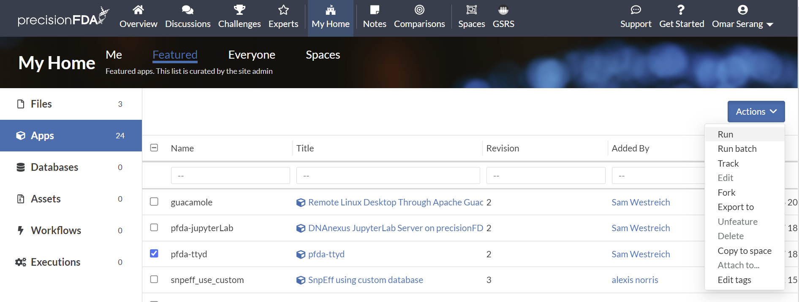

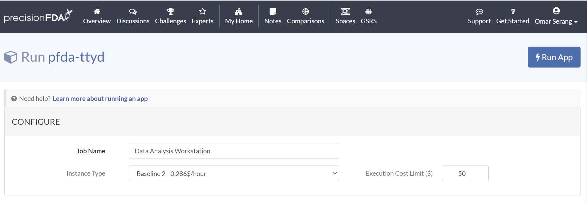

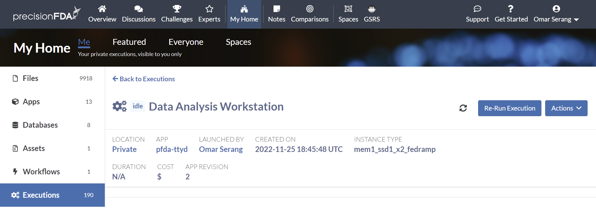

Refresh the execution status using the refresh button until the job is running and open the workstation.

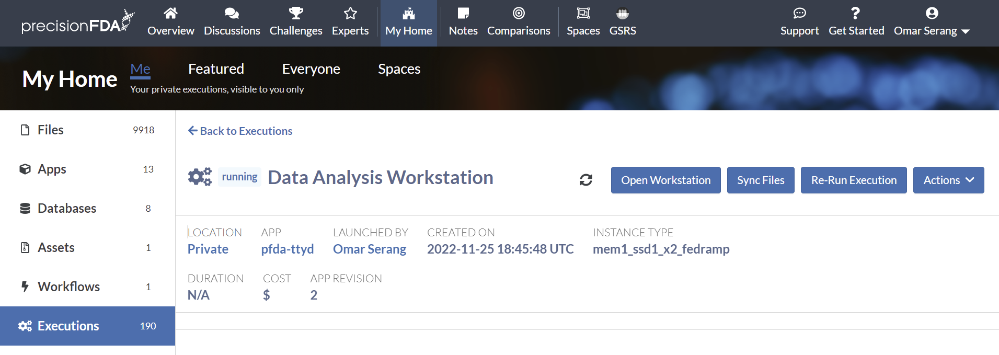

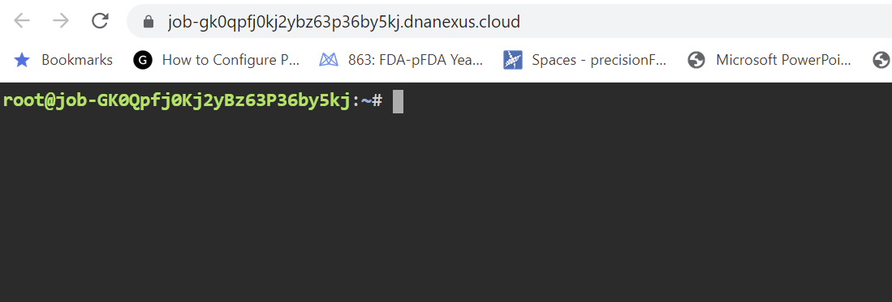

Use dx-get-timeout and dx-set-timeout to view and set the workstation application time-to-live after which it will self-terminate.
```
dx-set-timeout 2d
dx-get-timeout
0 days 23 hours 59 minutes 56 seconds
```

### Present a simple web server on port 8080

The ttyd and guacamole workstations enable presentation of web services that can be accessed via the job URL port 8080. Let's startup a simple Python-based web server and browse to it.

```bash
python3 -m http.server 8080 &
```

Now copy the URL from your ttyd window and append port 8080 to it(e.g. https://job-gxjjzj80kj2qgp2z6p9x1yvq.dnanexus.cloud:8080) to browse to your web service on the wo rkstation.

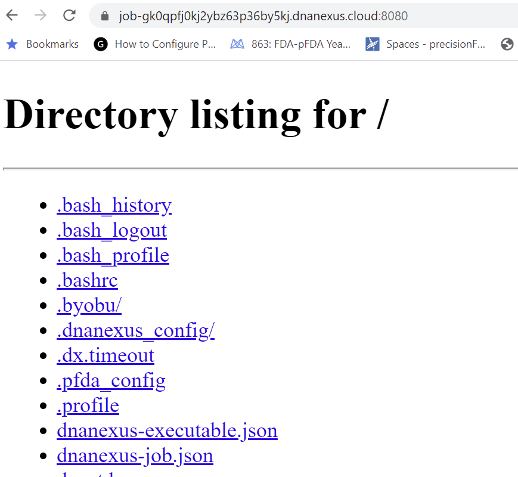

Kill the http.server job to free up port 8080.

### Deploy PostgreSQL, psql, pgadmin, and RStudio

A docker-compose.yml file is configured to launch a local PostgreSQL database, and RStudio, and pgadmin web services that connect to the database. RStudio and pgadmin are accessed using the workstation job URL extended to target the specific service on port 8080 (e.g. https://job-gb1y8jj0kj2xvbggbp3qgv55.dnanexus.cloud:8080/pgadmin/). The postgres-local database container is accessed from the pgadmin and rstudio containers and from the psql command line client on the workstation shell.

The pfda-ttyd and guacamole workstation apps provide port 8080 for access to user deployed web services on the workstation. In order to access multiple different web services (e.g. pgadmin and RStudio) on the single port 8080, a Docker-based reverse proxy is configured using the traefik open source cloud-native application proxy application (https://github.com/traefik/traefik).

Install docker-compose-plugin.

```bash
install-docker-compose.sh
```

Download the traefik-postgres-pgadmin-rstudio-docker-compose.yml file to the workstation.

```bash
pfda download --file-id file-Gb21QGj0Kj2pBzZ9Q3Yqv1Kp-2
```

Start the traefik, postgres-local, rstudio, and pgadmin docker services.

```bash
docker compose -f traefik-postgres-pgadmin-rstudio-docker-compose.yml create
docker compose -f traefik-postgres-pgadmin-rstudio-docker-compose.yml start
```

Install the psql postgres command line client and test the connection to the database.

```bash
apt update
apt install postgresql-client -y < "/dev/null"

PGPASSWORD="password" psql -h localhost -U postgres
```

Ctrl-D to exit psql.

Configure the pgadmin container mounted directory permissions.
```bash
sudo chown -R 5050:5050 db_backups/
sudo chmod ugo+w db_backups/
```

## Access the postgres-local DB from pgadmin

Access the pgadmin web service from your web browser (e.g. https://job-gk0qpfj0kj2ybz63p36by5kj.dnanexus.cloud:8080/pgadmin).

Add the workstation local database as a new server (e.g. Data Analysis Workstation DB Server) using hostname postgres-local and port 5432, maintenance database postgres, user postgres, and password password.

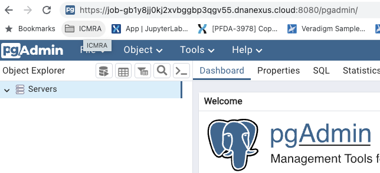

<div style="display: grid; grid-template-columns: 1fr 1fr; gap: 16px;" markdown="1">
  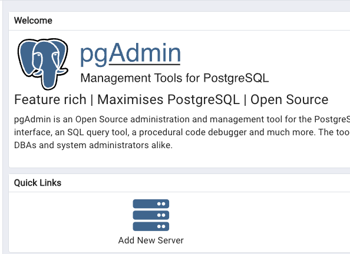
  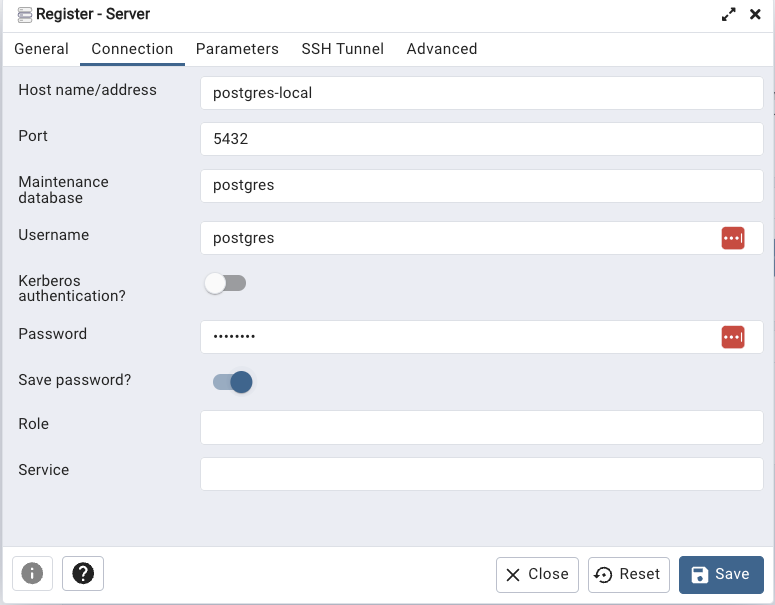
</div>

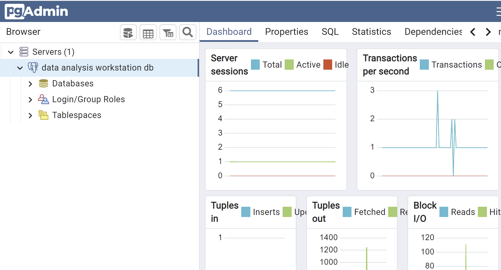

### Create a new database and tables

Connect to the cluster database from psql in the data analysis workstation shell.

```bash
PGPASSWORD="password" psql -h localhost -U postgres
```

Using psql, create a new database.

```sql
-- Database: workstations_and_databases_tutorial_db
CREATE DATABASE workstations_and_databases_tutorial_db
    WITH
    OWNER = postgres
    ENCODING = 'UTF8'
    CONNECTION LIMIT = -1
    IS_TEMPLATE = False;

```

Connect to the new database and create two tables.

```
\c workstations_and_databases_tutorial_db;

psql (9.5.25, server 11.16)
WARNING: psql major version 9.5, server major version 11.
         Some psql features might not work.
SSL connection (protocol: TLSv1.2, cipher: ECDHE-RSA-AES128-GCM-SHA256, bits: 128, compression: off)
You are now connected to database "workstations_and_databases_tutorial_db" as user "root".
workstations_and_databases_tutorial_db=>

CREATE TABLE public."PATIENT" (
    patient_id bigint NOT NULL,
    name character varying,
    gender character varying,
    zip character varying,
    country character varying,
    created_date date
);

CREATE TABLE public."OBSERVATION" (
    observation_id bigint NOT NULL,
    patient_id bigint,
    observation_name character varying,
    loinc character varying,
    created_date date
);

\dt
          List of relations
 Schema |    Name     | Type  | Owner 
--------+-------------+-------+-------
 public | OBSERVATION | table | root
 public | PATIENT     | table | root
(2 rows)
```

### Load the cluster database from delimited text files
In the data analysis workstation shell, create a datafiles directory
```bash
mkdir datafiles
cd datafiles
```

Create file `patients.txt` with the following content:
```bash
cat > patients.txt
12345|Fred Foobar|M|94040|USA|2022-10-25
12346|Mary Merry|F|94040|USA|2022-09-24
12347|Barney Rubble|M|94040|USA|2022-08-23
ctrl-D
```

Create file `observations.txt` with the following content:
```bash
cat > observations.txt
9870|12345|Annual check up|66678-4|2022-11-01
9871|12345|Emergency|LG32756-5|2022-11-02
9872|12346|Clinic visit|66678-4|2022-11-03
9873|12347|Lab results|74418-5|2022-11-04
9874|12347|Post-op checkup|65375-8|2022-11-05
ctrl-D
```

### Copy the data into the cluster DB tables

```bash
PGPASSWORD="password" psql -h localhost -U postgres
workstations_and_databases_tutorial_db=>
```
In psql:
```sql
\copy public."PATIENT" from '/home/dnanexus/datafiles/patients.txt' delimiter '|' NULL ''

\copy public."OBSERVATION" from '/home/dnanexus/datafiles/observations.txt' delimiter '|' NULL ''

select * from public."PATIENT";
patient_id |     name      | gender |  zip  | country | created_date 
------------+---------------+--------+-------+---------+--------------
      12345 | Fred Foobar   | M      | 94040 | USA     | 2022-10-25
      12346 | Mary Merry    | F      | 94040 | USA     | 2022-09-24
      12347 | Barney Rubble | M      | 94040 | USA     | 2022-08-23

select * from public."OBSERVATION";
observation_id | patient_id | observation_name |   loinc   |created_date 
----------------+------------+------------------+-----------+-----------
           9870 |      12345 | Annual check up  | 66678-4   | 2022-11-01
           9871 |      12345 | Emergency        | LG32756-5 | 2022-11-02
           9872 |      12346 | Clinic visit     | 66678-4   | 2022-11-03
           9873 |      12347 | Lab results      | 74418-5   | 2022-11-04
           9874 |      12347 | Post-op checkup  | 65375-8   | 2022-11-05
```
Observe the new tables and data in the pgadmin Workstations and Databases Tutorial server connection.

### Share Files Between Workstation FS and PostgreSQL Docker FS

Since pgadmin is running in a Docker container on the workstation, we are going to have to connect to the pgadmin container shell and copy files we want to share between the workstation and pgadmin to and from the mount point shared by the container and the workstation (i.e. /home/dnanexus/db_backups).

When performing a database backup in pgadmin, save the file in /home/dnanexus/db_backups.

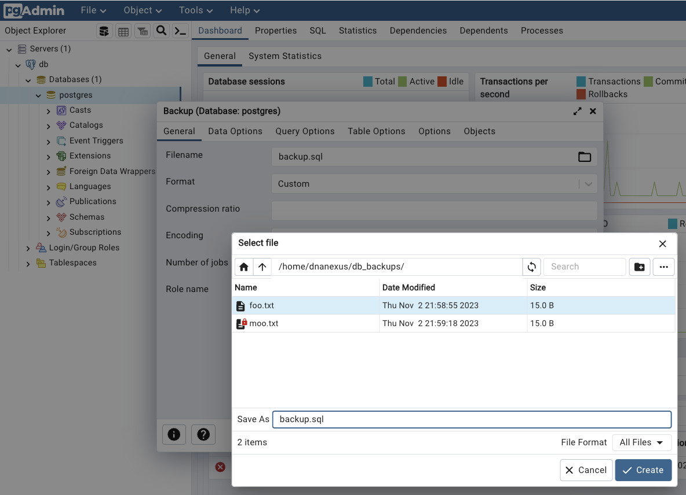

The backup file is accessible in workstation /home/dnanexus/db_backups. Files can be placed in this directory for access by pgadmin.
```bash
root@job-Gb21Kfj0Kj2jxbjv0pzxQx8Y:~# ls /home/dnanexus/db_backups/
backup.sql  foo.txt  moo.txt
```

### Access the postgres-local DB from rstudio

Access the RStudio web service from your web browser (e.g. https://job-gb1y8jj0kj2xvbggbp3qgv55.dnanexus.cloud:8080/rstudio/).

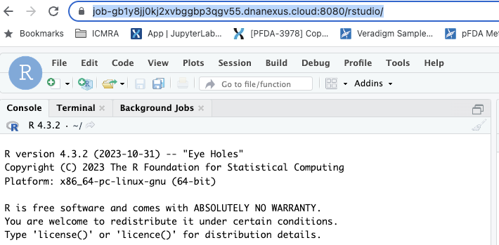

Install the RPostgres packages and test access to the workstation local database. In the R Studio console:
```r
# Install RPostgres
install.packages("RPostgres")

# Connect to local database
library(DBI)
con <- DBI::dbConnect(
    RPostgres::Postgres(),
    host = "172.17.0.1", 
    port = 5432, dbname = "postgres",
    user = "postgres", password = "password"
)
# List the tables in db postgres	
dbListTables(con)
```
Since there are no tables in the postgres database, the response is character(0). Let’s add two tables using psql and run the same R query.
Using the psql command line client in the data analysis workstation shell:
```sql
PGPASSWORD="password" psql -h localhost -U postgres

CREATE TABLE public."PATIENT" (
    patient_id bigint NOT NULL,
    name character varying,
    gender character varying,
    zip character varying,
    country character varying,
    created_date date
);

CREATE TABLE public."OBSERVATION" (
    observation_id bigint NOT NULL,
    patient_id bigint,
    observation_name character varying,
    loinc character varying,
    created_date date
);
```
The same query in the RStudio console now shows the two new tables.
```sql
dbListTables(con)
[1] "PATIENT"     "OBSERVATION"
```
Let’s drop the tables since we will be populating this database from a backup a later stage in this tutorial. Using the psql command line client in the data analysis workstation shell:
```sql
DROP TABLE public."PATIENT"
DROP TABLE public."OBSERVATION”
```
Control-D to exit psql.


### Share Files Between Workstation FS and RStudio Docker FS

The rstudio container shares the /home/dnanexus mount point with the workstation filesystem so it straightforward to access the workstation filesystem from within RStudio. Simply set the path in the RStudio file browser to /home/rstudio/dnanexus.

<div style="display: grid; grid-template-columns: 1fr 1fr; gap: 16px;" markdown="1">
  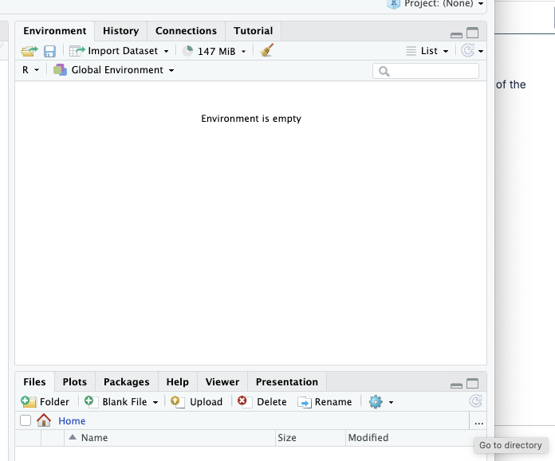
  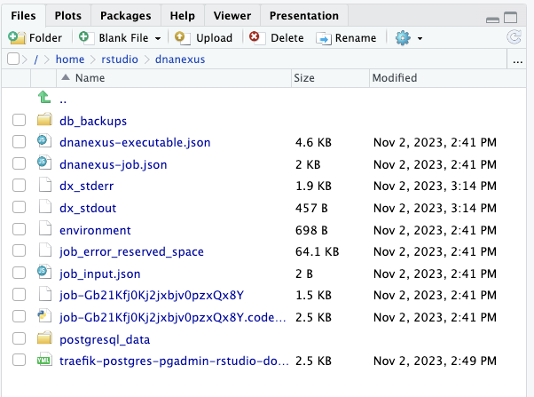
</div>

### PostgreSQL Tips
#### Force drop connections
If you need to drop a database, you’ll need to close all the sessions connected to it using the following postgreSQL code:

```sql
SELECT 
    pg_terminate_backend(pid) 
FROM 
    pg_stat_activity 
WHERE 
    -- don't kill my own connection!
    pid <> pg_backend_pid()
    -- don't kill the connections to other databases
    AND datname = 'ehr_data'
    ;
```
#### Quick queries for estimated row counts
To present the estimated row count for each table:
```sql
SELECT relname, TO_CHAR(n_live_tup, 'fmG999G999G999')
  FROM pg_stat_user_tables 
ORDER BY relname ASC;
Alternatively:
SELECT
  pgClass.relname   AS tableName,
  TO_CHAR(pgClass.reltuples, 'fmG999G999G999') AS rowCount
FROM
  pg_class pgClass
INNER JOIN
  pg_namespace pgNamespace ON (pgNamespace.oid = pgClass.relnamespace)
WHERE
  pgNamespace.nspname NOT IN ('pg_catalog', 'information_schema') AND
  pgClass.relkind='r'
ORDER BY pgClass.reltuples ASC
```
To present to total row count for all tables:
```sql
SELECT TO_CHAR(SUM(n_live_tup), 'fmG999G999G999')
  FROM pg_stat_user_tables
```
