PrecisionFDA provides AWS Aurora RDS database clusters that are accessible from Apps and Workstations. You will need to request DB Cluster access for your precisionFDA username in order to use this capability.

### Create the Database
Select the Databases tab in My Home and click the Create Database button.
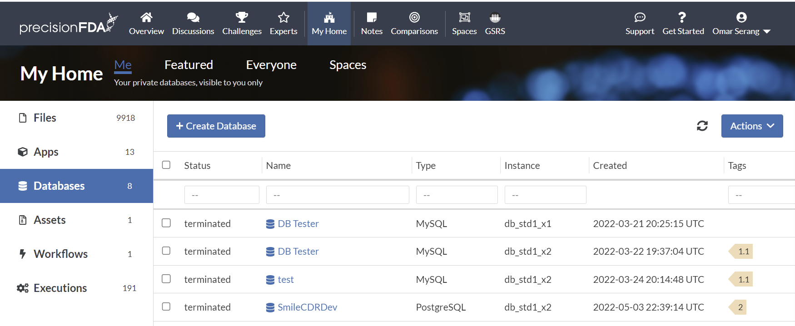

Create a “Workstations and Databases Tutorial” database, “password”, PostgreSQL 11.16 on the smallest available database instance type, and click the Submit button.

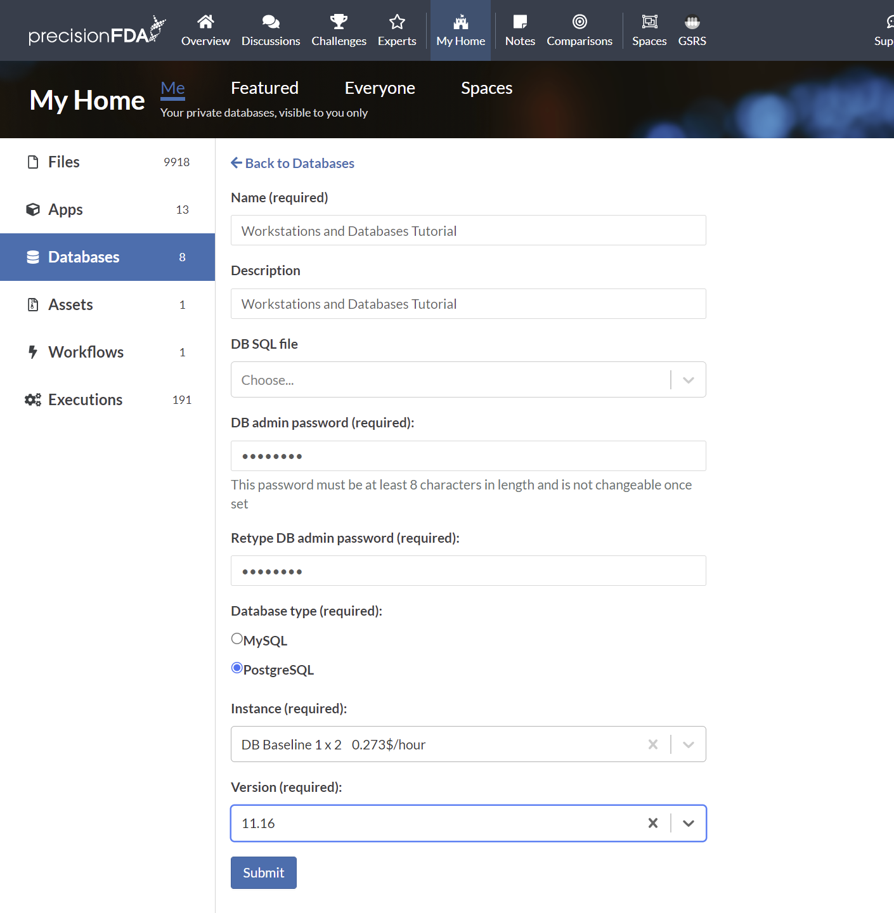

Refresh the database status using the refresh button until the database is available.

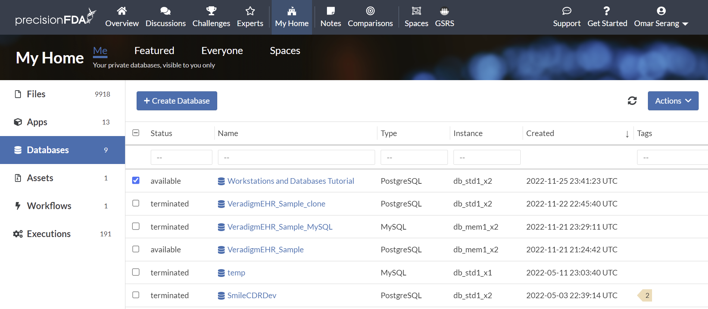

Click on the Workstations and Databases Tutorial database to open the detail page and copy the host endpoint URL.

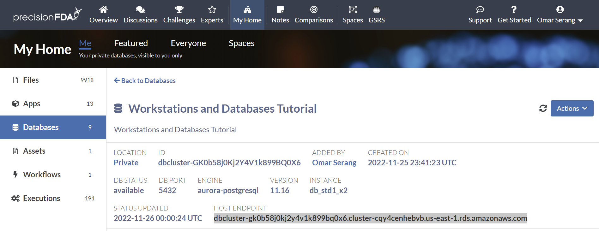

### Connect to the cluster DB from pgadmin

In the pgadmin web service, add a new server for the Workstations and Databases Tutorial DB cluster using the host endpoint,  user root, and the password specified when the database was created.

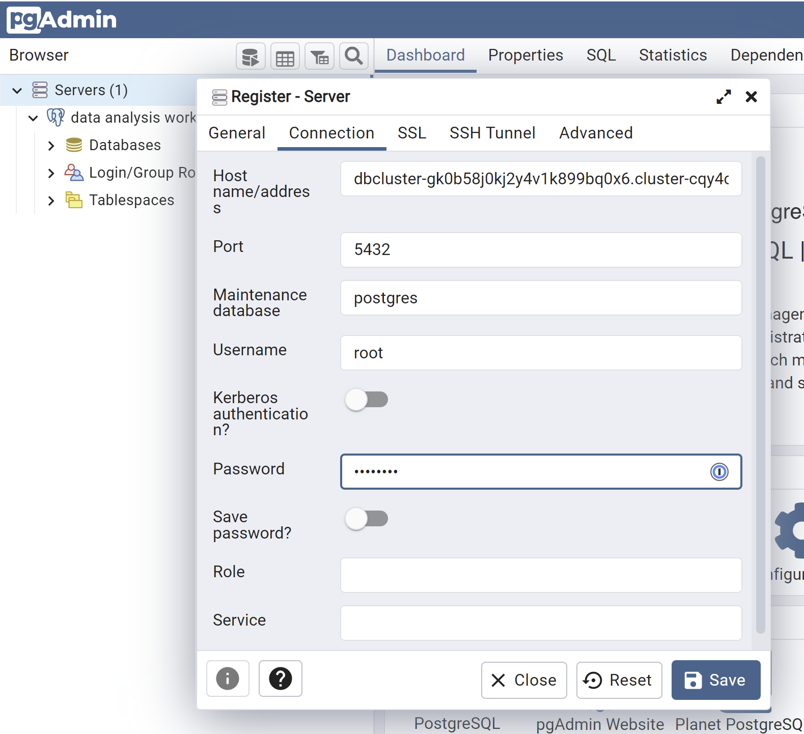

Note that we now have connections to both the local database on the data analysis workstation, and the cluster database.

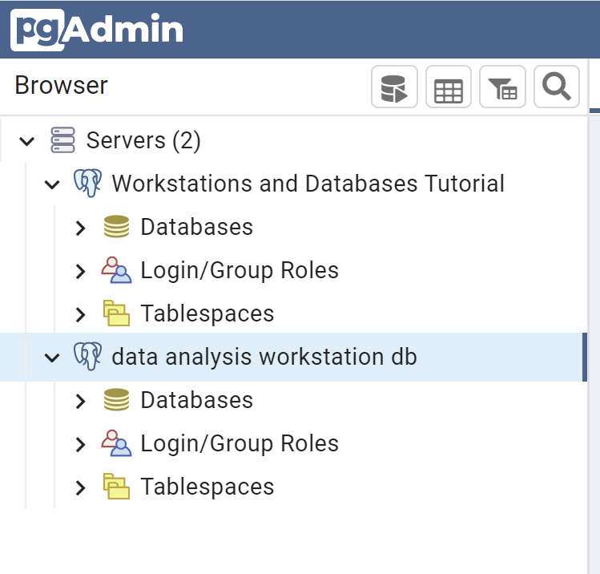

### Create a new database and tables
Connect to the cluster database from psql in the data analysis workstation shell.

```bash
PGPASSWORD="password" psql --host=dbcluster-gbfqzqq0kj2jxgj109354vjj.cluster-cqy4cenhebvb.us-east-1.rds.amazonaws.com --username=root -d postgres
```

Using psql, create a new database.

```sql
-- Database: workstations_and_databases_tutorial_db
CREATE DATABASE workstations_and_databases_tutorial_db
    WITH
    OWNER = root
    ENCODING = 'UTF8'
    CONNECTION LIMIT = -1
    IS_TEMPLATE = False;
```

Connect to the new database and create two tables.

```sql
\c workstations_and_databases_tutorial_db;

psql (9.5.25, server 11.16)
WARNING: psql major version 9.5, server major version 11.
         Some psql features might not work.
SSL connection (protocol: TLSv1.2, cipher: ECDHE-RSA-AES128-GCM-SHA256, bits: 128, compression: off)
You are now connected to database "workstations_and_databases_tutorial_db" as user "root".
workstations_and_databases_tutorial_db=>

CREATE TABLE public."PATIENT" (
    patient_id bigint NOT NULL,
    name character varying,
    gender character varying,
    zip character varying,
    country character varying,
    created_date date
);

CREATE TABLE public."OBSERVATION" (
    observation_id bigint NOT NULL,
    patient_id bigint,
    observation_name character varying,
    loinc character varying,
    created_date date
);

\dt
          List of relations
 Schema |    Name     | Type  | Owner 
--------+-------------+-------+-------
 public | OBSERVATION | table | root
 public | PATIENT     | table | root
(2 rows)

```
#### Load the cluster database from delimited text files
Although the workflow illustrated here may seem over-engineered for loading two data files, the techniques presented here were used to reliably and efficiently transfer tens of thousands of files and 15+ TB of data to precisionFDA.

In the data analysis workstation shell, create a datafiles directory
```bash
mkdir datafiles
```
##### Create and upload delimited data files
On your local client (i.e. laptop), create file patients.txt with the following content:
```
12345|Fred Foobar|M|94040|USA|2022-10-25
12346|Mary Merry|F|94040|USA|2022-09-24
12347|Barney Rubble|M|94040|USA|2022-08-23
```
Create file observations.txt with the following content:
```
9870|12345|Annual check up|66678-4|2022-11-01
9871|12345|Emergency|LG32756-5|2022-11-02
9872|12346|Clinic visit|66678-4|2022-11-03
9873|12347|Lab results|74418-5|2022-11-04
9874|12347|Post-op checkup|65375-8|2022-11-05
```
In My Home / Files use the Add Files button to upload the two files to your private area.

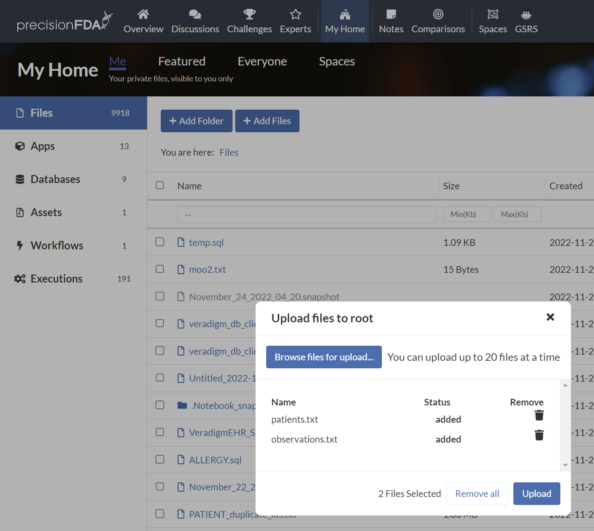

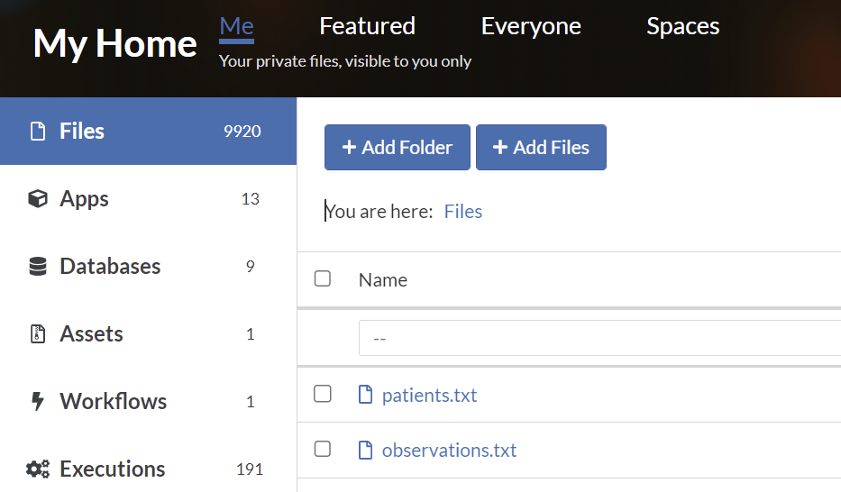

##### Create and upload a manifest of data file IDs
Click into patients.txt and observations.txt details pages and copy their file IDs into a file named manifest.txt file on your local client.

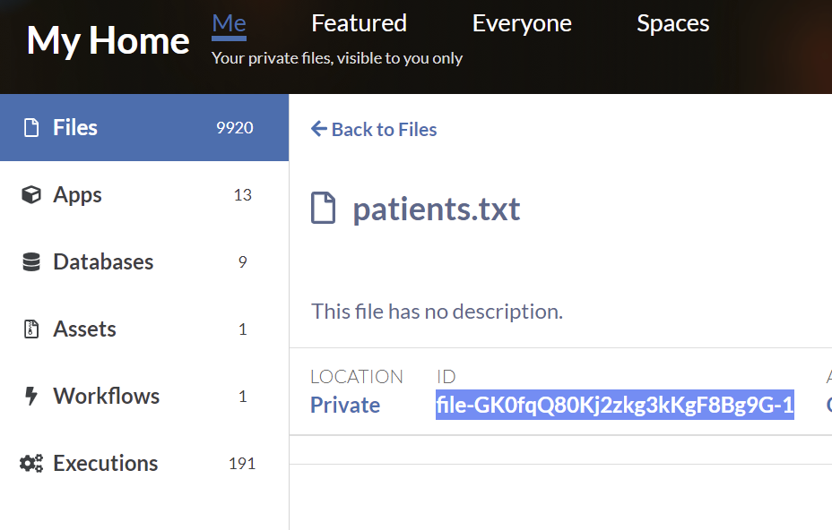

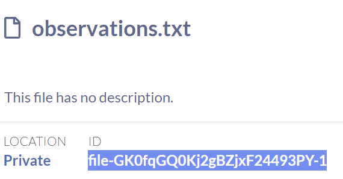

```
-- manifest.txt
file-GK0fqQ80Kj2zkg3kKgF8Bg9G-1
file-GK0fqGQ0Kj2gBZjxF24493PY-1
```
Use the Add Files button to upload the manifest.txt file to your private area. Click into the details for the uploaded file and copy the file ID.

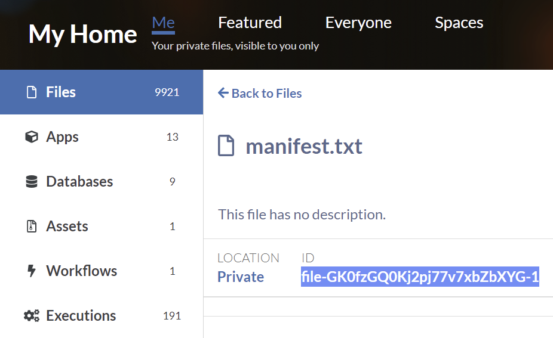

##### Download the files in the manifest to the Data Analysis Workstation
Using pfda CLI in the data analysis workstation shell, download the manifest.txt file to the workstation filesystem.
```bash
pfda download -file-id file-GK0fzGQ0Kj2pj77v7xbZbXYG-1

ls -l
-rw-r--r-- 1 root root 66 Nov 26 01:58 manifest.txt
```
#### Iterate through manifest and download data files
In the data analysis workstation shell install and run dos2unix on the manifest.txt file to ensure there are no cross-OS end-of-line issues.

```bash
cd/datafiles
apt install dos2unix
dos2unix manifest.txt

for FILE in $(cat manifest.txt); do pfda download -key $key -file-id $FILE; done

ls
manifest.txt  observations.txt  patients.txt
```

#### Copy the data into the cluster DB tables
##### Connect to the workstations_and_databases_tutorial_db cluster database
Using the database host endpoint, connect to the workstations_and_databases_tutorial_db cluster database using psql on the data analysis workstation:


```
PGPASSWORD="password" psql --host=dbcluster-gk0b58j0kj2y4v1k899bq0x6.cluster-cqy4cenhebvb.us-east-1.rds.amazonaws.com --username=root -d workstations_and_databases_tutorial_db

workstations_and_databases_tutorial_db=>
```

##### Copy the patients and observations data into the cluster DB
In psql:
```sql
\copy public."PATIENT" from '/home/dnanexus/datafiles/patients.txt' delimiter '|' NULL ''

\copy public."OBSERVATION" from '/home/dnanexus/datafiles/observations.txt' delimiter '|' NULL ''

select * from public."PATIENT";
patient_id |     name      | gender |  zip  | country | created_date 
------------+---------------+--------+-------+---------+--------------
      12345 | Fred Foobar   | M      | 94040 | USA     | 2022-10-25
      12346 | Mary Merry    | F      | 94040 | USA     | 2022-09-24
      12347 | Barney Rubble | M      | 94040 | USA     | 2022-08-23

select * from public."OBSERVATION";
observation_id | patient_id | observation_name |   loinc   |created_date 
----------------+------------+------------------+-----------+-----------
           9870 |      12345 | Annual check up  | 66678-4   | 2022-11-01
           9871 |      12345 | Emergency        | LG32756-5 | 2022-11-02
           9872 |      12346 | Clinic visit     | 66678-4   | 2022-11-03
           9873 |      12347 | Lab results      | 74418-5   | 2022-11-04
           9874 |      12347 | Post-op checkup  | 65375-8   | 2022-11-05
```
Observe the new tables and data in the pgadmin Workstations and Databases Tutorial server connection.

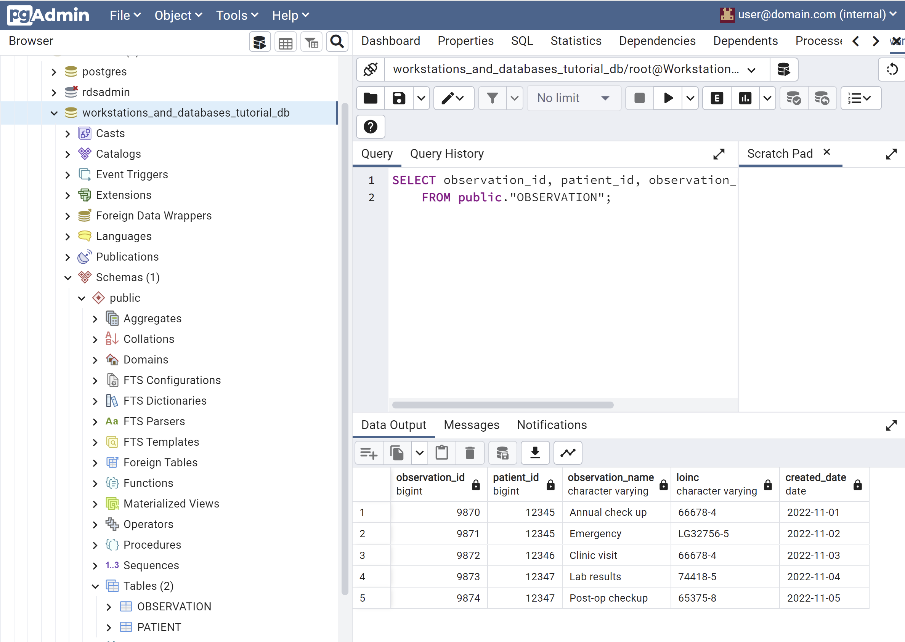

#### Connect RStudio to the cluster DB
In the RStudio console:
```r
library(DBI)
con <- DBI::dbConnect(
    RPostgres::Postgres(),
    host = "dbcluster-gk0b58j0kj2y4v1k899bq0x6.cluster-cqy4cenhebvb.us-east-1.rds.amazonaws.com", 
  port = 5432, dbname = "workstations_and_databases_tutorial_db",
    user = "root", password = "password"
)
dbListTables(con)
[1] "OBSERVATION" "PATIENT"   
```
