This tutorial demonstrates installation of the KNIME Analysis Platform as a desktop client application on a Guacamole workstation. The KNIME tutorial workflow:
- Creates a database on the local PostgreSQL server
- Downloads data files from a designated precisionFDA folder to the local filesystem
- ETLs the data from the local filesystem into the database
- Performs pivot analysis and geomap presentation of the data
- Uploads analysis results to precisionFDA My Home area
This provides KNIME examples for connecting to precisionFDA, running shell scripts, and executing DB operations using SQL.

### Run the guacamole Featured App
Using the a baseline-4 instance type, run the KNIME Workstation job using the guacamole featured app. Specify a maximum session length of 5y.

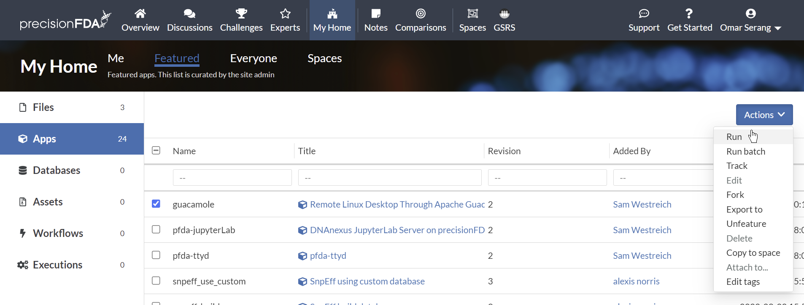

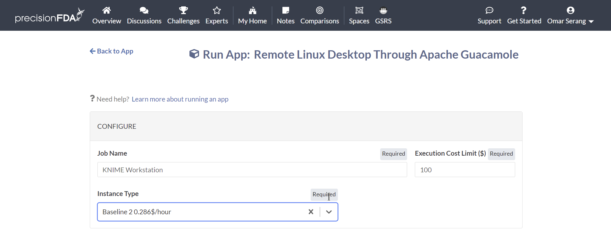

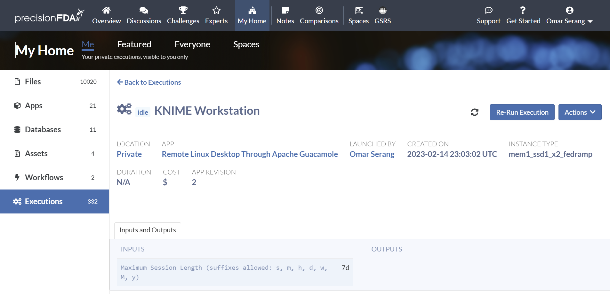

Refresh the execution status using the button until the job is running and open the workstation. Note that it takes a few minutes for the guacamole workstation to come up after going into running status.

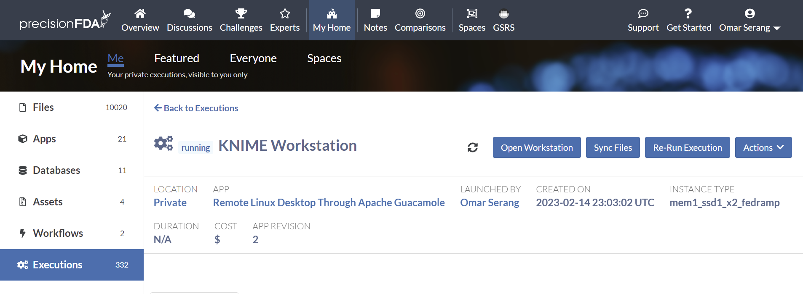

Allow the desktop to see text and images copied to the clipboard and login with user “guacuser” password “test”.

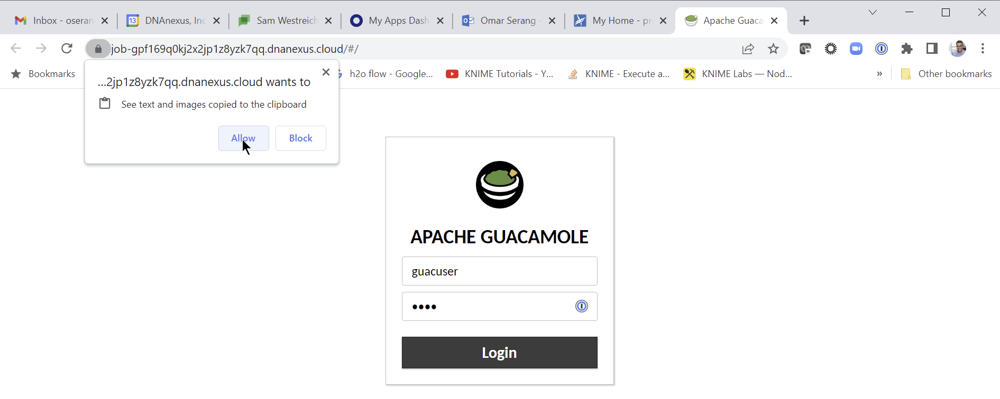

Use the default panel configuration when first entering the Linux desktop environment.

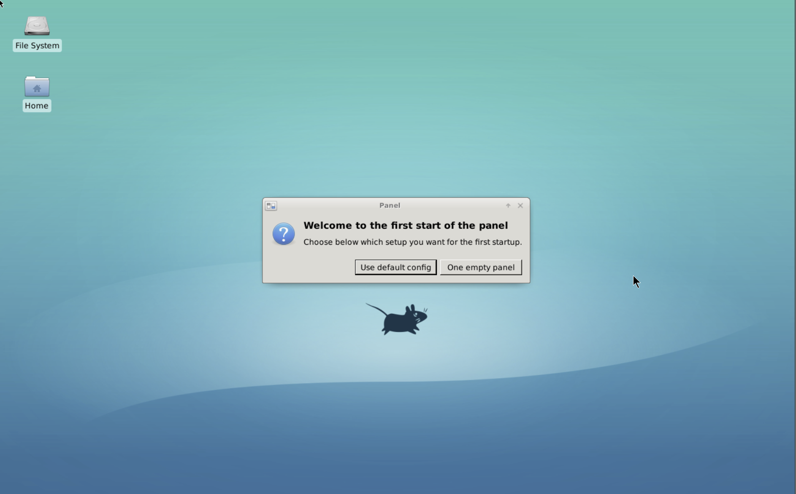

Open a terminal emulator window, check the OS version. Note that I needed to use ctrl-shift-v to paste from my laptop to the workstation.

```bash
lsb_release -a
```

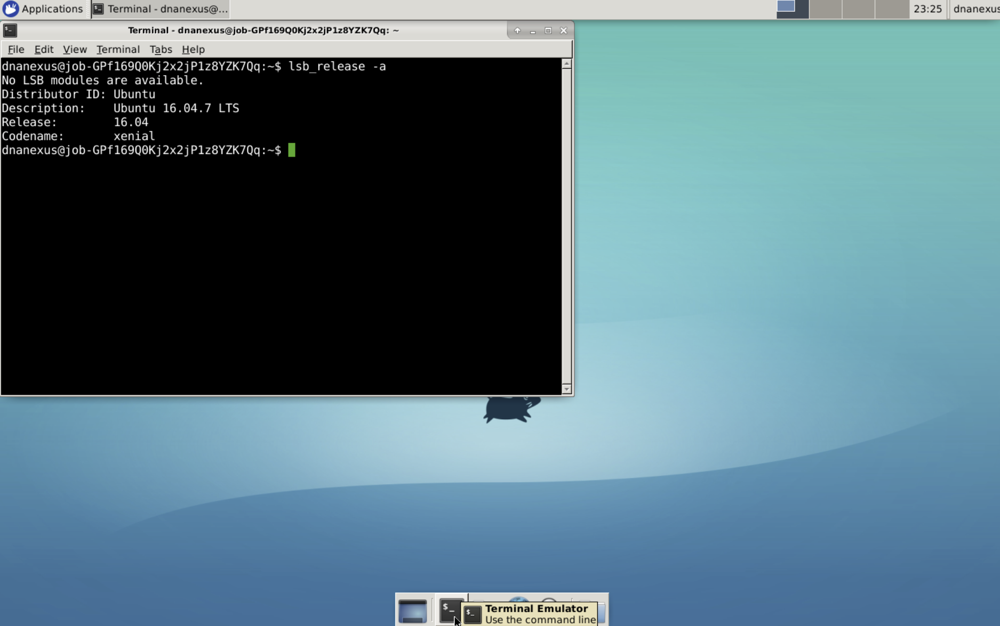

Adjust environment variables to enable interaction with file on precisionFDA.
```bash
unset DX_WORKSPACE_ID
dx cd $DX_PROJECT_CONTEXT_ID
```
Use dx-get-timeout and dx-set-timeout to view and set the workstation application time-to-live after which it will self-terminate.
```bash
dx-set-timeout 5y
dx-get-timeout
```
### Install Additional Utilities and Dependencies
```bash
# Browser, tree, dos2unix
sudo apt update
sudo apt-get install -y chromium-browser < "/dev/null"
sudo apt install -y tree < "/dev/null"
sudo apt install -y dos2unix < "/dev/null"

# KNIME Dependencies
sudo apt install -y libwebkit2gtk-4.0-37 < "/dev/null"
sudo apt install -y libgtk-3-dev < "/dev/null"
```
### Install and Start KNIME
Install start KNIME and accept the default Workspace directory. Accept the offer to help improve KNIME since that will enable some of KNIME’s wizard capabilities.
```bash
# KNIME
cd ~
mkdir -p knime
cd knime
wget https://download.knime.org/analytics-platform/linux/knime-latest-linux.gtk.x86_64.tar.gz
tar xvf knime-latest-linux.gtk.x86_64.tar.gz
cd
./knime/knime_4.7.3/knime &
```

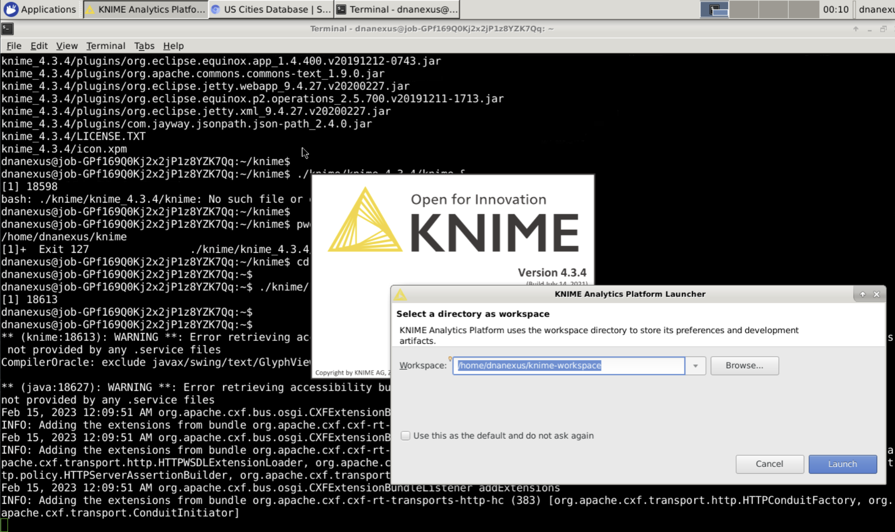

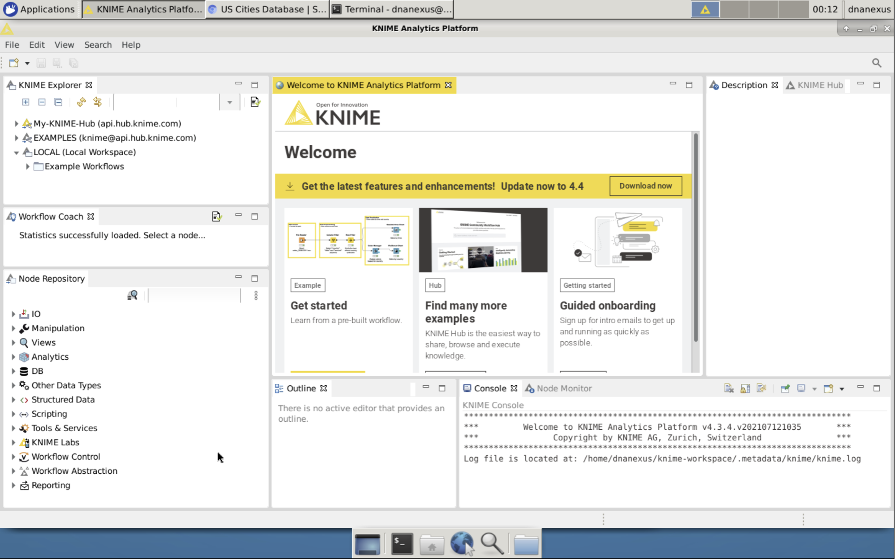

### Install US City Geo Data Using the Chromium Browser
Start the Chromium Browser and download simplemaps_uscities_basicv1.75.zip from https://simplemaps.com/data/us-cities.

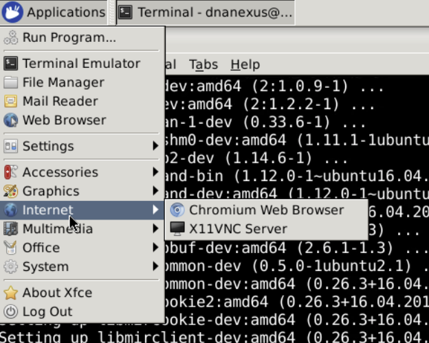

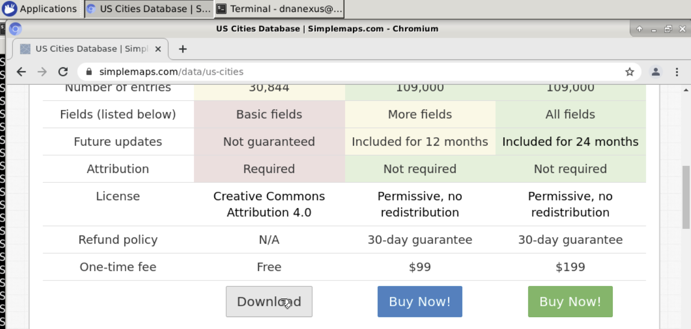

Leaving the previous terminal for KNIME to run in the background, start a new terminal window and set the key variable to the cli authentication token.
```bash
key="<copied key>"

cd
mv Downloads/simplemaps_uscities_basicv1.76.zip .
unzip simplemaps_uscities_basicv1.76.zip 
rm license.txt uscities.xlsx 
mv uscities.csv knime-workspace/
rm simplemaps_uscities_basicv1.76.zip 
```
### Deploy Local PostgreSQL DB Server and CLI
Deploy a local PostgreSQL DB server on the Data Analysis workstation. Map the postgres port from the container to the workstation (host) OS. Note that there is already a dockerized PostgreSQL DB used by Guacamole so this will be a second instance.
```bash
# Install and start a second postgreSQL server (and psql CLI)
# Note there is already a postgres docker container that is used by guacamole
sudo docker run --name postgres2 -e POSTGRES_PASSWORD=password -p 5432:5432 -d postgres:13.4-buster

# Install postgres client
sudo apt update
sudo apt install -y postgresql-client < "/dev/null"

# Connect to local postgres db
PGPASSWORD="password" psql -h localhost -U postgres -c '\l'
```
### Deploy pgadmin and Connect to the Local DB
pgadmin4 is deployed in a Docker container mapping the pgadmin web service port 80 to workstation port 8080. A directory is created on the workstation with the appropriate ownership to enable database backup files created in pgadmin to be copied from the container to the workstation.
```bash
# Create and configure host directory for backup files from pgadmin
cd
mkdir /home/dnanexus/db_backups
sudo chown -R 5050:5050 db_backups/
sudo chmod ugo+w db_backups/

# Run pgadmin
sudo docker run --name pgadmin -it -v /home/dnanexus/db_backups:/home/dnanexus/db_backups -p 8080:80 -e 'PGADMIN_DEFAULT_EMAIL=user@domain.com' -e 'PGADMIN_DEFAULT_PASSWORD=password' -d dpage/pgadmin4
```
Access the pgadmin web service from your web browser (e.g. https://job-gk0qpfj0kj2ybz63p36by5kj.dnanexus.cloud:8080) with the specified credentials (user@domain.com, password).

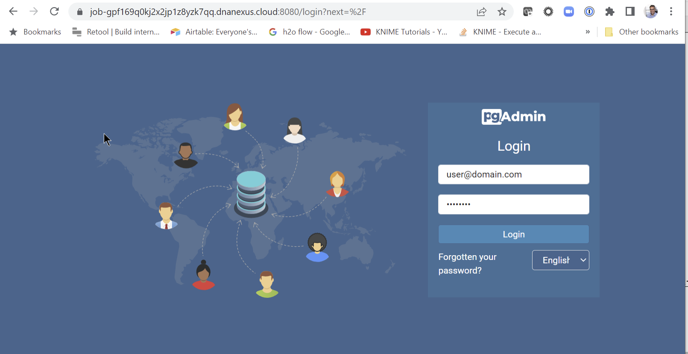

To connect pgadmin in the container to the postgres database server port on the host, first obtain the docker0 interface IP address. This will be used in place of localhost in pgadmin (since localhost in pgadmin refers to the container local host). Add the workstation local database as a new server (data analysis workstation db) using the docker0 address (user postgres, password password).
```
ip addr show docker0

2: docker0: <BROADCAST,MULTICAST,UP,LOWER_UP> mtu 1500 qdisc noqueue state UP group default 
    link/ether 02:42:cd:c8:f1:0e brd ff:ff:ff:ff:ff:ff
    inet 172.17.0.1/16 brd 172.17.255.255 scope global docker0
```

<div style="display: grid; grid-template-columns: 1.2fr 1fr; gap: 16px;" markdown="1">
  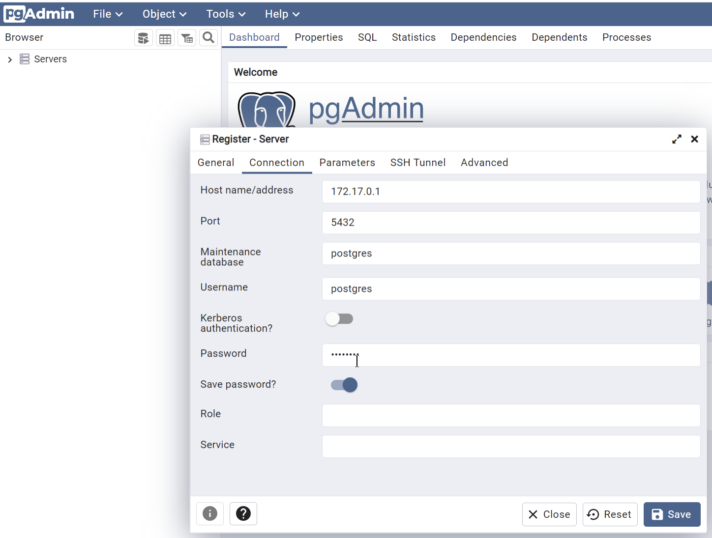
  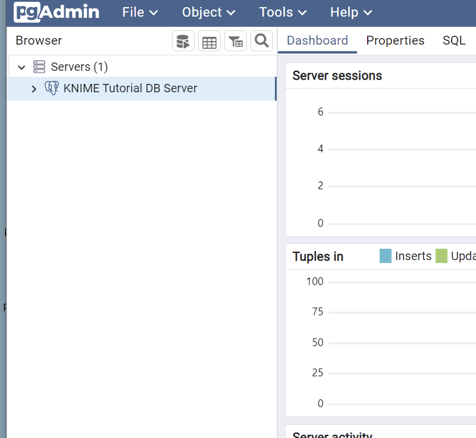
</div>

### Share Files Between Workstation FS and PostgreSQL Docker FS
Since pgadmin is running in a Docker container on the workstation, we are going to have to connect to the pgadmin container shell and copy files we want to share with pgadmin to the mount point shared by the container and the workstation (i.e. /home/dnanexus/db_backups). On a KNIME workstation terminal:

Connect to the shell in the pgadmin container.
```bash
sudo docker exec -it pgadmin sh
/pgadmin4 $
```
Copy files between the pgadmin backup directory to the container-host shared volume.
```bash
ls /var/lib/pgadmin/storage/user_domain.com
ls /home/dnanexus/db_backups
```
Control-D to exit the pgadmin container.
### Add Shell and SQL Scripts for Use With KNIME

```bash
# Shell scripts for pfda cli upload-file, download, and ls
#
cd
pfda download -key $key --file-id file-GPf54j00Fk5xb2zgbKxV0JQ4-1
chmod ugo+x pfda-download-runner
sudo mv pfda-download-runner /usr/bin

pfda download -key $key --file-id file-GPgQZF00Fk5zxYX1QqY1v6XP-1
chmod ugo+x pfda-upload-runner
sudo mv pfda-upload-runner /usr/bin
pfda download -key $key --file-id file-GPf54j80Fk5x0BY71qvBB3Jf-1
chmod ugo+x pfda-ls-runner
sudo mv pfda-ls-runner /usr/bin

# Shell script for executing SQL from files using psql client
#
pfda download -key $key --file-id file-GPf54j00Fk5bVVK3BXK22p41-1
chmod ugo+x sql-runner
sudo mv sql-runner /usr/bin

# Shell script for ETL of data from csv.gz files into DB
#
pfda download -key $key --file-id file-GPgPGJ00Fk5q805K278f7V3G-1
chmod ugo+x EHR_Data_ETL.bash
sudo mv EHR_Data_ETL.bash /usr/bin

# DDL for tutorial DB
#
pfda download -key $key --file-id file-GPgKJ4j0Kj2k48B1yFGB117b-1
mv KNIME_Tutorial_EHR_Data_TableDDL_No2ndIndex.sql knime-workspace/
```

### Download the KNIME Workflow
```bash
pfda download -key $key --file-id file-GPgy0bj0Fk5f7PGJf9vVJQPB-1
mv KNIME-Tutorial-20230217.knwf ~/knime-workspace/
```
### Run the KNIME Data Transformation Workflow
Restart KNIME to pickup the newly added files.

<div style="display: grid; grid-template-columns: 1.2fr 1fr; gap: 16px;" markdown="1">
  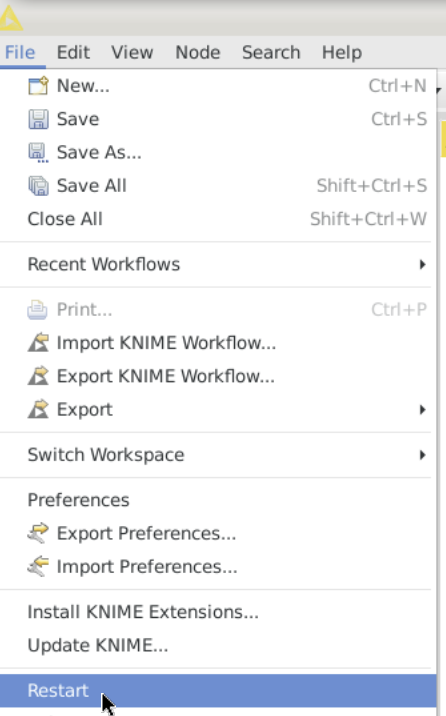
</div>

### Import and Open the Workflow and Update Dependencies

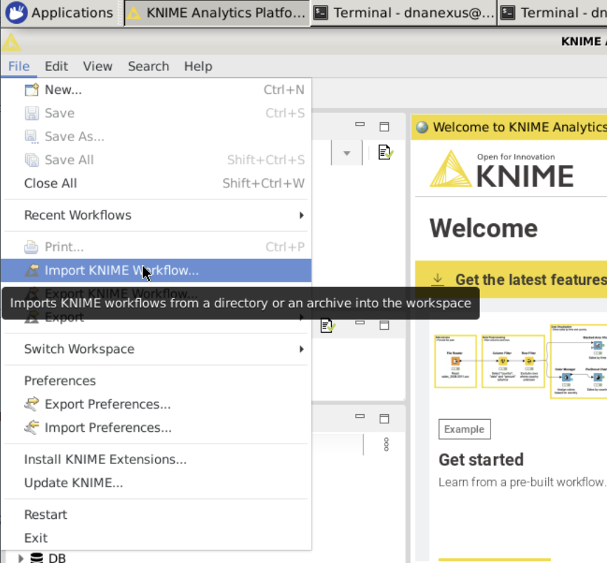

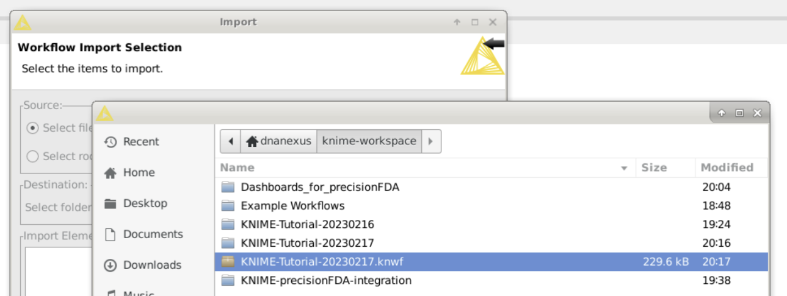

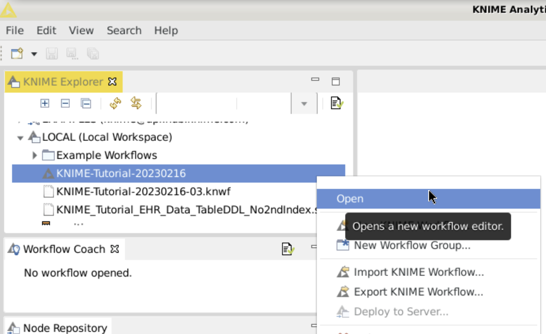

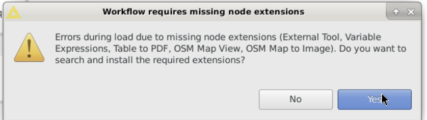

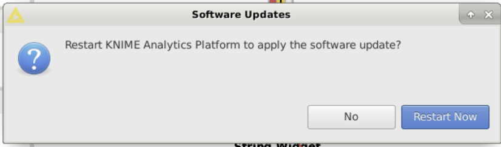

Ignore the warnings and errors.

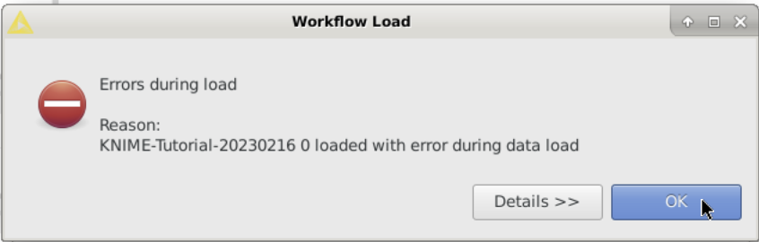

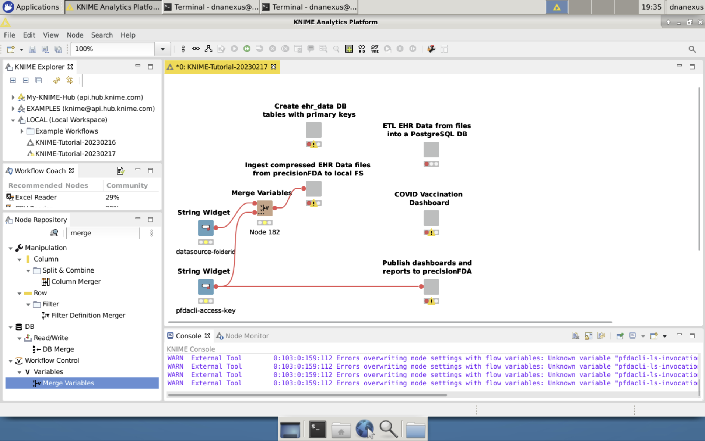

### Set the pFDA CLI Auth Token and Data Folder Variables

Configure the pfdacli-access-key String Widget to set the pfda CLI authentication token.

<div style="display: grid; grid-template-columns: 1fr 1fr; gap: 16px;" markdown="1">
  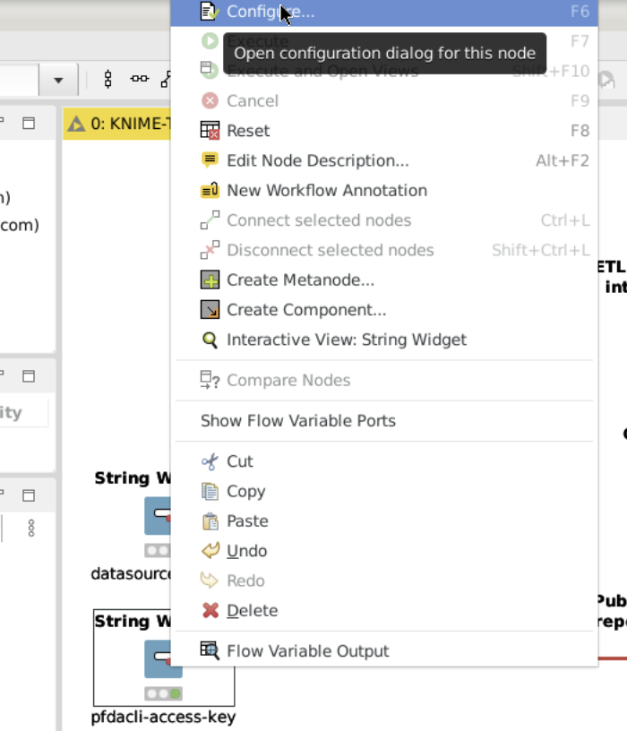
  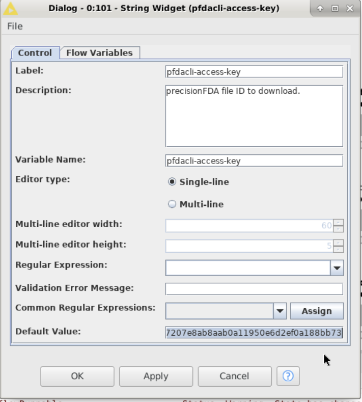
</div>

(Temporary workaround until the precisionFDA CLI is updated to properly perform ls on folders in the Everyone scope). 

In precisionFDA, navigate to the KNIME Workstation Tutorial / Datafiles folder in the My Home Everyone context and select and download all six files to your local machine.  Then, My Home / Files / Add Folder calling it “ KNIME sample data”, (or whatever you’d like since we’ll be referencing it by folder ID not name). Click into the new folder, and Add Files to re-upload the six files just downloaded. Copy the folder_id from the URL.

In KNIME, Configure the datasource-folderid String Widget to set the folder ID.

(Steps once the pFDA CLI is updated; ignore for now) Navigate to the KNIME Workstation Tutorial folder in the My Home Everyone context and copy the folder ID for the Datafiles folder from the browser URL. Configure the datasource-folderid String Widget to set the folder ID.

<div style="display: grid; grid-template-columns: 1fr 1fr; gap: 16px;" markdown="1">
  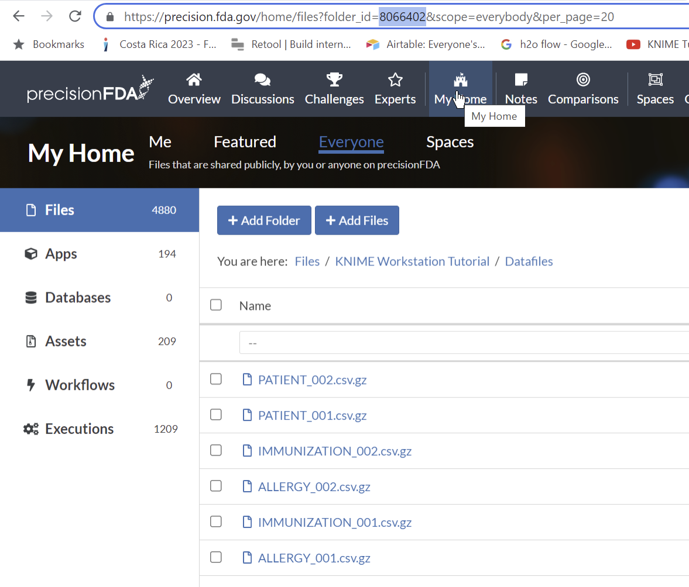
  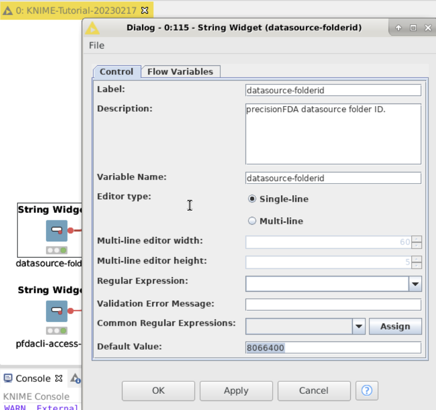
</div>

#### Create the DB
Execute the Create ehr_data DB tables with primary keys node.

<div style="display: grid; grid-template-columns: 1.5fr 1fr; gap: 16px;" markdown="1">
  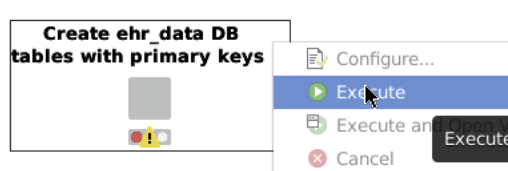
  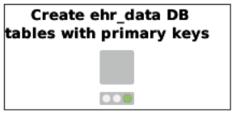
</div>

Once the node shows green, refresh the KNIME Tutorial DB Server in pgadmin to see the newly created knime_tutorial_ehr_data DB.

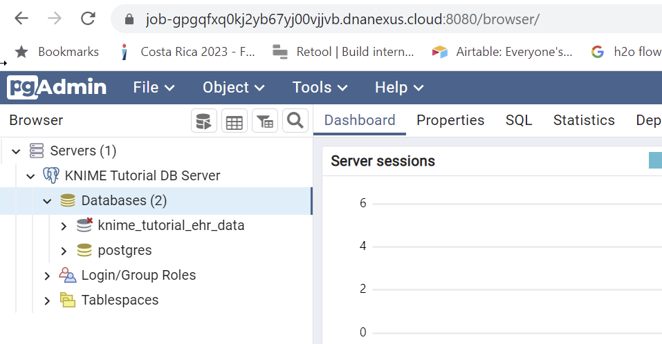

#### Download the Data from precisionFDA Folder
Execute the Ingest compressed EHR Data files from precisionFDA to local FS node.

<div style="display: grid; grid-template-columns: 1.5fr 1fr; gap: 16px;" markdown="1">
  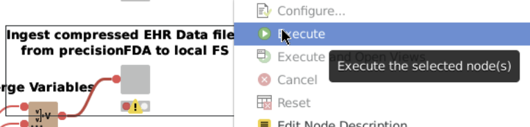
  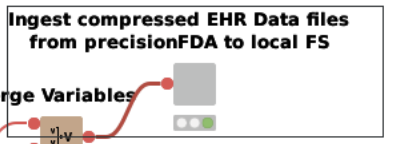
</div>

Once the node shows green, check the downloaded files in the newly created EHR_Data directory.

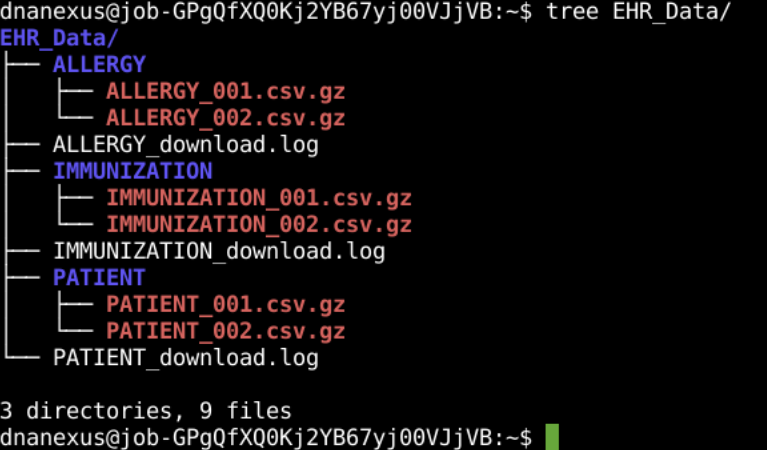

#### ETL the Data into the DB
Execute the ETL EHR Data from files into a PostgreSQL DB node to ETL the data from the compressed csv files into the DB.

<div style="display: grid; grid-template-columns: 3fr 1fr; gap: 16px;" markdown="1">
  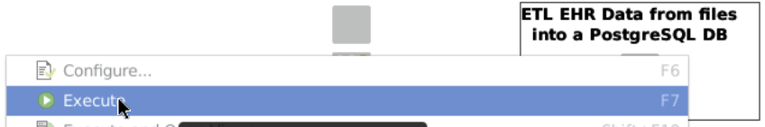
  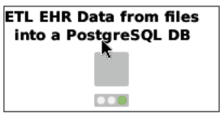
</div>

Once the shows green, check the DB for content in pgadmin.

<div style="display: grid; grid-template-columns: 1fr 2fr; gap: 16px;" markdown="1">
  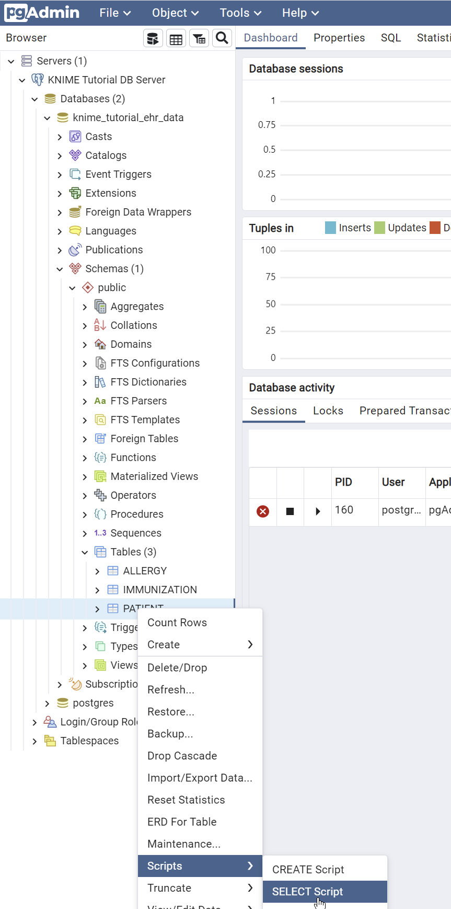
  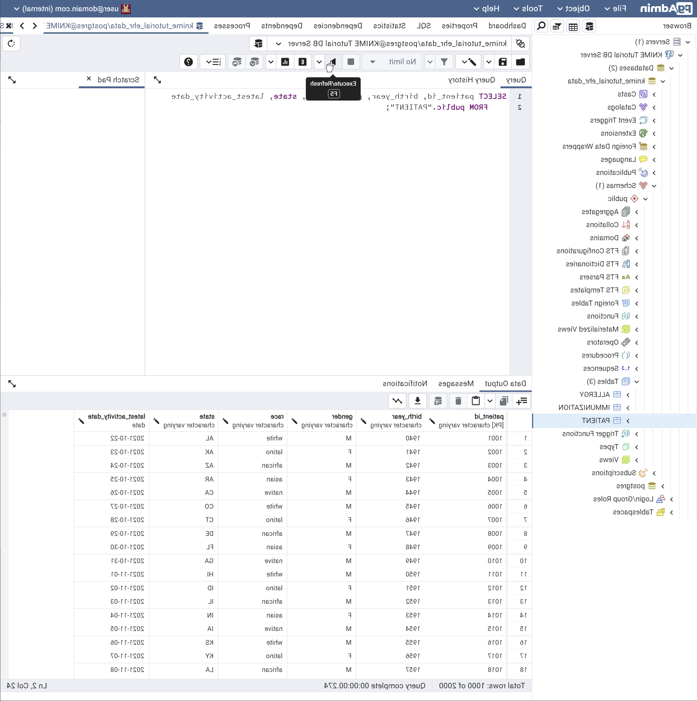
</div>

#### Analyze the Data and Create Reports
Execute the Dashboard node to and when it shows green, inspect the data table and geomap in the interactive node view .

<div style="display: grid; grid-template-columns: 1fr 1.4fr; gap: 16px;" markdown="1">
  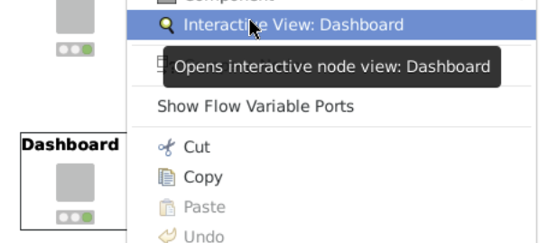
  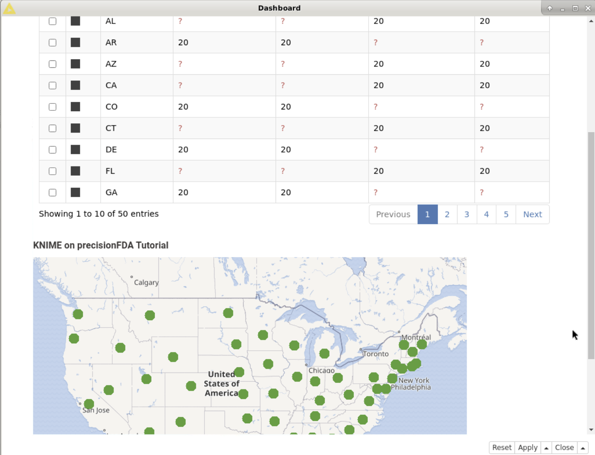
</div>

#### Publish the Reports to precisionFDA My Home
Execute the Publish dashboards and reports to precisionFDA node to upload the reports to your My Home files.

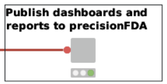

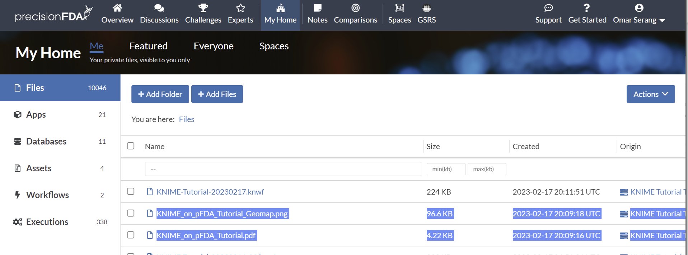