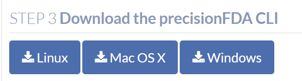
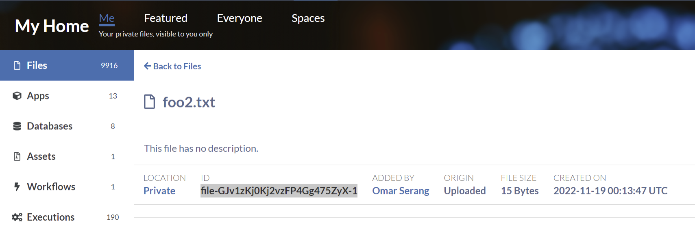
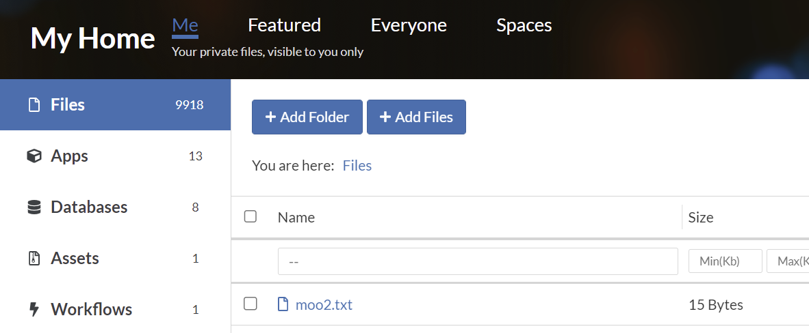

Copy the link for the current version of the Linux pFDA CLI from the CLI Docs page https://precision.fda.gov/docs/cli. Open a Terminal in the Data Analysis notebook and download unpack the CLI.
```bash
-- Install pfda CLI
wget https://pfda-production-static-files.s3.amazonaws.com/cli/pfda-linux-2.1.2.tar.gz
tar xf pfda-linux-2.1.2.tar.gz 
mv pfda /usr/bin/
pfda –-version
```
Retrieve a CLI authorization key. Under My Home Assets, click on the How to create assets button to find links to the precisionFDA CLI, and the button to generate the temporary authorization key that you’ll use with the CLI.
 
<div style="display: grid; grid-template-columns: 1fr 1fr; gap: 16px;" markdown="1">
  
  <div>
    
    
  </div>
</div>


```
pfda download -key Mk5VTENlTS83R2I1U3dXQkRnWEhzamJvVVFrTVZrOHA4STI4OTM0MitRWnNqZWVBSVRndlBicG1IUU9PeStjbTBLRXUzNW5rMmMrMjV6bGVhSnVTUlhDd2dEOVhRdUZvdmE1a29pcHdWWS92RGNyN1ljTlZtdnNjbE15RXVyVnl1Zkd3UUVxODZpYzNsWi9JWVVBcEw3VE5uaXdMSTdYNHNWVFJpZGJYdXlVa2hsRFFnR2dDc1JISzhuYWxla2JXLS1zVjRhSVBCWFdaRXBFWnBsMXNtSXB3PT0=--e19f53de7644d63dd3898717896a88bd0a383db6 -file-id file-GJv1zKj0Kj2vzFP4Gg475ZyX-1
```
Upload a file from the workstation local filesystem to precisionFDA (note the key is cached).
```
mv foo2.txt moo2.txt
pfda upload-file -file moo2.txt
```
