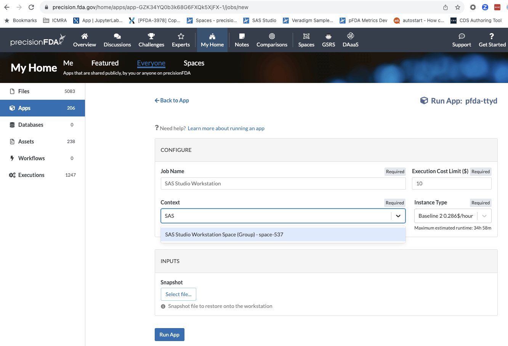
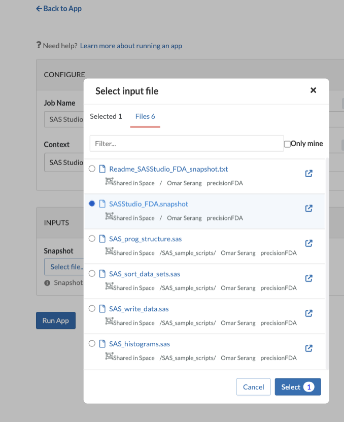
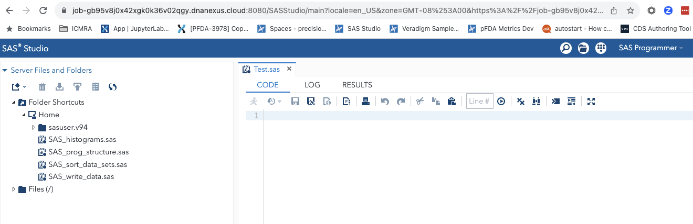
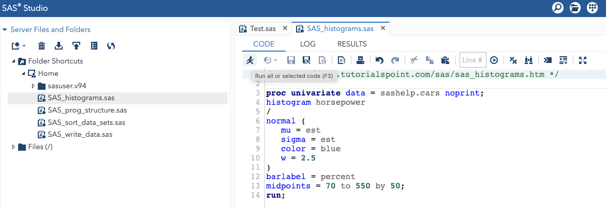
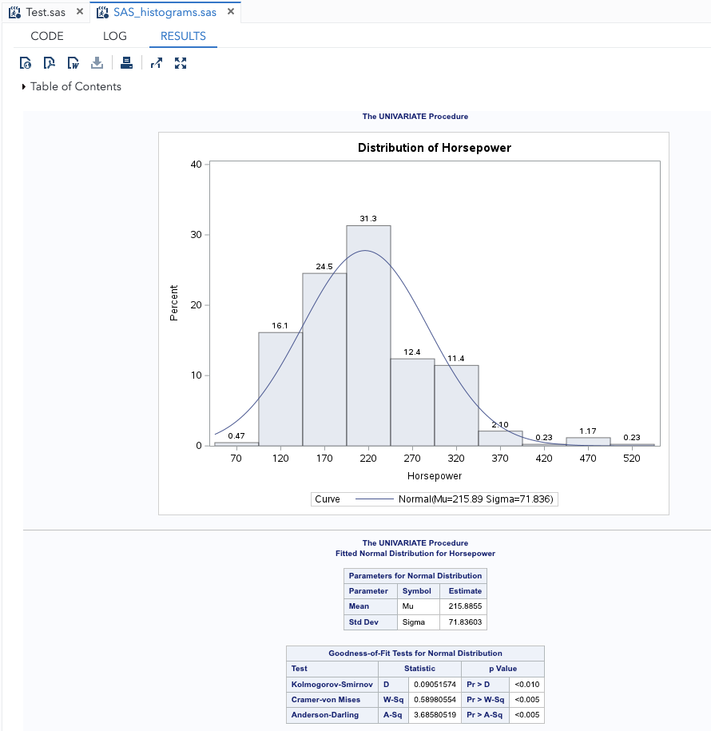

### SAS Studio Workstation Space
You will need to be a member of the SAS Studio Workstation Space (https://precision.fda.gov/spaces/537) in order to use the FDA's enterprise SAS license that is incorporated into a SAS Studio Snapshot file located in the Space (e.g. SASStudio_FDA.snapshot). FDA users that wish to use SAS Studio on precisionFDA should contact precisionFDA Support to request membership in the SAS Studio Workstation Space.
### Run the pfda-ttyd Featured App with SAS Studio Snapshot
Follow the procedure in the Run the pfda-ttyd Featured App section of this tutorial, selecting the execution Context as SAS Studio Workstation Space and specifying SASStudio_FDA.snapshot in the Snapshot inputs section.

<div style="display: grid; grid-template-columns: 1.5fr 1fr; gap: 16px;" markdown="1">
  
  
</div>
 
Open the workstation once it is running, download the sample SAS code, and start SAS Studio.
```bash
pfda download -space-id 537 -folder-id 8331897 
mv *.sas /home/sasuser/
mv *.xpt /home/sasuser/
mkdir /home/sasuser/SAS_Datasets
chown sasuser /home/sasuser/SAS_Datasets/
./sasstudio.sh start
```
Copy the ttyd job URL and append :8080/SASStudio to it (e.g. https://job-gb95v8j0x42xgk0k36v02qgy.dnanexus.cloud:8080/SASStudio) to open SAS Studio and login with user "sasuser" password "sas".



Note that the home folder in SAS Studio is mapped to /home/sasuser on the workstation local filesystem.
```bash
ls /home/sasuser/
SAS_histograms.sas  SAS_prog_structure.sas  SAS_sort_data_sets.sas  SAS_write_data.sas  sasuser.v94
```
Open up one of the SAS example files and run it.





### Open an SDTM File in SAS Studio

Open  the Open_SDTM.sas app and run it to read a SDTM file in xport format into SAS Studio then select View Column Labels to explore the sample clinical data.
