## Run the pfda-jupyterLab Featured App
Using the smallest instance type, run the Data Analysis Notebook job specifying PYTHON_R.

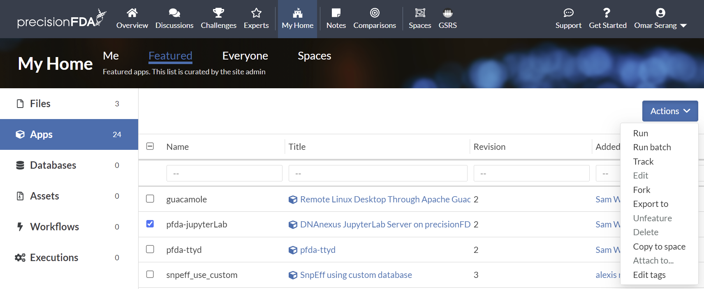

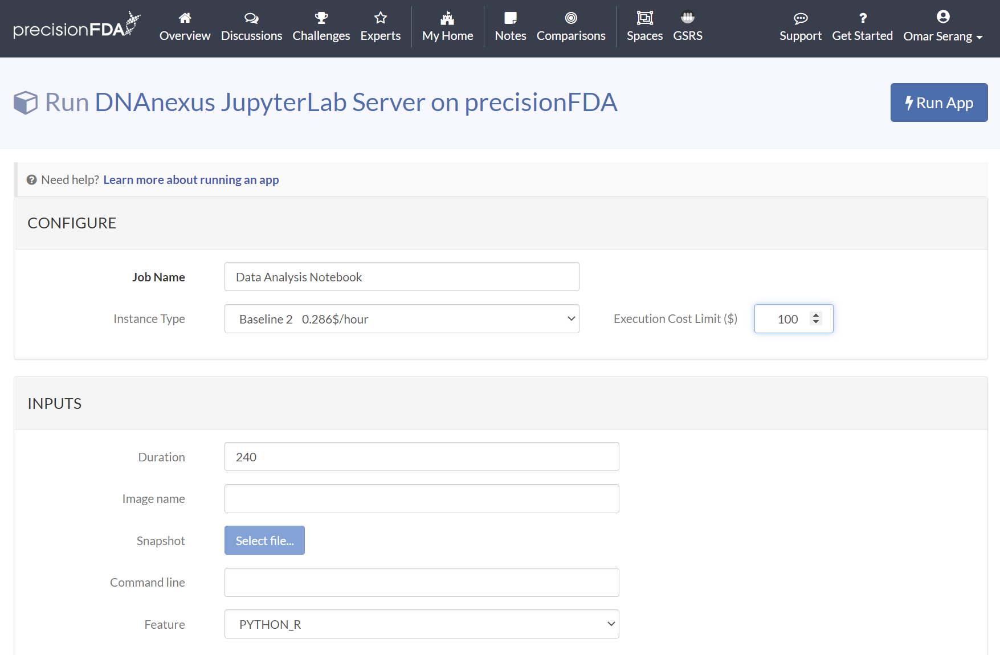

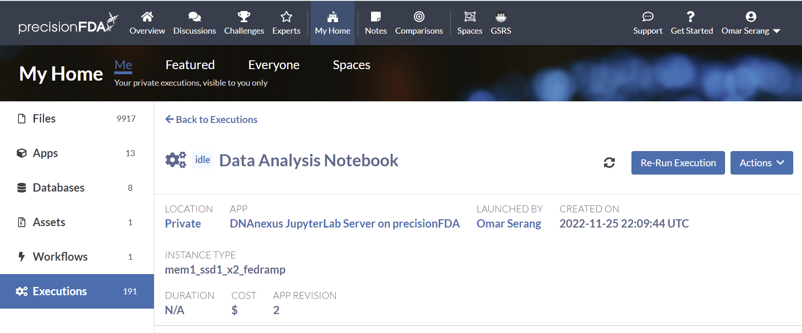

Refresh the execution status using the button until the job is running and open the workstation. It may take a few minutes after the job is running for the notebook to open.

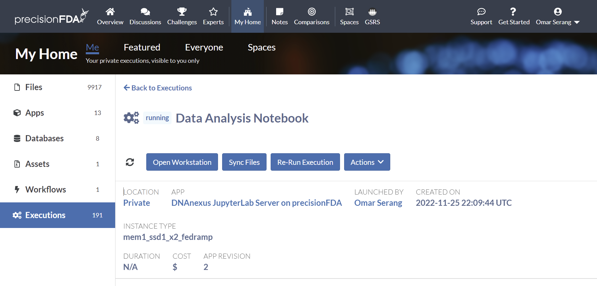

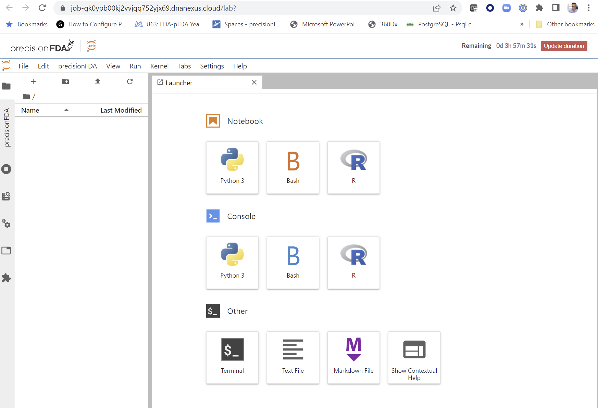

Adjust the remaining time-to-live for the notebook using the Update duration button.

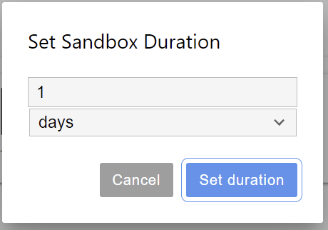


## Deploy Local PostgreSQL DB Server
Deploy a local PostgreSQL DB server on the Data Analysis workstation. Map the postgres port from the container to the workstation (host) OS. In the notebook terminal:
```bash
sh -c 'echo "deb http://apt.postgresql.org/pub/repos/apt $(lsb_release -cs)-pgdg main" > /etc/apt/sources.list.d/pgdg.list'
wget --quiet -O - https://www.postgresql.org/media/keys/ACCC4CF8.asc | apt-key add -
apt-get update
apt-get -y install postgresql < "/dev/null"
```
Configure postgres to enable password-free local login.  Find pg_hba.conf in /etc/postgresql/ and configure with permissive permissions. 
```
find /etc/postgresql -name pg_hba.conf | xargs sed -i 's/peer/trust/'
find /etc/postgresql -name pg_hba.conf | xargs sed -i 's/md5/trust/'
```
Start the local PostgreSQL DB server on the Data Analysis notebook.
```
/etc/init.d/postgresql start
 * Starting PostgreSQL 15 database server                                                                            [ OK ] 
/etc/init.d/postgresql status
15/main (port 5432): online

psql -U postgres -h 127.0.0.1
psql (15.1 (Ubuntu 15.1-1.pgdg18.04+1))
SSL connection (protocol: TLSv1.3, cipher: TLS_AES_256_GCM_SHA384, compression: off)
Type "help" for help.

postgres=#
```
## Create a Table with some data in the Local DB
In psql in the notebook terminal create a table, then copy two records from stdin into the table display them.
```sql
CREATE TABLE public."PATIENT" (
    patient_id int NOT NULL,
    name character varying,
    gender character varying,
    zip character varying,
    country character varying,
    created_date date
);

COPY public."PATIENT" (patient_id, name, gender, zip, country, created_date) from stdin;
```
Add these two records when prompted from the above COPY, and terminate with the \. record.
```
12345	foo	m	94040	usa	2022-11-25
54321	bar	m	94040	usa	2022-11-25
\.

select * from public."PATIENT";
 patient_id | name | gender |  zip  | country | created_date 
------------+------+--------+-------+---------+--------------
      12345 | foo  | m      | 94040 | usa     | 2022-11-25
      54321 | bar  | m      | 94040 | usa     | 2022-11-25
(2 rows)
```
Create a Notebook and Connect to the Local DB
In the notebook terminal, install the psycopg2 binary.
```
pip install psycopg2-binary
```
Open a Python 3 notebook.
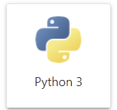


And enter the following code:

```py
import psycopg2
conn = psycopg2.connect("dbname='postgres' user='postgres' host='127.0.0.1'")
cur = conn.cursor()
cur.execute('SELECT * FROM public."PATIENT" limit 10')
# fetch results
rows = cur.fetchall()
# iterate through results
for row in rows:
    print ("   ", row)
```

## Connect to the Cluster DB
Open a Python 3 notebook.


And enter the following code:
```py
import psycopg2

conn = psycopg2.connect("dbname='workstations_and_databases_tutorial_db' user='root' host='dbcluster-gk0b58j0kj2y4v1k899bq0x6.cluster-cqy4cenhebvb.us-east-1.rds.amazonaws.com' password='password'")

cur = conn.cursor()
cur.execute('SELECT * FROM public."PATIENT" limit 10')
# fetch results
rows = cur.fetchall()
# iterate through results
for row in rows:
    print ("PATIENT", row[0], row[1], row[2])

cur.execute('SELECT * FROM public."OBSERVATION" limit 10')
# fetch results
rows = cur.fetchall()
# iterate through results
for row in rows:
    print ("OBSERVATION", row[0], row[1], row[2])

PATIENT 12345 Fred Foobar M
PATIENT 12346 Mary Merry F
PATIENT 12347 Barney Rubble M
OBSERVATION 9870 12345 Annual check up
OBSERVATION 9871 12345 Emergency
OBSERVATION 9872 12346 Clinic visit
OBSERVATION 9873 12347 Lab results
OBSERVATION 9874 12347 Post-op checkup
```
## Load a Complete Notebook from a Snapshot
Using My Home / Applications, run the featured pfda-jupyterLab app on the smallest instance type, providing the Jupyter-DESeq2-notebook-snapshot.tar file as input. This snapshot contains a complete RNA-seq DESeq2 quantification JupyterLab workbook with R package, notebook, input file and sample sheet all included.

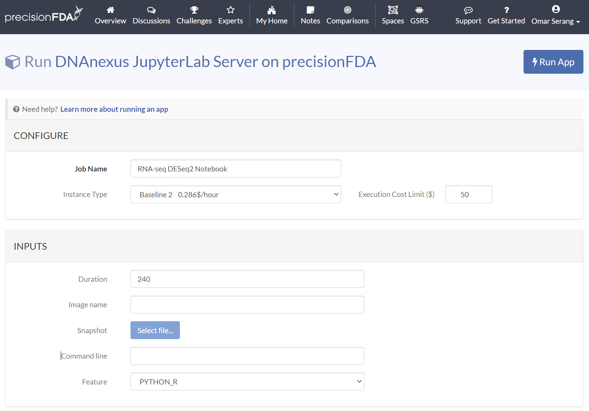

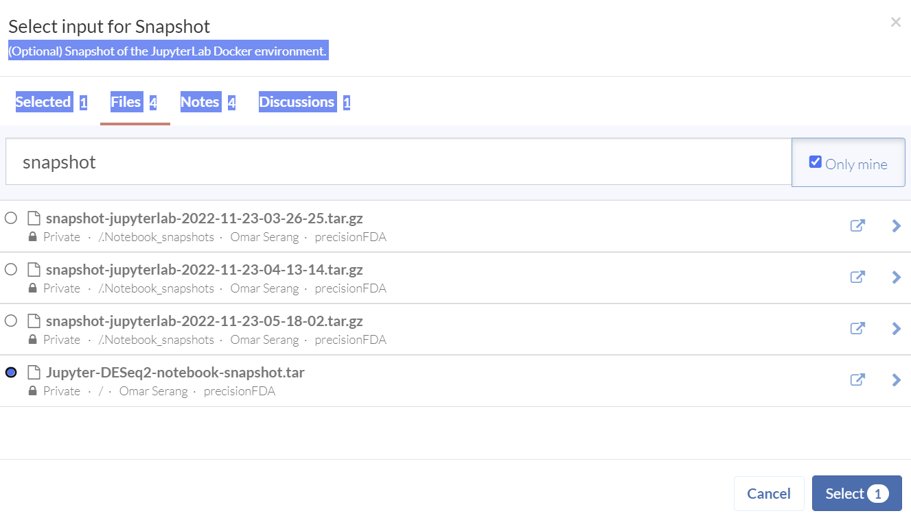

Once the app is running, click the open workstation button to access  a rich visual and interactive analysis environment.

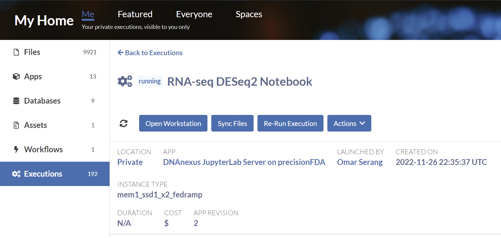
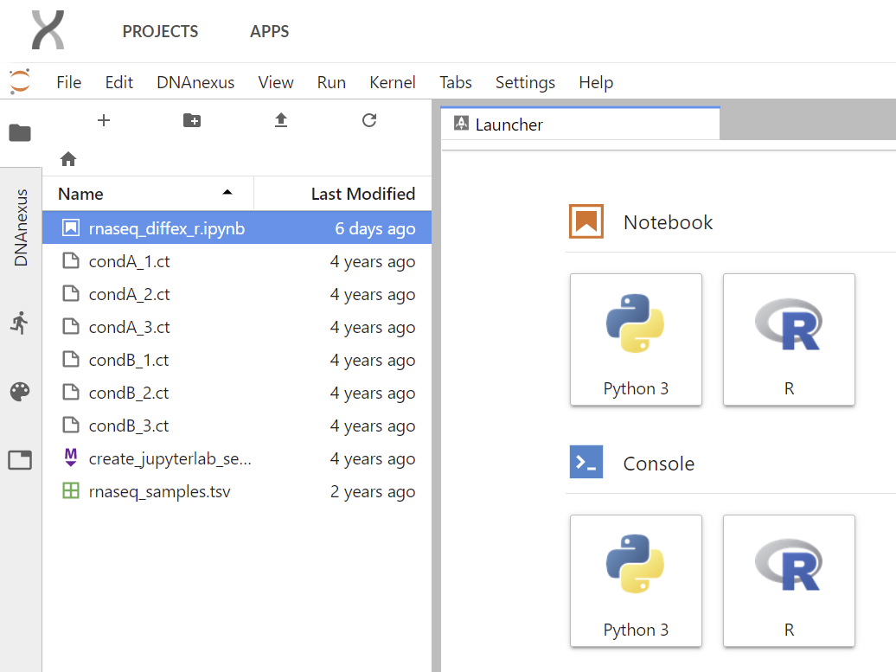

Open the rnaseq_diffex_r notebook to explore the data.

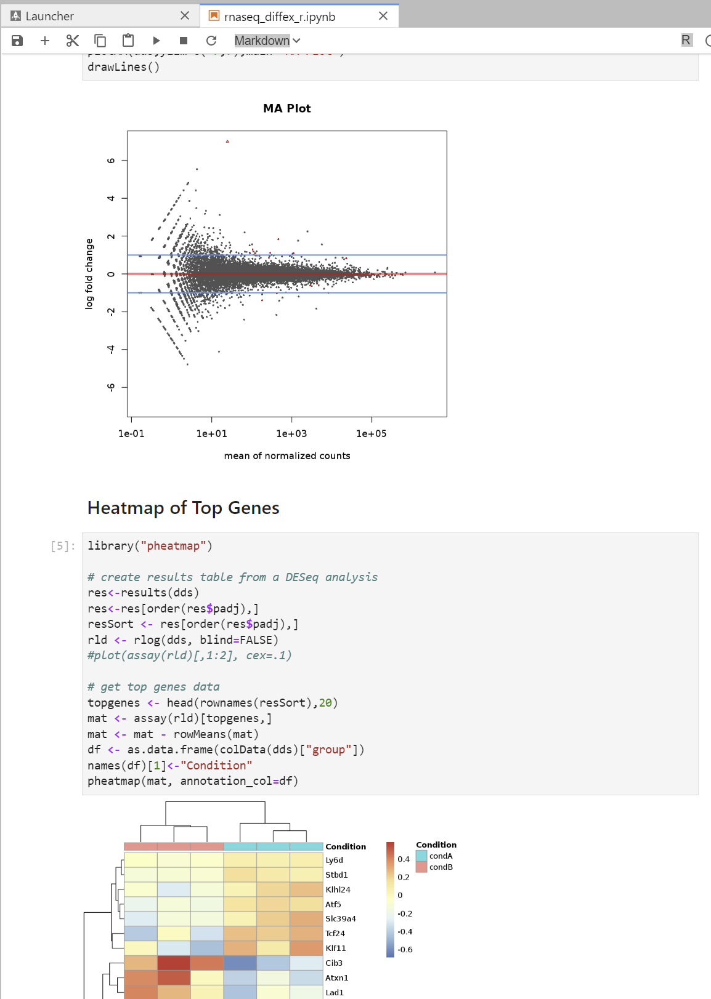


## Build Epidemiology Data Analysis Notebooks
The Epidemiologist's R Handbook (https://epirhandbook.com/en) provides a wealth of R code examples for applied epidemiology and public health. The following pipelines have been created for deployment on Jupyter Notebooks using snapshots: 
- Data cleaning and de-duplication
- Time series and outbreak detection
- Epidemic modeling and contract tracking

## Copy the Notebook Resources to a New Private Space
In order to access these resources from the Notebooks that you launch, you will need to copy them to a private space. Create a new private space for this purpose.

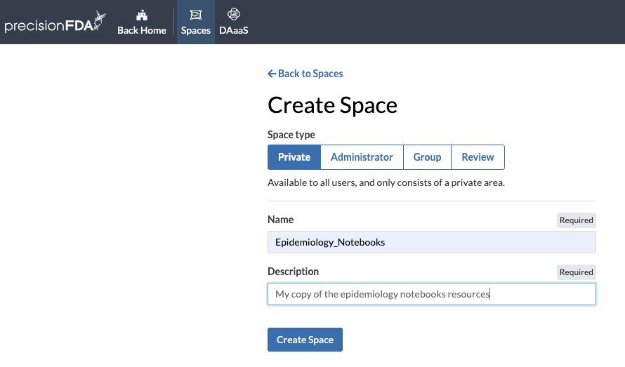

The resources to launch and test these pipelines are available in the Epidemiology_tutorial folder that can be accessed under My Home / Files / Featured (https://precision.fda.gov/home/files?folder_id=8314805&scope=featured). Select all the items and copy to your new private space using the Actions pulldown menu.
You only have to perform this operation once.

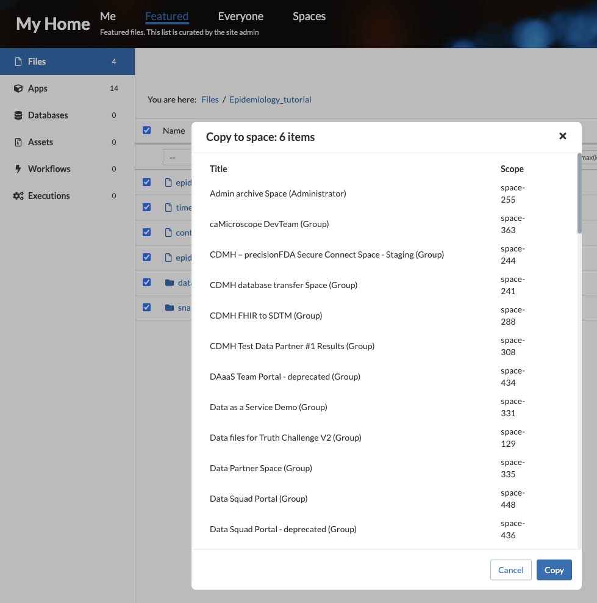

## Running in non-interactive mode with papermill
The epidemic_modeling.ipynb notebook can take a considerable amount of time to run (1.5 hours on a Baseline 16 instance) and thus has issues when attempting to run it interactively. It is recommended that you first run the notebook non-interactively using "papermill".  This is a two-step process, first running the notebook non-interactively and then opening the rendered result in a new notebook.

You will need the file ID for the epidemic_modeling.ipynb notebook. Remove the -x suffix for use in the runtime command invocation (e.g. file-GYXjgGj0J85qJ8x618yybg8v).

<div style="display: grid; grid-template-columns: 1.5fr 1fr; gap: 16px;" markdown="1">
  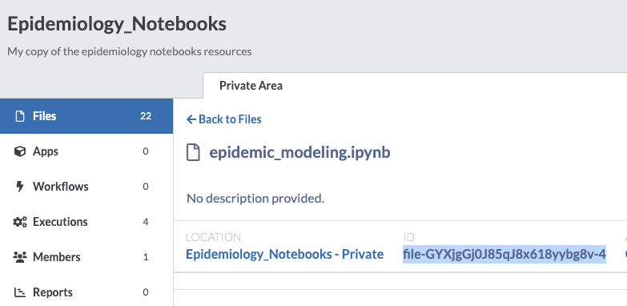
  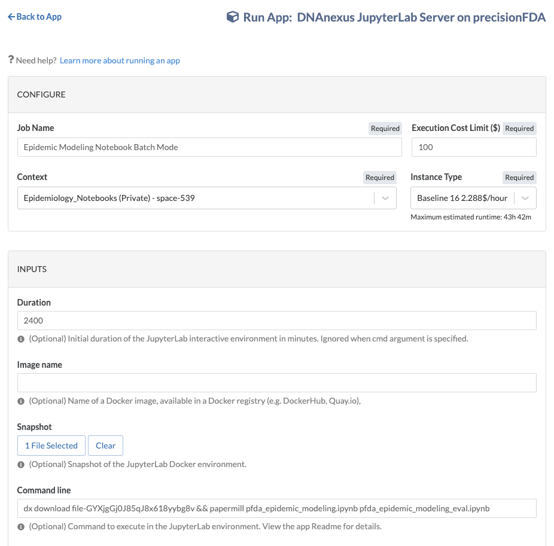
</div>

Follow the procedure in the Run the pfda-jupyterLab Featured App section of this tutorial, selecting the execution Context as Epidemiology_Notebooks, specifying snapshot-epidemic-modeling.tar.gz in the Snapshot inputs section, and specifying the following in the Command Line input:
```
dx download file-GYXjgGj0J85qJ8x618yybg8v && papermill epidemic_modeling.ipynb epidemic_modeling_eval.ipynb
```
You'll notice the following error in the job log but be patient, it will complete.
```
Executing: 18%|█▊ | 7/39 [00:01<00:17, 1.79cell/s]Failed to create bus connection: 
No such file or directory
```
## Build Epidemic Modeling Notebook
Follow the procedure in the Run the pfda-jupyterLab Featured App section of this tutorial, selecting the execution Context as Epidemiology_Notebooks and specifying snapshot-epidemic-modeling.tar.gz in the Snapshot inputs section, to launch the epidemic modeling notebook.

<div style="display: grid; grid-template-columns: 1.5fr 1fr; gap: 16px;" markdown="1">
  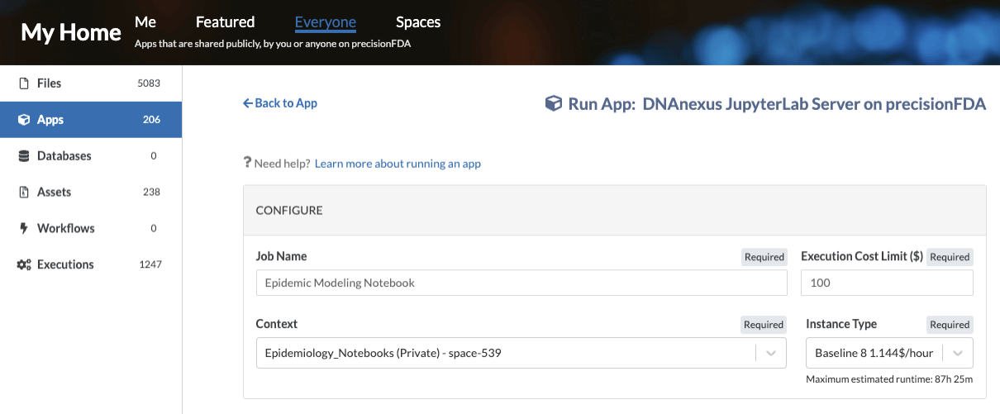
  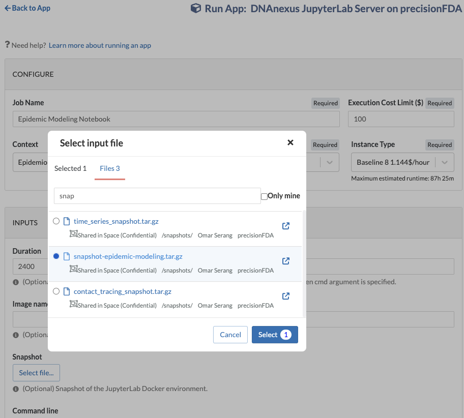
</div>
 
You'll find this execution running in your new space. It will take some time for the large snapshot to be unpacked. Use the Action View Logs pull down menu to observe when the snapshot restore is complete and the notebook is started. Then click the Open Workstation button to open the notebook. Click on the DNAnexus sidebar to view the resources in your space and open the epidemic_modeling.ipynb_eval notebook that was produced in the previous step. All the cells have been rendered with results presented.

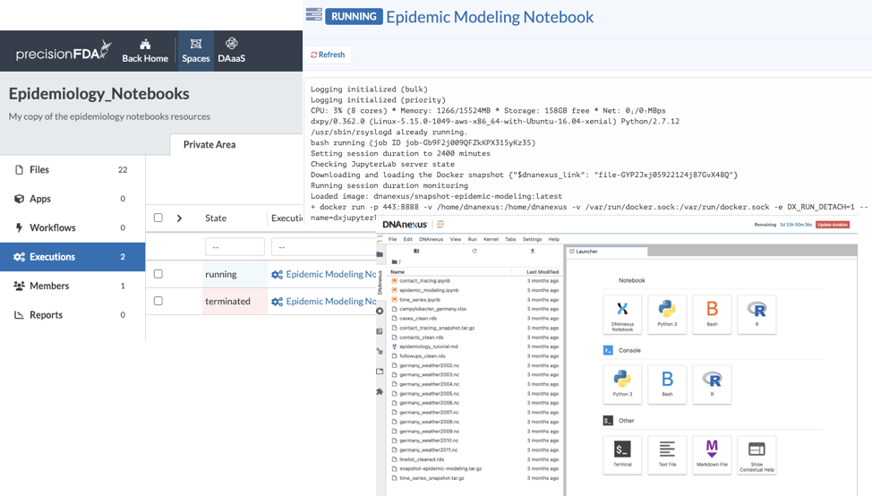

## Build Time Series and Outbreak Detection Notebook
Follow the procedure in the Build Epidemic Modeling Notebook section above, selecting the execution Context as Epidemiology_Notebooks and specifying time_series_snapshot.tar.gz in the Snapshot inputs section, to launch the time series and outbreak detection notebook. Once the notebook is running and the snapshot restored, click on the DNAnexus sidebar to view the resources in your space and open the time_series.ipynbnotebook. Select Run All Cells from the Run menu and view the calculation results appear in the notebook cells.

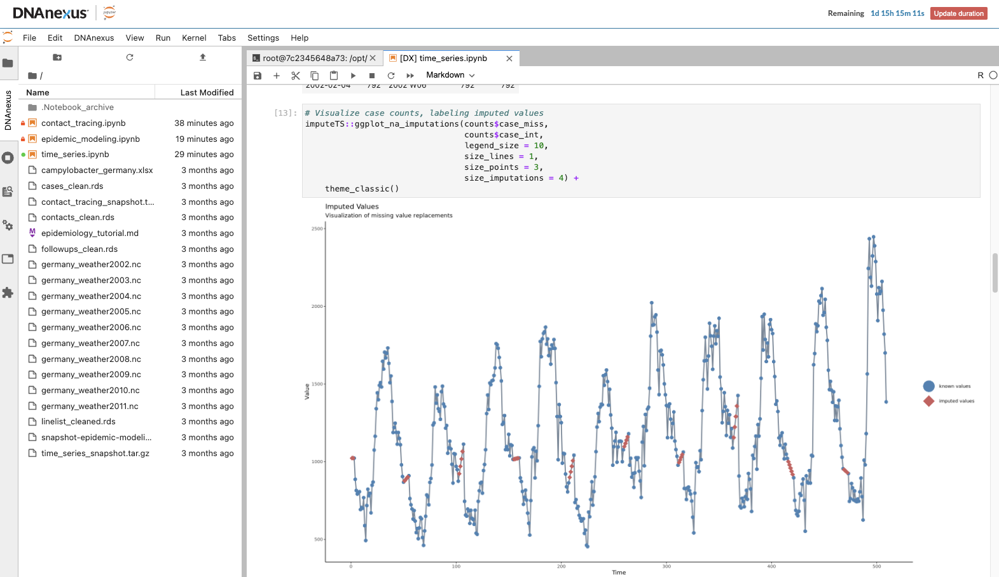

## Build Contact Tracing Notebook
Follow the procedure in the Build Epidemic Modeling Notebook section above, selecting the execution Context as Epidemiology_Notebooks and specifying contact_tracing_snapshot.tar.gz in the Snapshot inputs section, to launch the contract tracing notebook. Once the notebook is running and the snapshot restored, click on the DNAnexus sidebar to view the resources in your space and open the contact_tracing.ipynb notebook. Select Run All Cells from the Run menu and view the calculation results appear in the notebook cells.

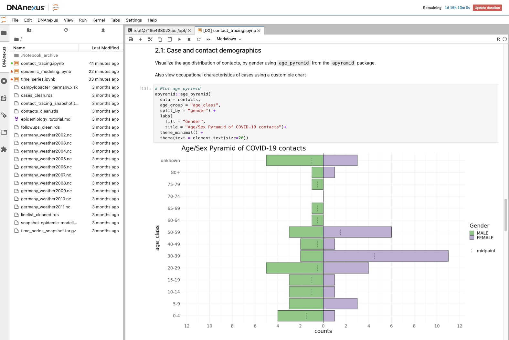

# Snapshot and Terminate Workstations
In keeping with good cloud usage practice, we will snapshot and terminate the workstations, preserving their entire state as built out through this tutorial. Additionally since we’ve backed up the database to a precisionFDA file, we can safely terminate the cluster database as well.

## Stop the Docker Containers and Snapshot Data Analysis Workstation
Using the data analysis workstation shell, create a snapshot of the workstation in you My Home files area.
```bash
Docker stop 
dx-create-snapshot

dx ls -al *snapshot
```
### Terminate the Workstation
In My Home / Executions, select (one at a time unfortunately) the Data Analysis Workstation and Data Analysis Notebook executions and select Terminate under the Action dropdown menu.

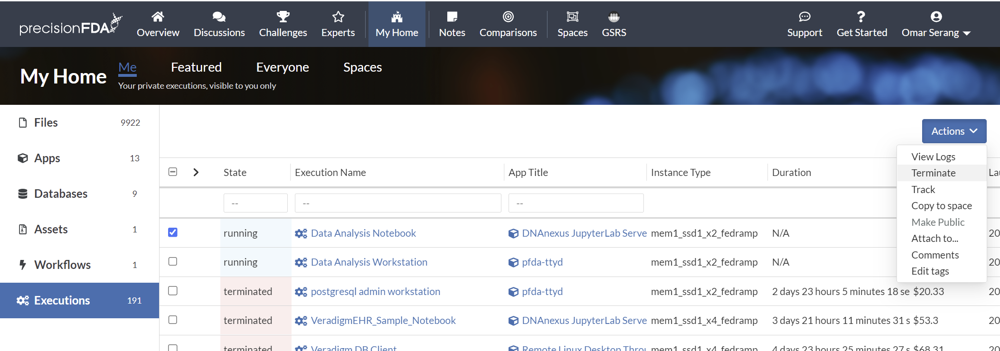

## Snapshot and Terminate the Data Analysis Notebook
Select Create Snapshot in the precisionFDA menu in the jupyterLabs interface.

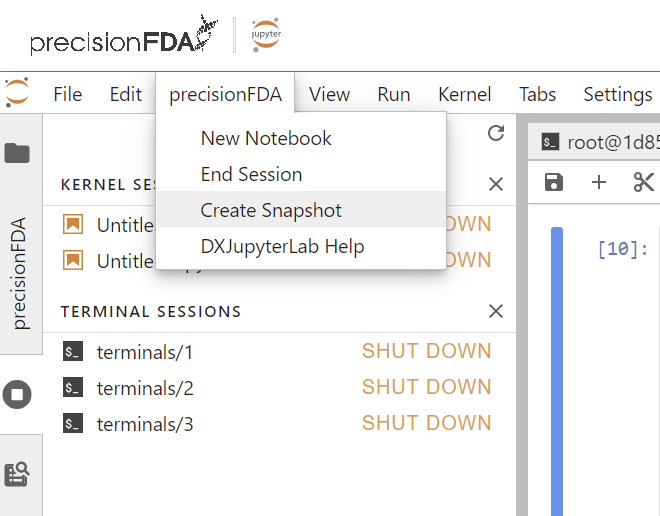

### Terminate the Workstation and Notebook and Database Cluster
In My Home / Executions, select (one at a time unfortunately) the Data Analysis Workstation and Data Analysis Notebook executions and select Terminate under the Action dropdown menu.


