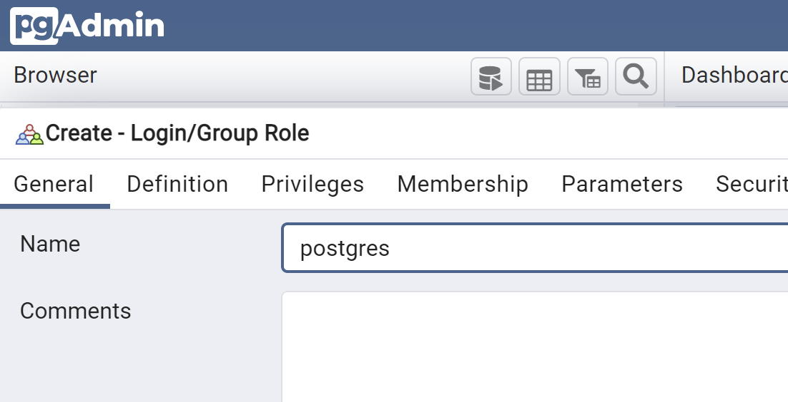

# Tutorial: Collaborative Data Science with Interactive Workstations and Databases

# Introduction

This hands-on tutorial presents design patterns for collaborative data science using the featured precisionFDA pfda-ttyd, pfda-jupyterLab, and guacmole interactive workstation apps, and precisionFDA Databases. Through the development of the tutorial assets, precisionFDA’s powerful capabilities for secure sharing and analysis of FISMA-Moderate authorized data are clearly demonstrated, and users will be empowered to develop their own collaborative regulatory data science use cases.

As always, keep in mind that all of these workstations, notebooks, and databases are strictly within the sole provenance of the user that launched them, and that in compliance with  precisionFDA’s FISMA authorization, the ability to deliver multi-user web services or databases is specifically not supported on precisionFDA. 

Users can however use the power of the cloud to efficiently achieve their collaborative data science and bioinformatics objectives, and use the regulatory-grade platform to share the tools and results with full chain of provenance tracking. For cross-cutting analysis across FDA datasets, users will need to bring their data into the FDA's Intelligent Data Lifecycle Ecosystem (FiDLE).

# Learning Objectives

Through this hands-on tutorial you will:
- Use the precisionFDA command line utility (pfda) to programmatically transfer files to and from precisionFDA and workstations and notebooks.
- Configure ttyd workstations to present multiple web services on ports 8080 using a reverse proxy for secure browser-based access with a rich UI.
- Launch a data analysis ttyd workstation with a local PostgreSQL database server, psql command line database client, pgadmin GUI database client, and RStudio configured with PostgreSQL access.
- Launch a SAS Studio workstation using a pfda-ttyd snapshot.
- Launch a KNIME Analytics Platform guacamole workstation with a local PostgreSQL database server, psql command line database client, and pgadmin GUI database client.
- Launch a precisionFDA Database cluster and access it from the data analysis workstation using psql and pgadmin to configure and install a database on the cluster from DDL and delimited data files.
- Use pgadmin to backup the cluster database to a precisionFDA file.
- Use pgadmin to restore the database backup to the data analysis workstation local database.
- Access the cluster and the workstation local databases from RStudio.
- Launch a jupyterLab workstation with a local PostgreSQL database server, and psql command line database client, and an example Python database analysis notebook.
- Launch a series of epidemiology-related Jupyter notebooks and use papermill to execute a long-running notebook non-interactively,
- Use pgadmin to restore the database backup to the jupyterLab workstation local database.
- Access the cluster and the workstation local databases from a Python notebook.


# Build Data Analysis Workstation

## Run the pfda-ttyd Featured App

Using the smallest instance type, run the Data Analysis Workstation job using the pfda-ttyd featured app.


Refresh the execution status using the refresh button until the job is running and open the workstation.


Use dx-get-timeout and dx-set-timeout to view and set the workstation application time-to-live after which it will self-terminate.
```
dx-set-timeout 2d
dx-get-timeout
0 days 23 hours 59 minutes 56 seconds
```

## Present a simple web server on port 8080

The ttyd and guacamole workstations enable presentation of web services that can be accessed via the job URL port 8080. Let's startup a simple Python-based web server and browse to it.

```bash
python3 -m http.server 8080 &
```

Now copy the URL from your ttyd window and append port 8080 to it(e.g. https://job-gxjjzj80kj2qgp2z6p9x1yvq.dnanexus.cloud:8080) to browse to your web service on the wo rkstation.


Kill the http.server job to free up port 8080.

## Deploy PostgreSQL, psql, pgadmin, and RStudio

A docker-compose.yml file is configured to launch a local PostgreSQL database, and RStudio, and pgadmin web services that connect to the database. RStudio and pgadmin are accessed using the workstation job URL extended to target the specific service on port 8080 (e.g. https://job-gb1y8jj0kj2xvbggbp3qgv55.dnanexus.cloud:8080/pgadmin/). The postgres-local database container is accessed from the pgadmin and rstudio containers and from the psql command line client on the workstation shell.

The pfda-ttyd and guacamole workstation apps provide port 8080 for access to user deployed web services on the workstation. In order to access multiple different web services (e.g. pgadmin and RStudio) on the single port 8080, a Docker-based reverse proxy is configured using the traefik open source cloud-native application proxy application (https://github.com/traefik/traefik).

Install docker-compose-plugin.

```bash
install-docker-compose.sh
```

Download the traefik-postgres-pgadmin-rstudio-docker-compose.yml file to the workstation.

```bash
pfda download --file-id file-Gb21QGj0Kj2pBzZ9Q3Yqv1Kp-2
```

Start the traefik, postgres-local, rstudio, and pgadmin docker services.

```bash
docker compose -f traefik-postgres-pgadmin-rstudio-docker-compose.yml create
docker compose -f traefik-postgres-pgadmin-rstudio-docker-compose.yml start
```

Install the psql postgres command line client and test the connection to the database.

```bash
apt update
apt install postgresql-client -y < "/dev/null"

PGPASSWORD="password" psql -h localhost -U postgres
```

Ctrl-D to exit psql.

Configure the pgadmin container mounted directory permissions.
```bash
sudo chown -R 5050:5050 db_backups/
sudo chmod ugo+w db_backups/
```

## Access the postgres-local DB from pgadmin

Access the pgadmin web service from your web browser (e.g. https://job-gk0qpfj0kj2ybz63p36by5kj.dnanexus.cl oud:8080/pgadmin).

Add the workstation local database as a new server (e.g. Data Analysis Workstation DB Server) using hostname postgres-local and port 5432, maintenance database postgres, user postgres, and password password.


<div style="display: grid; grid-template-columns: 1fr 1fr; gap: 16px;" markdown="1">
  
  
</div>


## Create a new database and tables

Connect to the cluster database from psql in the data analysis workstation shell.

```bash
PGPASSWORD="password" psql -h localhost -U postgres
```

Using psql, create a new database.

```sql
-- Database: workstations_and_databases_tutorial_db
CREATE DATABASE workstations_and_databases_tutorial_db
    WITH
    OWNER = postgres
    ENCODING = 'UTF8'
    CONNECTION LIMIT = -1
    IS_TEMPLATE = False;

```

Connect to the new database and create two tables.

```
\c workstations_and_databases_tutorial_db;

psql (9.5.25, server 11.16)
WARNING: psql major version 9.5, server major version 11.
         Some psql features might not work.
SSL connection (protocol: TLSv1.2, cipher: ECDHE-RSA-AES128-GCM-SHA256, bits: 128, compression: off)
You are now connected to database "workstations_and_databases_tutorial_db" as user "root".
workstations_and_databases_tutorial_db=>

CREATE TABLE public."PATIENT" (
    patient_id bigint NOT NULL,
    name character varying,
    gender character varying,
    zip character varying,
    country character varying,
    created_date date
);

CREATE TABLE public."OBSERVATION" (
    observation_id bigint NOT NULL,
    patient_id bigint,
    observation_name character varying,
    loinc character varying,
    created_date date
);

\dt
          List of relations
 Schema |    Name     | Type  | Owner 
--------+-------------+-------+-------
 public | OBSERVATION | table | root
 public | PATIENT     | table | root
(2 rows)
```

## Load the cluster database from delimited text files
In the data analysis workstation shell, create a datafiles directory
```bash
mkdir datafiles
cd datafiles
```

Create file `patients.txt` with the following content:
```bash
cat > patients.txt
12345|Fred Foobar|M|94040|USA|2022-10-25
12346|Mary Merry|F|94040|USA|2022-09-24
12347|Barney Rubble|M|94040|USA|2022-08-23
ctrl-D
```

Create file `observations.txt` with the following content:
```bash
cat > observations.txt
9870|12345|Annual check up|66678-4|2022-11-01
9871|12345|Emergency|LG32756-5|2022-11-02
9872|12346|Clinic visit|66678-4|2022-11-03
9873|12347|Lab results|74418-5|2022-11-04
9874|12347|Post-op checkup|65375-8|2022-11-05
ctrl-D
```

## Copy the data into the cluster DB tables

```bash
PGPASSWORD="password" psql -h localhost -U postgres
workstations_and_databases_tutorial_db=>
```
In psql:
```sql
\copy public."PATIENT" from '/home/dnanexus/datafiles/patients.txt' delimiter '|' NULL ''

\copy public."OBSERVATION" from '/home/dnanexus/datafiles/observations.txt' delimiter '|' NULL ''

select * from public."PATIENT";
patient_id |     name      | gender |  zip  | country | created_date 
------------+---------------+--------+-------+---------+--------------
      12345 | Fred Foobar   | M      | 94040 | USA     | 2022-10-25
      12346 | Mary Merry    | F      | 94040 | USA     | 2022-09-24
      12347 | Barney Rubble | M      | 94040 | USA     | 2022-08-23

select * from public."OBSERVATION";
observation_id | patient_id | observation_name |   loinc   |created_date 
----------------+------------+------------------+-----------+-----------
           9870 |      12345 | Annual check up  | 66678-4   | 2022-11-01
           9871 |      12345 | Emergency        | LG32756-5 | 2022-11-02
           9872 |      12346 | Clinic visit     | 66678-4   | 2022-11-03
           9873 |      12347 | Lab results      | 74418-5   | 2022-11-04
           9874 |      12347 | Post-op checkup  | 65375-8   | 2022-11-05
```
Observe the new tables and data in the pgadmin Workstations and Databases Tutorial server connection.

## Share Files Between Workstation FS and PostgreSQL Docker FS

Since pgadmin is running in a Docker container on the workstation, we are going to have to connect to the pgadmin container shell and copy files we want to share between the workstation and pgadmin to and from the mount point shared by the container and the workstation (i.e. /home/dnanexus/db_backups).

When performing a database backup in pgadmin, save the file in /home/dnanexus/db_backups.


The backup file is accessible in workstation /home/dnanexus/db_backups. Files can be placed in this directory for access by pgadmin.
```bash
root@job-Gb21Kfj0Kj2jxbjv0pzxQx8Y:~# ls /home/dnanexus/db_backups/
backup.sql  foo.txt  moo.txt
```

## Access the postgres-local DB from rstudio

Access the RStudio web service from your web browser (e.g. https://job-gb1y8jj0kj2xvbggbp3qgv55.dnanexus.cloud:8080/rstudio/).


Install the RPostgres packages and test access to the workstation local database. In the R Studio console:
```r
# Install RPostgres
install.packages("RPostgres")

# Connect to local database
library(DBI)
con <- DBI::dbConnect(
    RPostgres::Postgres(),
    host = "172.17.0.1", 
    port = 5432, dbname = "postgres",
    user = "postgres", password = "password"
)
# List the tables in db postgres	
dbListTables(con)
```
Since there are no tables in the postgres database, the response is character(0). Let’s add two tables using psql and run the same R query.
Using the psql command line client in the data analysis workstation shell:
```sql
PGPASSWORD="password" psql -h localhost -U postgres

CREATE TABLE public."PATIENT" (
    patient_id bigint NOT NULL,
    name character varying,
    gender character varying,
    zip character varying,
    country character varying,
    created_date date
);

CREATE TABLE public."OBSERVATION" (
    observation_id bigint NOT NULL,
    patient_id bigint,
    observation_name character varying,
    loinc character varying,
    created_date date
);
```
The same query in the RStudio console now shows the two new tables.
```sql
dbListTables(con)
[1] "PATIENT"     "OBSERVATION"
```
Let’s drop the tables since we will be populating this database from a backup a later stage in this tutorial. Using the psql command line client in the data analysis workstation shell:
```sql
DROP TABLE public."PATIENT"
DROP TABLE public."OBSERVATION”
```
Control-D to exit psql.


## Share Files Between Workstation FS and RStudio Docker FS

The rstudio container shares the /home/dnanexus mount point with the workstation filesystem so it straightforward to access the workstation filesystem from within RStudio. Simply set the path in the RStudio file browser to /home/rstudio/dnanexus.

<div style="display: grid; grid-template-columns: 1fr 1fr; gap: 16px;" markdown="1">
  
  
</div>

## PostgreSQL Tips
### Force drop connections
If you need to drop a database, you’ll need to close all the sessions connected to it using the following postgreSQL code:

```sql
SELECT 
    pg_terminate_backend(pid) 
FROM 
    pg_stat_activity 
WHERE 
    -- don't kill my own connection!
    pid <> pg_backend_pid()
    -- don't kill the connections to other databases
    AND datname = 'ehr_data'
    ;
```
### Quick queries for estimated row counts
To present the estimated row count for each table:
```sql
SELECT relname, TO_CHAR(n_live_tup, 'fmG999G999G999')
  FROM pg_stat_user_tables 
ORDER BY relname ASC;
Alternatively:
SELECT
  pgClass.relname   AS tableName,
  TO_CHAR(pgClass.reltuples, 'fmG999G999G999') AS rowCount
FROM
  pg_class pgClass
INNER JOIN
  pg_namespace pgNamespace ON (pgNamespace.oid = pgClass.relnamespace)
WHERE
  pgNamespace.nspname NOT IN ('pg_catalog', 'information_schema') AND
  pgClass.relkind='r'
ORDER BY pgClass.reltuples ASC
```
To present to total row count for all tables:
```sql
SELECT TO_CHAR(SUM(n_live_tup), 'fmG999G999G999')
  FROM pg_stat_user_tables
```

# Build SAS Studio Workstation

## SAS Studio Workstation Space
You will need to be a member of the SAS Studio Workstation Space (https://precision.fda.gov/spaces/537) in order to use the FDA's enterprise SAS license that is incorporated into a SAS Studio Snapshot file located in the Space (e.g. SASStudio_FDA.snapshot). FDA users that wish to use SAS Studio on precisionFDA should contact precisionFDA Support to request membership in the SAS Studio Workstation Space.
## Run the pfda-ttyd Featured App with SAS Studio Snapshot
Follow the procedure in the Run the pfda-ttyd Featured App section of this tutorial, selecting the execution Context as SAS Studio Workstation Space and specifying SASStudio_FDA.snapshot in the Snapshot inputs section.

<div style="display: grid; grid-template-columns: 1.5fr 1fr; gap: 16px;" markdown="1">
  
  
</div>
 
Open the workstation once it is running, download the sample SAS code, and start SAS Studio.
```bash
pfda download -space-id 537 -folder-id 8331897 
mv *.sas /home/sasuser/
mv *.xpt /home/sasuser/
mkdir /home/sasuser/SAS_Datasets
chown sasuser /home/sasuser/SAS_Datasets/
./sasstudio.sh start
```
Copy the ttyd job URL and append :8080/SASStudio to it (e.g. https://job-gb95v8j0x42xgk0k36v02qgy.dnanexus.cloud:8080/SASStudio) to open SAS Studio and login with user "sasuser" password "sas".


Note that the home folder in SAS Studio is mapped to /home/sasuser on the workstation local filesystem.
```bash
ls /home/sasuser/
SAS_histograms.sas  SAS_prog_structure.sas  SAS_sort_data_sets.sas  SAS_write_data.sas  sasuser.v94
```
Open up one of the SAS example files and run it.


## Open an SDTM File in SAS Studio

Open  the Open_SDTM.sas app and run it to read a SDTM file in xport format into SAS Studio then select View Column Labels to explore the sample clinical data.

# Build KNIME Workstation
This tutorial demonstrates installation of the KNIME Analysis Platform as a desktop client application on a Guacamole workstation. The KNIME tutorial workflow:
- Creates a database on the local PostgreSQL server
- Downloads data files from a designated precisionFDA folder to the local filesystem
- ETLs the data from the local filesystem into the database
- Performs pivot analysis and geomap presentation of the data
- Uploads analysis results to precisionFDA My Home area
This provides KNIME examples for connecting to precisionFDA, running shell scripts, and executing DB operations using SQL.

## Run the guacamole Featured App
Using the a baseline-4 instance type, run the KNIME Workstation job using the guacamole featured app. Specify a maximum session length of 5y.


Refresh the execution status using the button until the job is running and open the workstation. Note that it takes a few minutes for the guacamole workstation to come up after going into running status.


Allow the desktop to see text and images copied to the clipboard and login with user “guacuser” password “test”.


Use the default panel configuration when first entering the Linux desktop environment.


Open a terminal emulator window, check the OS version. Note that I needed to use ctrl-shift-v to paste from my laptop to the workstation.

```bash
lsb_release -a
```


Adjust environment variables to enable interaction with file on precisionFDA.
```bash
unset DX_WORKSPACE_ID
dx cd $DX_PROJECT_CONTEXT_ID
```
Use dx-get-timeout and dx-set-timeout to view and set the workstation application time-to-live after which it will self-terminate.
```bash
dx-set-timeout 5y
dx-get-timeout
```
## Install Additional Utilities and Dependencies
```bash
# Browser, tree, dos2unix
sudo apt update
sudo apt-get install -y chromium-browser < "/dev/null"
sudo apt install -y tree < "/dev/null"
sudo apt install -y dos2unix < "/dev/null"

# KNIME Dependencies
sudo apt install -y libwebkit2gtk-4.0-37 < "/dev/null"
sudo apt install -y libgtk-3-dev < "/dev/null"
```
## Install and Start KNIME
Install start KNIME and accept the default Workspace directory. Accept the offer to help improve KNIME since that will enable some of KNIME’s wizard capabilities.
```bash
# KNIME
cd ~
mkdir -p knime
cd knime
wget https://download.knime.org/analytics-platform/linux/knime-latest-linux.gtk.x86_64.tar.gz
tar xvf knime-latest-linux.gtk.x86_64.tar.gz
cd
./knime/knime_4.7.3/knime &
```


## Install US City Geo Data Using the Chromium Browser
Start the Chromium Browser and download simplemaps_uscities_basicv1.75.zip from https://simplemaps.com/data/us-cities.


Leaving the previous terminal for KNIME to run in the background, start a new terminal window and set the key variable to the cli authentication token.
```bash
key="<copied key>"

cd
mv Downloads/simplemaps_uscities_basicv1.76.zip .
unzip simplemaps_uscities_basicv1.76.zip 
rm license.txt uscities.xlsx 
mv uscities.csv knime-workspace/
rm simplemaps_uscities_basicv1.76.zip 
```
## Deploy Local PostgreSQL DB Server and CLI
Deploy a local PostgreSQL DB server on the Data Analysis workstation. Map the postgres port from the container to the workstation (host) OS. Note that there is already a dockerized PostgreSQL DB used by Guacamole so this will be a second instance.
```bash
# Install and start a second postgreSQL server (and psql CLI)
# Note there is already a postgres docker container that is used by guacamole
sudo docker run --name postgres2 -e POSTGRES_PASSWORD=password -p 5432:5432 -d postgres:13.4-buster

# Install postgres client
sudo apt update
sudo apt install -y postgresql-client < "/dev/null"

# Connect to local postgres db
PGPASSWORD="password" psql -h localhost -U postgres -c '\l'
```
## Deploy pgadmin and Connect to the Local DB
pgadmin4 is deployed in a Docker container mapping the pgadmin web service port 80 to workstation port 8080. A directory is created on the workstation with the appropriate ownership to enable database backup files created in pgadmin to be copied from the container to the workstation.
```bash
# Create and configure host directory for backup files from pgadmin
cd
mkdir /home/dnanexus/db_backups
sudo chown -R 5050:5050 db_backups/
sudo chmod ugo+w db_backups/

# Run pgadmin
sudo docker run --name pgadmin -it -v /home/dnanexus/db_backups:/home/dnanexus/db_backups -p 8080:80 -e 'PGADMIN_DEFAULT_EMAIL=user@domain.com' -e 'PGADMIN_DEFAULT_PASSWORD=password' -d dpage/pgadmin4
```
Access the pgadmin web service from your web browser (e.g. https://job-gk0qpfj0kj2ybz63p36by5kj.dnanexus.cloud:8080) with the specified credentials (user@domain.com, password).


To connect pgadmin in the container to the postgres database server port on the host, first obtain the docker0 interface IP address. This will be used in place of localhost in pgadmin (since localhost in pgadmin refers to the container local host). Add the workstation local database as a new server (data analysis workstation db) using the docker0 address (user postgres, password password).
```
ip addr show docker0

2: docker0: <BROADCAST,MULTICAST,UP,LOWER_UP> mtu 1500 qdisc noqueue state UP group default 
    link/ether 02:42:cd:c8:f1:0e brd ff:ff:ff:ff:ff:ff
    inet 172.17.0.1/16 brd 172.17.255.255 scope global docker0
```

<div style="display: grid; grid-template-columns: 1.2fr 1fr; gap: 16px;" markdown="1">
  
  
</div>

## Share Files Between Workstation FS and PostgreSQL Docker FS
Since pgadmin is running in a Docker container on the workstation, we are going to have to connect to the pgadmin container shell and copy files we want to share with pgadmin to the mount point shared by the container and the workstation (i.e. /home/dnanexus/db_backups). On a KNIME workstation terminal:

Connect to the shell in the pgadmin container.
```bash
sudo docker exec -it pgadmin sh
/pgadmin4 $
```
Copy files between the pgadmin backup directory to the container-host shared volume.
```bash
ls /var/lib/pgadmin/storage/user_domain.com
ls /home/dnanexus/db_backups
```
Control-D to exit the pgadmin container.
## Add Shell and SQL Scripts for Use With KNIME

```bash
# Shell scripts for pfda cli upload-file, download, and ls
#
cd
pfda download -key $key --file-id file-GPf54j00Fk5xb2zgbKxV0JQ4-1
chmod ugo+x pfda-download-runner
sudo mv pfda-download-runner /usr/bin

pfda download -key $key --file-id file-GPgQZF00Fk5zxYX1QqY1v6XP-1
chmod ugo+x pfda-upload-runner
sudo mv pfda-upload-runner /usr/bin
pfda download -key $key --file-id file-GPf54j80Fk5x0BY71qvBB3Jf-1
chmod ugo+x pfda-ls-runner
sudo mv pfda-ls-runner /usr/bin

# Shell script for executing SQL from files using psql client
#
pfda download -key $key --file-id file-GPf54j00Fk5bVVK3BXK22p41-1
chmod ugo+x sql-runner
sudo mv sql-runner /usr/bin

# Shell script for ETL of data from csv.gz files into DB
#
pfda download -key $key --file-id file-GPgPGJ00Fk5q805K278f7V3G-1
chmod ugo+x EHR_Data_ETL.bash
sudo mv EHR_Data_ETL.bash /usr/bin

# DDL for tutorial DB
#
pfda download -key $key --file-id file-GPgKJ4j0Kj2k48B1yFGB117b-1
mv KNIME_Tutorial_EHR_Data_TableDDL_No2ndIndex.sql knime-workspace/
```

## Download the KNIME Workflow
```bash
pfda download -key $key --file-id file-GPgy0bj0Fk5f7PGJf9vVJQPB-1
mv KNIME-Tutorial-20230217.knwf ~/knime-workspace/
```
## Run the KNIME Data Transformation Workflow
Restart KNIME to pickup the newly added files.

<div style="display: grid; grid-template-columns: 1.2fr 1fr; gap: 16px;" markdown="1">
  
</div>

## Import and Open the Workflow and Update Dependencies


Ignore the warnings and errors.


## Set the pFDA CLI Auth Token and Data Folder Variables

Configure the pfdacli-access-key String Widget to set the pfda CLI authentication token.

<div style="display: grid; grid-template-columns: 1fr 1fr; gap: 16px;" markdown="1">
  
  
</div>

(Temporary workaround until the precisionFDA CLI is updated to properly perform ls on folders in the Everyone scope). 

In precisionFDA, navigate to the KNIME Workstation Tutorial / Datafiles folder in the My Home Everyone context and select and download all six files to your local machine.  Then, My Home / Files / Add Folder calling it “ KNIME sample data”, (or whatever you’d like since we’ll be referencing it by folder ID not name). Click into the new folder, and Add Files to re-upload the six files just downloaded. Copy the folder_id from the URL.

In KNIME, Configure the datasource-folderid String Widget to set the folder ID.

(Steps once the pFDA CLI is updated; ignore for now) Navigate to the KNIME Workstation Tutorial folder in the My Home Everyone context and copy the folder ID for the Datafiles folder from the browser URL. Configure the datasource-folderid String Widget to set the folder ID.

<div style="display: grid; grid-template-columns: 1fr 1fr; gap: 16px;" markdown="1">
  
  
</div>

### Create the DB
Execute the Create ehr_data DB tables with primary keys node.

<div style="display: grid; grid-template-columns: 1.5fr 1fr; gap: 16px;" markdown="1">
  
  
</div>

Once the node shows green, refresh the KNIME Tutorial DB Server in pgadmin to see the newly created knime_tutorial_ehr_data DB.


### Download the Data from precisionFDA Folder
Execute the Ingest compressed EHR Data files from precisionFDA to local FS node.

<div style="display: grid; grid-template-columns: 1.5fr 1fr; gap: 16px;" markdown="1">
  
  
</div>

Once the node shows green, check the downloaded files in the newly created EHR_Data directory.


### ETL the Data into the DB
Execute the ETL EHR Data from files into a PostgreSQL DB node to ETL the data from the compressed csv files into the DB.

<div style="display: grid; grid-template-columns: 3fr 1fr; gap: 16px;" markdown="1">
  
  
</div>

Once the shows green, check the DB for content in pgadmin.

<div style="display: grid; grid-template-columns: 1fr 2fr; gap: 16px;" markdown="1">
  
  
</div>

### Analyze the Data and Create Reports
Execute the Dashboard node to and when it shows green, inspect the data table and geomap in the interactive node view .

<div style="display: grid; grid-template-columns: 1fr 1.4fr; gap: 16px;" markdown="1">
  
  
</div>

### Publish the Reports to precisionFDA My Home
Execute the Publish dashboards and reports to precisionFDA node to upload the reports to your My Home files.


# Deploy a precisionFDA Database Cluster

PrecisionFDA provides AWS Aurora RDS database clusters that are accessible from Apps and Workstations. You will need to request DB Cluster access for your precisionFDA username in order to use this capability.
## Create the Database
Select the Databases tab in My Home and click the Create Database button.


Create a “Workstations and Databases Tutorial” database, “password”, PostgreSQL 11.16 on the smallest available database instance type, and click the Submit button.


Refresh the database status using the refresh button until the database is available.


Click on the Workstations and Databases Tutorial database to open the detail page and copy the host endpoint URL.


## Connect to the cluster DB from pgadmin

In the pgadmin web service, add a new server for the Workstations and Databases Tutorial DB cluster using the host endpoint,  user root, and the password specified when the database was created.


Note that we now have connections to both the local database on the data analysis workstation, and the cluster database.


## Create a new database and tables
Connect to the cluster database from psql in the data analysis workstation shell.

```bash
PGPASSWORD="password" psql --host=dbcluster-gbfqzqq0kj2jxgj109354vjj.cluster-cqy4cenhebvb.us-east-1.rds.amazonaws.com --username=root -d postgres
```

Using psql, create a new database.

```sql
-- Database: workstations_and_databases_tutorial_db
CREATE DATABASE workstations_and_databases_tutorial_db
    WITH
    OWNER = root
    ENCODING = 'UTF8'
    CONNECTION LIMIT = -1
    IS_TEMPLATE = False;
```

Connect to the new database and create two tables.

```sql
\c workstations_and_databases_tutorial_db;

psql (9.5.25, server 11.16)
WARNING: psql major version 9.5, server major version 11.
         Some psql features might not work.
SSL connection (protocol: TLSv1.2, cipher: ECDHE-RSA-AES128-GCM-SHA256, bits: 128, compression: off)
You are now connected to database "workstations_and_databases_tutorial_db" as user "root".
workstations_and_databases_tutorial_db=>

CREATE TABLE public."PATIENT" (
    patient_id bigint NOT NULL,
    name character varying,
    gender character varying,
    zip character varying,
    country character varying,
    created_date date
);

CREATE TABLE public."OBSERVATION" (
    observation_id bigint NOT NULL,
    patient_id bigint,
    observation_name character varying,
    loinc character varying,
    created_date date
);

\dt
          List of relations
 Schema |    Name     | Type  | Owner 
--------+-------------+-------+-------
 public | OBSERVATION | table | root
 public | PATIENT     | table | root
(2 rows)

```
### Load the cluster database from delimited text files
Although the workflow illustrated here may seem over-engineered for loading two data files, the techniques presented here were used to reliably and efficiently transfer tens of thousands of files and 15+ TB of data to precisionFDA.

In the data analysis workstation shell, create a datafiles directory
```bash
mkdir datafiles
```
#### Create and upload delimited data files
On your local client (i.e. laptop), create file patients.txt with the following content:
```
12345|Fred Foobar|M|94040|USA|2022-10-25
12346|Mary Merry|F|94040|USA|2022-09-24
12347|Barney Rubble|M|94040|USA|2022-08-23
```
Create file observations.txt with the following content:
```
9870|12345|Annual check up|66678-4|2022-11-01
9871|12345|Emergency|LG32756-5|2022-11-02
9872|12346|Clinic visit|66678-4|2022-11-03
9873|12347|Lab results|74418-5|2022-11-04
9874|12347|Post-op checkup|65375-8|2022-11-05
```
In My Home / Files use the Add Files button to upload the two files to your private area.


#### Create and upload a manifest of data file IDs
Click into patients.txt and observations.txt details pages and copy their file IDs into a file named manifest.txt file on your local client.


```
-- manifest.txt
file-GK0fqQ80Kj2zkg3kKgF8Bg9G-1
file-GK0fqGQ0Kj2gBZjxF24493PY-1
```
Use the Add Files button to upload the manifest.txt file to your private area. Click into the details for the uploaded file and copy the file ID.


#### Download the files in the manifest to the Data Analysis Workstation
Using pfda CLI in the data analysis workstation shell, download the manifest.txt file to the workstation filesystem.
```bash
pfda download -file-id file-GK0fzGQ0Kj2pj77v7xbZbXYG-1

ls -l
-rw-r--r-- 1 root root 66 Nov 26 01:58 manifest.txt
```
### Iterate through manifest and download data files
In the data analysis workstation shell install and run dos2unix on the manifest.txt file to ensure there are no cross-OS end-of-line issues.

```bash
cd/datafiles
apt install dos2unix
dos2unix manifest.txt

for FILE in $(cat manifest.txt); do pfda download -key $key -file-id $FILE; done

ls
manifest.txt  observations.txt  patients.txt
```

### Copy the data into the cluster DB tables
#### Connect to the workstations_and_databases_tutorial_db cluster database
Using the database host endpoint, connect to the workstations_and_databases_tutorial_db cluster database using psql on the data analysis workstation:


```
PGPASSWORD="password" psql --host=dbcluster-gk0b58j0kj2y4v1k899bq0x6.cluster-cqy4cenhebvb.us-east-1.rds.amazonaws.com --username=root -d workstations_and_databases_tutorial_db

workstations_and_databases_tutorial_db=>
```

#### Copy the patients and observations data into the cluster DB
In psql:
```sql
\copy public."PATIENT" from '/home/dnanexus/datafiles/patients.txt' delimiter '|' NULL ''

\copy public."OBSERVATION" from '/home/dnanexus/datafiles/observations.txt' delimiter '|' NULL ''

select * from public."PATIENT";
patient_id |     name      | gender |  zip  | country | created_date 
------------+---------------+--------+-------+---------+--------------
      12345 | Fred Foobar   | M      | 94040 | USA     | 2022-10-25
      12346 | Mary Merry    | F      | 94040 | USA     | 2022-09-24
      12347 | Barney Rubble | M      | 94040 | USA     | 2022-08-23

select * from public."OBSERVATION";
observation_id | patient_id | observation_name |   loinc   |created_date 
----------------+------------+------------------+-----------+-----------
           9870 |      12345 | Annual check up  | 66678-4   | 2022-11-01
           9871 |      12345 | Emergency        | LG32756-5 | 2022-11-02
           9872 |      12346 | Clinic visit     | 66678-4   | 2022-11-03
           9873 |      12347 | Lab results      | 74418-5   | 2022-11-04
           9874 |      12347 | Post-op checkup  | 65375-8   | 2022-11-05
```
Observe the new tables and data in the pgadmin Workstations and Databases Tutorial server connection.


### Connect RStudio to the cluster DB
In the RStudio console:
```r
library(DBI)
con <- DBI::dbConnect(
    RPostgres::Postgres(),
    host = "dbcluster-gk0b58j0kj2y4v1k899bq0x6.cluster-cqy4cenhebvb.us-east-1.rds.amazonaws.com", 
	port = 5432, dbname = "workstations_and_databases_tutorial_db",
    user = "root", password = "password"
)
dbListTables(con)
[1] "OBSERVATION" "PATIENT"   
```

# Backup the cluster DB and restore it to local DBs
## Add a postgres role to the cluster DB

Right-click Login/Group Roles  in the Workstations and Databases Tutorial server connection in pgadmin and add a postgres role. 




Right-click the postgres role and select properties, and add the to the root group with admin privileges in the Membership tab.


## Backup the cluster DB using pgadmin

Select the workstations_and_databases_tutorial_db database in the Workstations and Databases Tutorial server connection in pgadmin and right-click to backup the database. 


Specify a backup filename (e.g. workstations_and_databases_tutorial_db-2022-11-25.tar), format as Tar, assign role name postgres and set all the Data/Objects Do not save options..


## Copy the backup file from the pgadmin container to the workstation filesystem

Since pgadmin is running in a Docker container on the data analysis workstation, we are going to have to connect to the pgadmin container shell and copy the backup file to the mount point shared by the container and the workstation (i.e. /home/dnanexus/db_backups). On the data analysis workstation:

Connect to the shell in the pgadmin container.
```bash
docker exec -it pgadmin sh
/pgadmin4 $
```
Copy the backup file from the pgadmin backup directory to the container-host shared volume.
```bash
cd /var/lib/pgadmin/storage/user_domain.com
workstations_and_databases_tutorial_db-2022-11-25

cp /var/lib/pgadmin/storage/user_domain.com/workstations_and_databases_tutorial_db-2022-11-25.tar /home/dnanexus/db_backups
```
Control-D to exit the container shell and verify the presence of the backup file on the workstation in the container-host shared mount point.
```
ls db_backups/
workstations_and_databases_tutorial_db-2022-11-25
```
## Upload the backup file to precisionFDA
Under My Home Assets, click on the How to create assets button to find the button to generate the temporary authorization key that you’ll use with the CLI.

<div style="display: grid; grid-template-columns: 1fr 1fr; gap: 16px;" markdown="1">
  
  <div>
    
    
  </div>
</div>

On the data analysis workstation shell:

```bash
key="..."

pfda upload-file -key $key -file ~/db_backups/workstations_and_databases_tutorial_db-2022-11-25.tar
```


## Restore the backup to the data analysis workstation local DB

Using the pgadmin connection to the data analysis workstation db, create a new database workstations_and_databases_tutorial_db, owner postgres.


Right-click on the new database on the data analysis and workstation db server connection and restore the backup to the local server (from the file in the pgadmin container), using custom or tar format, and the postgres role name.


Select the contents of the restored PATIENT and OBSERVATION tables.


## Restore the backup to the data analysis notebook local DB

Under My Home Assets, click on the How to create assets button to find the button to generate the temporary authorization key that you’ll use with the CLI.

<div style="display: grid; grid-template-columns: 1fr 1fr; gap: 16px;" markdown="1">
  
  <div>
    
    
  </div>
</div>

Click into the detail page for the backup file and copy the file ID.


In a terminal window in the data analysis jupyterLab notebook, download the backup file using its file ID as copied in the step above:

```bash
mkdir ~/db_backups
cd db_backups
key="..."
pfda download -key $key -file-id file-GK172180Kj2x743JPy4KGbf9-1
```


In psql connected to the local host, create a new database workstations_and_databases_tutorial_db, and a new user root.

```sql
psql -U postgres -h 127.0.0.1
psql (15.1 (Ubuntu 15.1-1.pgdg18.04+1))
postgres=#

CREATE USER root;

CREATE DATABASE workstations_and_databases_tutorial_db
    WITH
    OWNER = postgres
    ENCODING = 'UTF8'
    CONNECTION LIMIT = -1
    IS_TEMPLATE = False;
```

Ctrl-D to exit psql and use restore the database from the backup file.

```bash
pg_restore --dbname=workstations_and_databases_tutorial_db --verbose ~/db_backups/workstations_and_databases_tutorial_db-2022-11-25.tar -U postgres
```

You can ignore the errors associated with the root role not existing and use the Python notebook to select the contents from the restored database. We can observe the same results from newly restored database as from the cluster database that was the backup source. In a notebook Python code block:

```python
import psycopg2
conn = psycopg2.connect("dbname='workstations_and_databases_tutorial_db' user='postgres' host='127.0.0.1'")

cur = conn.cursor()
cur.execute('SELECT * FROM public."PATIENT" limit 10')
# fetch results
rows = cur.fetchall()
# iterate through results
for row in rows:
    print ("PATIENT", row[0], row[1], row[2])

cur.execute('SELECT * FROM public."OBSERVATION" limit 10')
# fetch results
rows = cur.fetchall()
# iterate through results
for row in rows:
    print ("OBSERVATION", row[0], row[1], row[2])
```


## Stop or Terminate the Database Cluster

In My Home / Databases, select the database for action and either Stop or Terminate the database using the Action dropdown menu. If your data is already stored on precisionFDA and can be readily reconstituted into a new database, then select Terminate. If your database is a work in progress and you’d like to keep it intact while not using it overnight, or the weekend, then select Stop. 


# Build Data Analysis Notebook
## Run the pfda-jupyterLab Featured App
Using the smallest instance type, run the Data Analysis Notebook job specifying PYTHON_R.


Refresh the execution status using the button until the job is running and open the workstation. It may take a few minutes after the job is running for the notebook to open.


Adjust the remaining time-to-live for the notebook using the Update duration button.


## Download and Install the pfda CLI
Copy the link for the current version of the Linux pFDA CLI from the CLI Docs page https://precision.fda.gov/docs/cli. Open a Terminal in the Data Analysis notebook and download unpack the CLI.
```bash
-- Install pfda CLI
wget https://pfda-production-static-files.s3.amazonaws.com/cli/pfda-linux-2.1.2.tar.gz
tar xf pfda-linux-2.1.2.tar.gz 
mv pfda /usr/bin/
pfda –-version
```
Retrieve a CLI authorization key. Under My Home Assets, click on the How to create assets button to find links to the precisionFDA CLI, and the button to generate the temporary authorization key that you’ll use with the CLI.
 
<div style="display: grid; grid-template-columns: 1fr 1fr; gap: 16px;" markdown="1">
  
  <div>
    
    
  </div>
</div>


```
pfda download -key Mk5VTENlTS83R2I1U3dXQkRnWEhzamJvVVFrTVZrOHA4STI4OTM0MitRWnNqZWVBSVRndlBicG1IUU9PeStjbTBLRXUzNW5rMmMrMjV6bGVhSnVTUlhDd2dEOVhRdUZvdmE1a29pcHdWWS92RGNyN1ljTlZtdnNjbE15RXVyVnl1Zkd3UUVxODZpYzNsWi9JWVVBcEw3VE5uaXdMSTdYNHNWVFJpZGJYdXlVa2hsRFFnR2dDc1JISzhuYWxla2JXLS1zVjRhSVBCWFdaRXBFWnBsMXNtSXB3PT0=--e19f53de7644d63dd3898717896a88bd0a383db6 -file-id file-GJv1zKj0Kj2vzFP4Gg475ZyX-1
```
Upload a file from the workstation local filesystem to precisionFDA (note the key is cached).
```
mv foo2.txt moo2.txt
pfda upload-file -file moo2.txt
```


## Deploy Local PostgreSQL DB Server
Deploy a local PostgreSQL DB server on the Data Analysis workstation. Map the postgres port from the container to the workstation (host) OS. In the notebook terminal:
```bash
sh -c 'echo "deb http://apt.postgresql.org/pub/repos/apt $(lsb_release -cs)-pgdg main" > /etc/apt/sources.list.d/pgdg.list'
wget --quiet -O - https://www.postgresql.org/media/keys/ACCC4CF8.asc | apt-key add -
apt-get update
apt-get -y install postgresql < "/dev/null"
```
Configure postgres to enable password-free local login.  Find pg_hba.conf in /etc/postgresql/ and configure with permissive permissions. 
```
find /etc/postgresql -name pg_hba.conf | xargs sed -i 's/peer/trust/'
find /etc/postgresql -name pg_hba.conf | xargs sed -i 's/md5/trust/'
```
Start the local PostgreSQL DB server on the Data Analysis notebook.
```
/etc/init.d/postgresql start
 * Starting PostgreSQL 15 database server                                                                            [ OK ] 
/etc/init.d/postgresql status
15/main (port 5432): online

psql -U postgres -h 127.0.0.1
psql (15.1 (Ubuntu 15.1-1.pgdg18.04+1))
SSL connection (protocol: TLSv1.3, cipher: TLS_AES_256_GCM_SHA384, compression: off)
Type "help" for help.

postgres=#
```
## Create a Table with some data in the Local DB
In psql in the notebook terminal create a table, then copy two records from stdin into the table display them.
```sql
CREATE TABLE public."PATIENT" (
    patient_id int NOT NULL,
    name character varying,
    gender character varying,
    zip character varying,
    country character varying,
    created_date date
);

COPY public."PATIENT" (patient_id, name, gender, zip, country, created_date) from stdin;
```
Add these two records when prompted from the above COPY, and terminate with the \. record.
```
12345	foo	m	94040	usa	2022-11-25
54321	bar	m	94040	usa	2022-11-25
\.

select * from public."PATIENT";
 patient_id | name | gender |  zip  | country | created_date 
------------+------+--------+-------+---------+--------------
      12345 | foo  | m      | 94040 | usa     | 2022-11-25
      54321 | bar  | m      | 94040 | usa     | 2022-11-25
(2 rows)
```
Create a Notebook and Connect to the Local DB
In the notebook terminal, install the psycopg2 binary.
```
pip install psycopg2-binary
```
Open a Python 3 notebook.


And enter the following code:

```py
import psycopg2
conn = psycopg2.connect("dbname='postgres' user='postgres' host='127.0.0.1'")
cur = conn.cursor()
cur.execute('SELECT * FROM public."PATIENT" limit 10')
# fetch results
rows = cur.fetchall()
# iterate through results
for row in rows:
    print ("   ", row)
```

## Connect to the Cluster DB
Open a Python 3 notebook.


And enter the following code:
```py
import psycopg2

conn = psycopg2.connect("dbname='workstations_and_databases_tutorial_db' user='root' host='dbcluster-gk0b58j0kj2y4v1k899bq0x6.cluster-cqy4cenhebvb.us-east-1.rds.amazonaws.com' password='password'")

cur = conn.cursor()
cur.execute('SELECT * FROM public."PATIENT" limit 10')
# fetch results
rows = cur.fetchall()
# iterate through results
for row in rows:
    print ("PATIENT", row[0], row[1], row[2])

cur.execute('SELECT * FROM public."OBSERVATION" limit 10')
# fetch results
rows = cur.fetchall()
# iterate through results
for row in rows:
    print ("OBSERVATION", row[0], row[1], row[2])

PATIENT 12345 Fred Foobar M
PATIENT 12346 Mary Merry F
PATIENT 12347 Barney Rubble M
OBSERVATION 9870 12345 Annual check up
OBSERVATION 9871 12345 Emergency
OBSERVATION 9872 12346 Clinic visit
OBSERVATION 9873 12347 Lab results
OBSERVATION 9874 12347 Post-op checkup
```
## Load a Complete Notebook from a Snapshot
Using My Home / Applications, run the featured pfda-jupyterLab app on the smallest instance type, providing the Jupyter-DESeq2-notebook-snapshot.tar file as input. This snapshot contains a complete RNA-seq DESeq2 quantification JupyterLab workbook with R package, notebook, input file and sample sheet all included.


Once the app is running, click the open workstation button to access  a rich visual and interactive analysis environment.


Open the rnaseq_diffex_r notebook to explore the data.


# Build Epidemiology Data Analysis Notebooks
The Epidemiologist's R Handbook (https://epirhandbook.com/en) provides a wealth of R code examples for applied epidemiology and public health. The following pipelines have been created for deployment on Jupyter Notebooks using snapshots: 
- Data cleaning and de-duplication
- Time series and outbreak detection
- Epidemic modeling and contract tracking

## Copy the Notebook Resources to a New Private Space
In order to access these resources from the Notebooks that you launch, you will need to copy them to a private space. Create a new private space for this purpose.


The resources to launch and test these pipelines are available in the Epidemiology_tutorial folder that can be accessed under My Home / Files / Featured (https://precision.fda.gov/home/files?folder_id=8314805&scope=featured). Select all the items and copy to your new private space using the Actions pulldown menu.
You only have to perform this operation once.


## Running in non-interactive mode with papermill
The epidemic_modeling.ipynb notebook can take a considerable amount of time to run (1.5 hours on a Baseline 16 instance) and thus has issues when attempting to run it interactively. It is recommended that you first run the notebook non-interactively using "papermill".  This is a two-step process, first running the notebook non-interactively and then opening the rendered result in a new notebook.

You will need the file ID for the epidemic_modeling.ipynb notebook. Remove the -x suffix for use in the runtime command invocation (e.g. file-GYXjgGj0J85qJ8x618yybg8v).

<div style="display: grid; grid-template-columns: 1.5fr 1fr; gap: 16px;" markdown="1">
  
  
</div>

Follow the procedure in the Run the pfda-jupyterLab Featured App section of this tutorial, selecting the execution Context as Epidemiology_Notebooks, specifying snapshot-epidemic-modeling.tar.gz in the Snapshot inputs section, and specifying the following in the Command Line input:
```
dx download file-GYXjgGj0J85qJ8x618yybg8v && papermill epidemic_modeling.ipynb epidemic_modeling_eval.ipynb
```
You'll notice the following error in the job log but be patient, it will complete.
```
Executing: 18%|█▊ | 7/39 [00:01<00:17, 1.79cell/s]Failed to create bus connection: 
No such file or directory
```
## Build Epidemic Modeling Notebook
Follow the procedure in the Run the pfda-jupyterLab Featured App section of this tutorial, selecting the execution Context as Epidemiology_Notebooks and specifying snapshot-epidemic-modeling.tar.gz in the Snapshot inputs section, to launch the epidemic modeling notebook.

<div style="display: grid; grid-template-columns: 1.5fr 1fr; gap: 16px;" markdown="1">
  
  
</div>
 
You'll find this execution running in your new space. It will take some time for the large snapshot to be unpacked. Use the Action View Logs pull down menu to observe when the snapshot restore is complete and the notebook is started. Then click the Open Workstation button to open the notebook. Click on the DNAnexus sidebar to view the resources in your space and open the epidemic_modeling.ipynb_eval notebook that was produced in the previous step. All the cells have been rendered with results presented.


## Build Time Series and Outbreak Detection Notebook
Follow the procedure in the Build Epidemic Modeling Notebook section above, selecting the execution Context as Epidemiology_Notebooks and specifying time_series_snapshot.tar.gz in the Snapshot inputs section, to launch the time series and outbreak detection notebook. Once the notebook is running and the snapshot restored, click on the DNAnexus sidebar to view the resources in your space and open the time_series.ipynbnotebook. Select Run All Cells from the Run menu and view the calculation results appear in the notebook cells.


## Build Contact Tracing Notebook
Follow the procedure in the Build Epidemic Modeling Notebook section above, selecting the execution Context as Epidemiology_Notebooks and specifying contact_tracing_snapshot.tar.gz in the Snapshot inputs section, to launch the contract tracing notebook. Once the notebook is running and the snapshot restored, click on the DNAnexus sidebar to view the resources in your space and open the contact_tracing.ipynb notebook. Select Run All Cells from the Run menu and view the calculation results appear in the notebook cells.


# Snapshot and Terminate Workstations
In keeping with good cloud usage practice, we will snapshot and terminate the workstations, preserving their entire state as built out through this tutorial. Additionally since we’ve backed up the database to a precisionFDA file, we can safely terminate the cluster database as well.

## Stop the Docker Containers and Snapshot Data Analysis Workstation
Using the data analysis workstation shell, create a snapshot of the workstation in you My Home files area.
```bash
Docker stop 
dx-create-snapshot

dx ls -al *snapshot
```
### Terminate the Workstation
In My Home / Executions, select (one at a time unfortunately) the Data Analysis Workstation and Data Analysis Notebook executions and select Terminate under the Action dropdown menu.


## Snapshot and Terminate the Data Analysis Notebook
Select Create Snapshot in the precisionFDA menu in the jupyterLabs interface.


### Terminate the Workstation and Notebook and Database Cluster
In My Home / Executions, select (one at a time unfortunately) the Data Analysis Workstation and Data Analysis Notebook executions and select Terminate under the Action dropdown menu.


